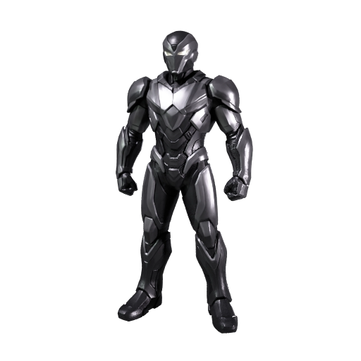

# Generate a 3D character from concept art

Turn a character image into a 3D model you can rotate, inspect, and bring into a project. Start with the included armored character, then try your own artwork.

| Concept art | Generated model |
|---|---|
|  |  |

[Preview provenance](assets/SOURCES.md).

## What you'll make

The armored character comes back as a 3D model you can rotate, light and place in a scene. The file is a GLB, which packages the two things a model is made of: the mesh, the shape, a surface made of many small triangles, and the textures, the images wrapped onto the mesh that give it color and material detail.

The textures here are a base color texture and PBR maps, short for physically based rendering, which tell a 3D viewer how each part of the surface reflects light, so the armor looks like metal instead of a flat color.

To get there, you'll:

1. Give your coding agent the recipe and store your Meshy API key. No credits are spent.
2. Check that the image gives Meshy a clear view of the character.
3. Start the run and approve the credit cost.
4. Wait two to three minutes while Meshy builds the mesh and generates its textures.
5. Open the model, turn it around, and decide what to do with it next.

- **Start with:** One PNG or JPEG image. The armored character shown above is included.
- **Receive:** A textured 3D model (`character.glb`) and a preview image.
- **Allow:** about two to three minutes for generation, plus time for first-time setup.
- **Budget:** about 30 Meshy credits for the default example.

These are recorded sample costs and timings, not guarantees. Your generated result will vary. [Check current API pricing](https://docs.meshy.ai/en/api/pricing) before you run it.

## Before you start

You need three things. None of them involves writing code.

1. **A Meshy account with API access.** Create an API key in the [Meshy Developer Platform](https://www.meshy.ai/developers/) and [check your credit balance](https://www.meshy.ai/settings/subscription). The default run spends about 30 credits.
2. **A coding agent.** That is an AI assistant such as Claude Code, Codex or Cursor that can open a folder on your computer and run commands for you. It handles installation, runs the recipe, and reports back in plain language.
3. **The example files.** [Download the cookbook files](https://github.com/meshy-dev/meshy-cookbook/archive/refs/heads/main.zip), unzip them, and open the extracted folder in your agent. Or skip the download and ask your agent to clone the [cookbook repository](https://github.com/meshy-dev/meshy-cookbook) for you. Either way, open the folder containing `AGENTS.md`, `examples`, and `shared`, so the agent can see everything it needs.

Optional: install [Blender](https://www.blender.org/download/), which is free, to open the finished model on your own computer. Without it, you can still inspect every result in your Meshy account, as Step 5 explains.

Keep your API key on your computer. The agent will help you create a local settings file named `.env`. Paste your key into that file yourself, never into chat.

Already comfortable running code? Jump to [Run it](#run-it) for the Python and TypeScript commands, and to [How it works](#how-it-works) for the API call behind the run.

## Step 1: Give your agent the recipe

With the cookbook folder open in your agent, paste this prompt. It sets everything up without spending any credits: the agent fetches the cookbook if it is not there yet, installs what the recipe needs, and helps you store your key in the local settings file.

```text
If the Meshy cookbook folder is not already open, clone https://github.com/meshy-dev/meshy-cookbook and work inside it. Read AGENTS.md and examples/01-image-to-3d-character/README.md. Set up everything this recipe needs, using Python unless my project already uses TypeScript. Help me store MESHY_API_KEY in a local .env file without asking me to paste the key into chat. Do not start any generation yet. When setup is done, explain in plain language what the run will do and how many credits it will cost.
```

Follow the agent's instructions and paste your key into the settings file yourself. This step is done when the agent confirms the key is in place and quotes a cost of about 30 credits.

## Step 2: Check the image

Meshy builds the whole character from a single picture, so the picture has to do a lot of work. It decides the shape of the mesh and the colors and materials in the textures.

| The included concept art: one character, fully visible, on a quiet background |
|---|
|  |

A good input shows:

- one character, with the whole figure in frame
- a front or three-quarter view, so the face and the main shapes are visible
- little background clutter, so Meshy does not mistake scenery for part of the character

Busy scenes, several characters, or a figure cropped at the knees all give Meshy less to work with. For this walkthrough, keep the included image. [Try your own idea](#try-your-own-idea) covers your own art once you have seen a full run.

## Step 3: Start the run and approve the cost

Paste this prompt. The agent quotes the cost and waits for your approval before anything is generated.

```text
Run cookbook 01, the character recipe, with the included armored character and the default settings. Tell me the expected credit cost and wait for my approval before generating. When it is done, show me where the files were saved.
```

Expect a quote of about 30 credits. Once you approve, the recipe sends the image to Meshy and reports progress until the files are downloaded. The run takes two to three minutes, so keep the terminal open and read ahead to see what is happening.

## Step 4: Meshy builds the model

The whole run is a single stage of two to three minutes, and Meshy does two jobs in it:

1. **Builds the mesh.** Meshy works out a complete 3D shape from the single view, including the sides and back the picture does not show, and outputs it as a mesh.
2. **Generates the textures.** The recipe asks for a base color texture and PBR maps. The base color texture is the image that gives the mesh its colors. The PBR maps are three more images: a metallic map that marks which parts are metal, a roughness map that marks which parts are polished or matte, and a normal map that makes the surface shade as if it had fine bumps and dents, without adding any geometry. Blender and game engines read all of them, which is why the armor reflects light like metal.

| The finished model's preview image, saved next to the model |
|---|
|  |

One limit to know: this mesh is dense. Expect about a million triangles and a file around 35 MB. That is fine for renders and for inspecting the result, but too heavy to drop into a game or a web page as it is. Step 5 says how to simplify it.

## Step 5: Turn it around

When the agent reports that everything is done, the output folder inside the recipe's `python` or `typescript` folder holds two files:

| File | What it is |
|---|---|
| `character.glb` | The mesh with its base color texture and PBR maps packed inside. |
| `character-thumbnail.png` | A still preview of the model, for a quick look. |

You don't need to install anything to take a first look. Open the [API console logs](https://www.meshy.ai/api-console/logs) in your Meshy account: every generation made with your key is listed there, and you can rotate and inspect the model in the browser. To open the downloaded file instead, open Blender and choose **File → Import → glTF 2.0**, then pick `character.glb`. Drag with the middle mouse button to orbit around it. Or ask your agent:

```text
Help me look at output/character.glb from all sides. If Blender is installed, open the file there. Otherwise suggest a free viewer that opens GLB files and help me open the file in it.
```

Look at the face, the hands, the armor and the back, and check that they match the drawing.

What comes next depends on where the character is going:

- **A rigged, animated character:** the [rigging recipe](../05-image-to-rigged-character/) uses this same image and adds a skeleton with walking and running clips.
- **A website or game:** simplify the mesh first. The [simplify recipe](../08-image-to-simplified-prop/) rebuilds a dense model as a quad mesh at a face count you choose, about 20,000 by default, keeping its textures. The remesh endpoint it uses accepts the task ID of a model Meshy already built, so your agent can simplify this character for 5 credits without generating it again, as long as Meshy still has the task, which is three days. Keep this original for its full detail.
- **A lighter shape from the start:** the [low-poly recipe](../02-image-to-low-poly-prop/) builds a small, simple model at a face count you choose.

## Try your own idea

Choose a PNG or JPEG that passes the checks in [Step 2](#step-2-check-the-image): one character, fully in frame, on a quiet background. Attach it to your agent or tell it where the file is, then paste this prompt.

```text
Use my character image as the input for cookbook 01. Keep the default settings. Tell me about anything in the image that could give a poor result before spending credits. Explain the expected credit cost and wait for my approval before starting a new generation.
```

Save a copy of your first result before generating another version. Changing the input or settings creates a new paid generation.

## If something goes wrong

- **The key is missing or rejected:** ask your agent to check that the local `.env` file is in the language folder and contains `MESHY_API_KEY`. Do not paste the key into chat.
- **The run cannot start:** check API access and available credits in your Meshy account, and ask the agent to explain the error before retrying.
- **Progress stops or a download fails:** keep the task ID your agent reports. Meshy keeps a finished result for up to three days, so ask the agent to check that existing task and download its result before starting again. Running the recipe again creates a new paid task, and closing the terminal does not cancel the first one.
- **The result looks different from the example:** each generation can vary. Check the image against [Step 2](#step-2-check-the-image) with your agent before paying for another run.

## Technical details

**Endpoints:** `POST /openapi/v1/image-to-3d` → `GET /openapi/v1/image-to-3d/:id`\
**Languages:** Python 3.10+ · TypeScript (Node 22+)\
**Source:** [Python](python/main.py) · [TypeScript](typescript/main.ts)\
**Last verified run measurements:** September 21, 2026 · [Sample result](sample-result.json)

This recipe sends one image to `image-to-3d` with texturing and PBR maps enabled, then downloads the GLB and preview.

## Run it

Complete [Before you start](#before-you-start) to configure API access and your key. Review the estimated budget above before running.

Clone once, then choose one language and run its commands from the repository root:

    git clone https://github.com/meshy-dev/meshy-cookbook.git
    cd meshy-cookbook

**Python**

    cd examples/01-image-to-3d-character/python
    python3 -m venv .venv && source .venv/bin/activate
    cp .env.example .env          # paste your key
    pip install -r requirements.txt
    python main.py

**TypeScript**

    cd examples/01-image-to-3d-character/typescript
    cp .env.example .env          # paste your key
    npm install
    npm start

You get `output/character.glb` and a 512 px preview at `output/character-thumbnail.png`. Open the GLB in Blender with File > Import > glTF 2.0.

To use your own art, pass the path to a PNG or JPEG:

    python main.py /path/to/character.png
    npm start -- /path/to/character.png

Each run overwrites the files in `output/`. Stopping a run does not cancel the task: the script prints the task ID first, and `client.get` with that ID returns the finished task for up to three days.

## How it works

1. **Encode the art and create the task.** `Meshy.data_uri` reads `input/concept-art.png` into a base64 data URI, and `client.create` POSTs the payload to `/openapi/v1/image-to-3d`.

```python
task_id = client.create(
    "image-to-3d",
    {
        "image_url": Meshy.data_uri(INPUT),
        "should_texture": True,
        "enable_pbr": True,
        "target_formats": ["glb"],
    },
)
```

   A data URI means you never have to host the image anywhere. The sample is the armored character from the Meshy quick start guide; pass your own PNG or JPG as the first argument to use it instead.

2. **Poll until the task finishes.** `client.wait` GETs `/openapi/v1/image-to-3d/:id` until the task succeeds or reports an error.

```python
task = client.wait("image-to-3d", task_id)
```

   On `FAILED` or `CANCELED`, the client raises an error with `task_error.message`.

3. **Download the GLB and the thumbnail.** `client.download` streams the signed `model_urls.glb` URL to `output/character.glb` and `thumbnail_url` to `output/character-thumbnail.png`.

```python
client.download(task["model_urls"]["glb"], OUTPUT / "character.glb")
client.download(task["thumbnail_url"], OUTPUT / "character-thumbnail.png")
```

   The output is a dense mesh; reduce its geometry before using it in a real-time scene.

## Parameters worth changing

| Parameter | We use | Why |
|---|---|---|
| [`image_url`](https://docs.meshy.ai/en/api/image-to-3d#create-an-image-to-3d-task) | data URI of `input/concept-art.png` | Works from a local file with no hosting step. A public URL works too |
| [`should_texture`](https://docs.meshy.ai/en/api/image-to-3d#create-an-image-to-3d-task) | `true` | You want a textured model, not a gray mesh. Set `false` for geometry only |
| [`enable_pbr`](https://docs.meshy.ai/en/api/image-to-3d#create-an-image-to-3d-task) | `true` | Adds metallic, roughness and normal maps that Blender wires into the Principled BSDF on import. Needs `should_texture: true` |
| [`target_formats`](https://docs.meshy.ai/en/api/image-to-3d#create-an-image-to-3d-task) | `["glb"]` | Blender imports GLB natively. Add `"fbx"` or `"obj"` for other tools |

`ai_model` is omitted, so the standard 3D task uses the API’s current default. See the sample record above for the model used in the recorded runs.

For a lightweight alternative, try the [Smart Topology recipe](../02-image-to-low-poly-prop/).
