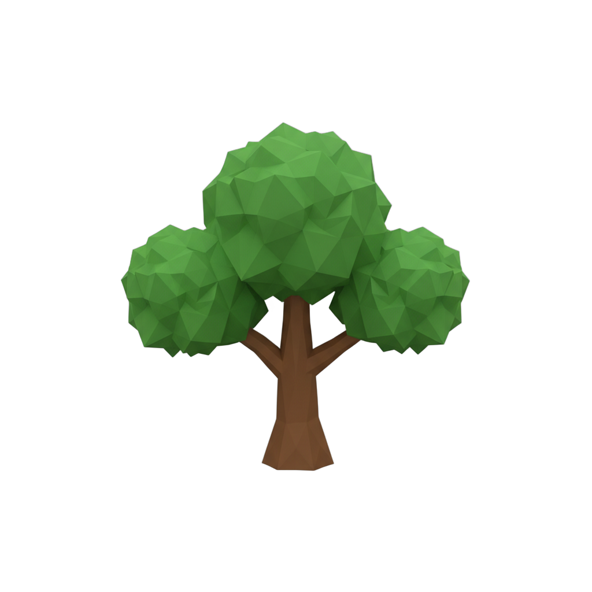
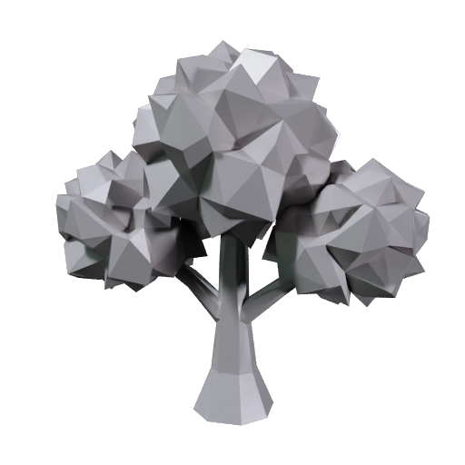
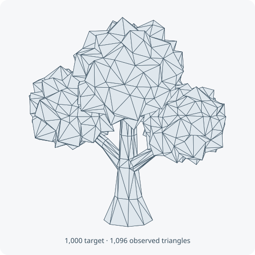

# Generate low-poly props with Smart Topology

Turn an image into a small, simple 3D prop. Try the included oak tree first, then choose how much shape detail you want for your own object.

| Concept art | Generated mesh | Actual triangle edges |
|---|---|---|
|  |  |  |

The wireframe is drawn from a real result: **1,096 triangles** from a **1,000-face target**. The target is approximate. [Preview provenance](assets/SOURCES.md).

## What you'll make

The oak comes back as a low-poly mesh: its shape is made of about 1,000 flat polygons, called faces, so the shape is simple and the file is tiny, about 20 KB. A mesh is the shape of a 3D model, a surface made of faces, usually triangles, and Smart Topology builds it directly at a face count you choose instead of building a dense mesh and simplifying it afterwards.

This recipe makes an untextured prop. A texture is the image wrapped onto a mesh to give it color, and this recipe skips it, so the image guides the shape but its colors are not carried over and the result is plain gray.

Skipping the texture is a choice, not a limitation. Texturing is a separate stage that Meshy runs after the mesh is built, and the task does not finish until it is done. Turning it off means Meshy returns as soon as the mesh exists, so the run is over in seconds, and it keeps the cost at 5 credits instead of the 15 that a textured Smart Topology run costs.

A plain mesh is also the right starting point when you plan to color the prop yourself. Low-poly game art usually gets its color from a flat material per part, or from one small palette texture that many props share, rather than from a unique texture image made for each model. A clean gray mesh is what those workflows begin with.

To get there, you'll:

1. Give your coding agent the recipe and store your Meshy API key. No credits are spent.
2. Check that the image shows one object with a clean outline.
3. Choose how many faces the model should have.
4. Start the run and approve the credit cost. Generation takes seconds.
5. Look at the triangles and decide whether to go simpler, finer, or add color.

- **Start with:** One PNG or JPEG image, plus a face count. The oak tree shown above is included.
- **Receive:** A lightweight 3D shape (`low-poly-prop.glb`) and a preview image.
- **Allow:** about eight seconds for generation, plus time for first-time setup.
- **Budget:** about 5 Meshy credits for the default example.

These are recorded sample costs and timings, not guarantees. Your generated result will vary. [Check current API pricing](https://docs.meshy.ai/en/api/pricing) before you run it.

## Before you start

You need three things. None of them involves writing code.

1. **A Meshy account with API access.** Create an API key in the [Meshy Developer Platform](https://www.meshy.ai/developers/) and [check your credit balance](https://www.meshy.ai/settings/subscription). The default run spends about 5 credits.
2. **A coding agent.** That is an AI assistant such as Claude Code, Codex or Cursor that can open a folder on your computer and run commands for you. It handles installation, runs the recipe, and reports back in plain language.
3. **The example files.** [Download the cookbook files](https://github.com/meshy-dev/meshy-cookbook/archive/refs/heads/main.zip), unzip them, and open the extracted folder in your agent. Or skip the download and ask your agent to clone the [cookbook repository](https://github.com/meshy-dev/meshy-cookbook) for you. Either way, open the folder containing `AGENTS.md`, `examples`, and `shared`, so the agent can see everything it needs.

Optional: install [Blender](https://www.blender.org/download/), which is free, to see the triangles on your own computer. Without it, you can still inspect every result in your Meshy account, as Step 5 explains.

Keep your API key on your computer. The agent will help you create a local settings file named `.env`. Paste your key into that file yourself, never into chat.

Already comfortable running code? Jump to [Run it](#run-it) for the Python and TypeScript commands, and to [How it works](#how-it-works) for the API call behind the run.

## Step 1: Give your agent the recipe

With the cookbook folder open in your agent, paste this prompt. It sets everything up without spending any credits: the agent fetches the cookbook if it is not there yet, installs what the recipe needs, and helps you store your key in the local settings file.

```text
If the Meshy cookbook folder is not already open, clone https://github.com/meshy-dev/meshy-cookbook and work inside it. Read AGENTS.md and examples/02-image-to-low-poly-prop/README.md. Set up everything this recipe needs, using Python unless my project already uses TypeScript. Help me store MESHY_API_KEY in a local .env file without asking me to paste the key into chat. Do not start any generation yet. When setup is done, explain in plain language what the run will do and how many credits it will cost.
```

Follow the agent's instructions and paste your key into the settings file yourself. This step is done when the agent confirms the key is in place and quotes a cost of about 5 credits.

## Step 2: Check the image

Smart Topology cares about outline more than anything else. It reads the silhouette of the object and the big shapes inside it, and it ignores color entirely, because the result has no texture.

| The included oak: one object, a clean outline, nothing behind it |
|---|
|  |

A good input shows:

- one object, with the whole thing in frame
- a clean outline against a plain or transparent background
- big, readable shapes rather than fine detail, since fine detail will not survive a small face count

The oak was drawn as a low-poly object to begin with, with a thick trunk and three rounded canopy clumps, which is why its model reads so clearly. For this walkthrough, keep the included image. [Try your own idea](#try-your-own-idea) covers your own object once you have seen a full run.

## Step 3: Choose a face count

The face count is the one setting in this recipe, and it is the whole point of Smart Topology. You ask for a number of faces between 100 and 15,000, and Meshy builds a mesh close to that number. The number is a target, not an exact count: Smart Topology builds the mesh directly at about that many faces rather than cutting a dense mesh down to an exact number, so the result lands a little above or below it, within about ten percent in the table below. Smart Topology's faces are triangles, so the results below are triangle counts. Here is what the oak looks like at four targets:

| You ask for | You get | What it looks like |
|---|---|---|
| 100 | 98 triangles | The tree is still recognizable, with almost no detail. |
| 300 | 324 triangles | A small target for a background prop, between the simplest silhouette and the default. |
| 1,000 | 1,096–1,104 triangles | Keeps the concept's faceted canopy. This is the default, pictured above. |
| 15,000 | 15,540 triangles | More leaf clusters, and still only 281 KB on disk. |

Pick a count by asking where the prop will be seen. A prop far in the background can get by with a few hundred faces. One the player walks past reads well at the default. Save the higher counts for objects seen up close. For the first run, keep the default of 1,000.

## Step 4: Start the run and approve the cost

Paste this prompt. The agent quotes the cost and waits for your approval before anything is generated.

```text
Run cookbook 02, the low-poly prop recipe, with the included oak tree and the default 1,000-face target. Tell me the expected credit cost and wait for my approval before generating. When it is done, show me where the files were saved.
```

Expect a quote of about 5 credits. Once you approve, the run is over in about ten seconds from start to files on disk. Meshy builds the mesh directly at the target, skips texturing because the recipe turns it off, and sends back the model and a preview image.

| The gray, untextured oak, exactly as it comes back |
|---|
|  |

The gray surface is expected. With texturing off, Meshy stops as soon as the mesh is built instead of going on to generate a texture for it, and that is what keeps the run down to seconds and 5 credits. Compare the character recipe, where the same kind of task also generates textures and takes minutes.

## Step 5: Look at the triangles

When the agent reports that everything is done, the output folder inside the recipe's `python` or `typescript` folder holds two files:

| File | What it is |
|---|---|
| `low-poly-prop.glb` | The mesh. It has no texture, so no color. |
| `low-poly-prop-thumbnail.png` | A still preview of the shape. |

You don't need to install anything to take a first look. Open the [API console logs](https://www.meshy.ai/api-console/logs) in your Meshy account: every generation made with your key is listed there, and you can rotate and inspect the mesh in the browser. To count the triangles on your own computer, open Blender and choose **File → Import → glTF 2.0**, then pick `low-poly-prop.glb`. Press Z and choose Wireframe, and every edge appears. Or ask your agent:

```text
Help me open output/low-poly-prop.glb and view it as a wireframe so I can see the triangles. Use Blender if it is installed. Otherwise suggest a free viewer that opens GLB files and help me open the file in it.
```

| All 1,096 triangles of the finished oak, drawn from the actual file |
|---|
|  |

Turn the tree and check that its outline reads clearly at the size you plan to show it. If it looks too blocky, go back to Step 3 and ask for more faces. If the detail is wasted at that size, ask for fewer. Each new count is a new paid run, but at about 5 credits it is cheap to try two or three. Adjust the model's scale in your 3D tool before placing it in a scene.

Want color? There are two routes. The usual low-poly route is to color the mesh yourself: in Blender, select a part such as the canopy and give it a flat material, which is how most low-poly art is colored and needs no texture at all. Ask your agent to walk you through it. The other route is to have Meshy generate a texture for the mesh. The [restyle recipe](../06-text-to-restyled-prop/) does exactly that: it builds this same gray oak, then textures it from a short description such as an autumn tree, with PBR maps, for 10 more credits.

## Try your own idea

Choose a PNG or JPEG that passes the checks in [Step 2](#step-2-check-the-image): one object with a clean outline on a plain background. Attach it to your agent or tell it where the file is, then paste this prompt. Start with 1,000 faces, then try a lower target for a simpler shape or a higher one for more detail. The supported range is 100 to 15,000.

```text
Use my image for cookbook 02 with a target of 1,000 faces. Keep the model untextured. Explain the expected credit cost and wait for my approval before starting a new generation.
```

Save a copy of your first result before generating another version. Changing the input or settings creates a new paid generation.

## If something goes wrong

- **The key is missing or rejected:** ask your agent to check that the local `.env` file is in the language folder and contains `MESHY_API_KEY`. Do not paste the key into chat.
- **The run cannot start:** check API access and available credits in your Meshy account, and ask the agent to explain the error before retrying.
- **Progress stops or a download fails:** keep the task ID your agent reports. Meshy keeps a finished result for up to three days, so ask the agent to check that existing task and download its result before starting again. Running the recipe again creates a new paid task, and closing the terminal does not cancel the first one.
- **The result looks different from the example:** each generation can vary. Check the image against [Step 2](#step-2-check-the-image) and the face count with your agent before paying for another run.

## Technical details

**Endpoints:** `POST /openapi/v1/image-to-3d` → `GET /openapi/v1/image-to-3d/:id`\
**Languages:** Python 3.10+ · TypeScript (Node 22+)\
**Source:** [Python](python/main.py) · [TypeScript](typescript/main.ts)\
**Last verified run measurements:** September 21, 2026 · [Sample result](sample-result.json)

Smart Topology generates a mesh directly at an approximate face count. This recipe uses it to create an untextured prop with a configurable face count. Texturing is turned off, so the task returns as soon as the mesh is built.

## Run it

Complete [Before you start](#before-you-start) to configure API access and your key. Review the estimated budget above before running.

Clone once, then choose one language and run its commands from the repository root:

    git clone https://github.com/meshy-dev/meshy-cookbook.git
    cd meshy-cookbook

**Python**

    cd examples/02-image-to-low-poly-prop/python
    python3 -m venv .venv && source .venv/bin/activate
    cp .env.example .env          # paste your key
    pip install -r requirements.txt
    python main.py

**TypeScript**

    cd examples/02-image-to-low-poly-prop/typescript
    cp .env.example .env          # paste your key
    npm install
    npm start

You get `output/low-poly-prop.glb` and a 512 px preview at `output/low-poly-prop-thumbnail.png`. Open the GLB in Blender with File > Import > glTF 2.0, then press Z and choose Wireframe to see the triangles.

To use your own image, or a different face count, pass them in that order:

    python main.py my-sketch.png 300
    npm start -- my-sketch.png 300

The face count can be anything from 100 to 15,000. Each run overwrites the files in `output/`. Stopping a run does not cancel the task: the script prints the task ID first, and `client.get` with that ID returns the finished task for up to three days.

## How it works

1. **Create a Smart Topology task from the image.** `Meshy.data_uri` validates and encodes the PNG as a data URI before opening a client. `client.create` POSTs it to `/openapi/v1/image-to-3d` with `model_type` set to `smart-topology` and the face count you asked for.

```python
image_url = Meshy.data_uri(INPUT)
task_id = client.create(
    "image-to-3d",
    {
        "image_url": image_url,
        "model_type": "smart-topology",
        "target_polycount": POLYCOUNT,
        "should_texture": False,
        "target_formats": ["glb"],
    },
)
```

   `should_texture` is `False` on purpose: the task ends when the mesh is ready instead of continuing into a texturing stage, which is what makes the run take seconds rather than minutes and cost 5 credits.

2. **Wait for it.** `client.wait` GETs `/openapi/v1/image-to-3d/:id` until the task succeeds or reports an error.

```python
task = client.wait("image-to-3d", task_id)
```

3. **Download the GLB and the preview.** `client.download` streams `model_urls.glb` and `thumbnail_url` to disk.

```python
client.download(task["model_urls"]["glb"], OUTPUT / "low-poly-prop.glb")
client.download(task["thumbnail_url"], OUTPUT / "low-poly-prop-thumbnail.png")
print(f"Done: {OUTPUT / 'low-poly-prop.glb'}  ({task['consumed_credits']} credits)")
```

   The output has no UVs or textures. To separate disconnected pieces in Blender, use Edit Mode → Mesh → Separate → By Loose Parts, then give each part its own flat material to color it.

## Compare face counts

These sample measurements illustrate the tradeoffs; results vary. Only the 1,000-target result is pictured above.

| Requested faces | Observed triangles | Observed tradeoff |
|---|---|---|
| 100 | 98 | The tree silhouette remains recognizable with little detail |
| 300 | 324 | A small target for a background prop, between the simplest silhouette and the default |
| 1,000 | 1,096–1,104 | Keeps the concept's faceted canopy; 1,096 is pictured above |
| 15,000 | 15,540 | More leaf clusters; the recorded GLB was 281 KB |

## Parameters worth changing

| Parameter | We use | Why |
|---|---|---|
| [`model_type`](https://docs.meshy.ai/en/api/image-to-3d#create-an-image-to-3d-task) | `"smart-topology"` | Selects Smart Topology. Omit it for the standard, dense model. |
| [`target_polycount`](https://docs.meshy.ai/en/api/image-to-3d#create-an-image-to-3d-task) | `POLYCOUNT` (default `1000`) | The target face count, from 100 to 15,000; the result lands near it. See the comparison above to choose a starting point. |
| [`should_texture`](https://docs.meshy.ai/en/api/image-to-3d#create-an-image-to-3d-task) | `false` | Off, so Meshy returns the mesh as soon as it is built, for 5 credits. Set `true` to have Meshy paint a base color texture from the image, which adds a texturing stage and raises the run to 15 credits at the published prices; add `enable_pbr` for metallic, roughness and normal maps. |
| [`target_formats`](https://docs.meshy.ai/en/api/image-to-3d#create-an-image-to-3d-task) | `["glb"]` | Add `"fbx"` for Unity or Unreal |

Smart Topology produces triangles and does not support `geometry_resolution`. Use `target_polycount` to set the face count.
