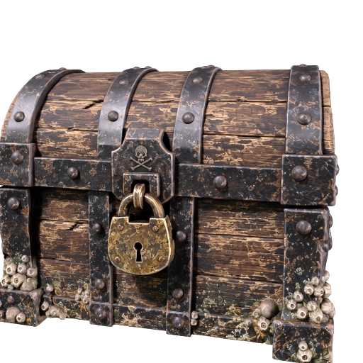

# Create a textured 3D prop from a text prompt

Describe an object and turn it into a detailed 3D model. Meshy first creates a concept image from your description, then uses that image to build the model, so you do not need a picture to start.

> Marrow's sea chest, a closed pirate treasure chest: weathered oak planks, black iron straps and rivets, a heavy brass padlock, barnacles along the base. Stylized hand-painted game prop, three-quarter view.

| Generated concept | Generated 3D model |
|---|---|
|  |  |

[Preview provenance](assets/SOURCES.md).

## What you'll make

A "hero prop" is an object that gets a close-up: a treasure chest the camera lingers on, not a crate in the background. This recipe produces one as a textured GLB: a file that packages the mesh, the 3D shape made of triangles, together with its textures, the images wrapped onto the mesh that give it color and material detail.

It uses Meshy's highest detail setting and works in two stages. First Meshy generates a concept image from your description. Then it builds the model from that image, and the image never leaves Meshy in between.

To get there, you'll:

1. Give your coding agent the recipe and store your Meshy API key. No credits are spent.
2. See how the included description is built.
3. Start the run and approve the credit cost.
4. Wait under a minute while Meshy generates the concept image.
5. Wait about six minutes while Meshy builds the model from it.
6. Compare the model with the concept and decide what to do next.

- **Start with:** A short description. The pirate treasure chest prompt shown above is included.
- **Receive:** A concept image, a textured 3D model (`hero-prop.glb`), and a preview image.
- **Allow:** about seven minutes for generation, plus time for first-time setup.
- **Budget:** about 44 Meshy credits for the default example: 9 for the concept image and 35 to build the model.

These are recorded sample costs and timings, not guarantees. Your generated result will vary. [Check current API pricing](https://docs.meshy.ai/en/api/pricing) before you run it.

## Before you start

You need three things. None of them involves writing code.

1. **A Meshy account with API access.** Create an API key in the [Meshy Developer Platform](https://www.meshy.ai/developers/) and [check your credit balance](https://www.meshy.ai/settings/subscription). The default run spends about 44 credits.
2. **A coding agent.** That is an AI assistant such as Claude Code, Codex or Cursor that can open a folder on your computer and run commands for you. It handles installation, runs the recipe, and reports back in plain language.
3. **The example files.** [Download the cookbook files](https://github.com/meshy-dev/meshy-cookbook/archive/refs/heads/main.zip), unzip them, and open the extracted folder in your agent. Or skip the download and ask your agent to clone the [cookbook repository](https://github.com/meshy-dev/meshy-cookbook) for you. Either way, open the folder containing `AGENTS.md`, `examples`, and `shared`, so the agent can see everything it needs.

Optional: install [Blender](https://www.blender.org/download/), which is free, to open the finished model on your own computer. Without it, you can still inspect every result in your Meshy account, as Step 6 explains.

Keep your API key on your computer. The agent will help you create a local settings file named `.env`. Paste your key into that file yourself, never into chat.

Already comfortable running code? Jump to [Run it](#run-it) for the Python and TypeScript commands, and to [How it works](#how-it-works) for the API calls behind each stage.

## Step 1: Give your agent the recipe

With the cookbook folder open in your agent, paste this prompt. It sets everything up without spending any credits: the agent fetches the cookbook if it is not there yet, installs what the recipe needs, and helps you store your key in the local settings file.

```text
If the Meshy cookbook folder is not already open, clone https://github.com/meshy-dev/meshy-cookbook and work inside it. Read AGENTS.md and examples/03-text-to-hero-prop/README.md. Set up everything this recipe needs, using Python unless my project already uses TypeScript. Help me store MESHY_API_KEY in a local .env file without asking me to paste the key into chat. Do not start any generation yet. When setup is done, explain in plain language what the run will do, stage by stage, and how many credits it will cost.
```

Follow the agent's instructions and paste your key into the settings file yourself. This step is done when the agent confirms the key is in place and quotes a cost of about 44 credits.

## Step 2: See how the description is built

This recipe starts from a description instead of an image. The description at the top of this page is the prompt Meshy works from, and it follows one pattern: name the object, list its materials, set the style, and ask for a view.

| The description says | What it does |
|---|---|
| Marrow's sea chest, a closed pirate treasure chest | Names one object. It is closed, so there is no open lid to complicate the shape. |
| weathered oak planks, black iron straps and rivets, a heavy brass padlock, barnacles along the base | Lists the materials. Each becomes a different surface in the textures, which is what makes the chest read as wood and metal rather than one flat paint job. |
| Stylized hand-painted game prop | Sets the style. The concept image is generated in that style, and the 3D model inherits it. |
| three-quarter view | Asks for a view that shows the front and one side, so Meshy sees two faces of the chest when it builds the model in Step 5. |

The recipe adds one setting you do not have to write: it asks Meshy to remove the background from the concept image, so the model stage receives a clean cut-out of just the chest.

For this walkthrough, keep the included description. [Try your own idea](#try-your-own-idea) reuses the same pattern for your own object.

## Step 3: Start the run and approve the cost

Paste this prompt. The agent quotes the cost and waits for your approval before anything is generated.

```text
Run cookbook 03, the text-to-prop recipe, with the included sea chest description and the default settings. Tell me the expected credit cost and wait for my approval before generating. Tell me when the concept image is ready and where it is saved, then when the model is done and where the files are.
```

Expect a quote of about 44 credits: 9 for the concept image and 35 for the model. Once you approve, the two stages run back to back. The whole run takes about seven minutes, so keep the terminal open and read ahead to see what is happening.

## Step 4: Meshy generates the concept image

This stage takes about 40 seconds. Meshy's image model generates a picture from the description, removes its background, and hands the result to the next stage. The recipe saves a copy as `hero-prop-concept.png` in the output folder as soon as it is ready.

| The concept image, generated from the description and saved before the model is built |
|---|
|  |

Open it as soon as the agent says it is there. This picture decides the model: the shape, the materials and the style you see here are what Meshy will build. One limit to know: the recipe does not pause here for your approval. If you would rather check the concept before paying for the model stage, ask your agent to adapt the recipe to stop after this step.

## Step 5: Meshy builds the model

This stage takes about six minutes, longer than the other image-to-3D recipes, because the recipe asks for Meshy's highest geometry setting, Ultra 4K, and 4K textures. The 2K setting takes about half as long, so the higher setting roughly doubles the wait.

Meshy builds the complete mesh from the concept, then generates its textures: a base color texture plus PBR maps, short for physically based rendering. Those are a metallic map that marks the iron and brass as metal, a roughness map that separates polished brass from dull wood, and a normal map that makes the flat surface shade as if the planks and rivets were raised, without adding any geometry.

| The finished chest, as its preview image |
|---|
|  |

One limit to know: this mesh is heavy. Expect about 1.1 million triangles and a file around 64 MB. That is the point of a hero prop, but it is far too large to use as it is in a game or on a web page. Step 6 covers what to do about that.

## Step 6: Compare it with the concept

When the agent reports that everything is done, the output folder inside the recipe's `python` or `typescript` folder holds three files:

| File | What it is |
|---|---|
| `hero-prop-concept.png` | The concept image from Step 4. |
| `hero-prop.glb` | The mesh with its base color texture and PBR maps packed inside. |
| `hero-prop-thumbnail.png` | A still preview of the model. |

You don't need to install anything to take a first look. Open the [API console logs](https://www.meshy.ai/api-console/logs) in your Meshy account: every generation made with your key is listed there, and you can rotate and inspect the model in the browser. To open the downloaded file instead, open Blender and choose **File → Import → glTF 2.0**, then pick `hero-prop.glb`. Or ask your agent:

```text
Help me look at output/hero-prop.glb from all sides, next to output/hero-prop-concept.png. If Blender is installed, open the model there. Otherwise suggest a free viewer that opens GLB files and help me open the file in it.
```

Put the concept next to the model and compare shape and materials. The two sides the concept showed should match it closely. Look at how the wood, iron and brass read under light, since that is what the PBR maps are for. Adjust the model's scale in your 3D tool before placing it in a scene.

To use the chest in a website or a real-time scene, ask your agent to help prepare a smaller copy, and keep this original for renders and close-ups.

## Try your own idea

Write a description following the pattern from [Step 2](#step-2-see-how-the-description-is-built): name one object, list its materials, set a style, and ask for a three-quarter view. For example: "A small ceramic teapot, pale blue glaze, rounded wooden handle, stylized illustration, three-quarter view." Then paste this prompt.

```text
Use cookbook 03 with this description: A small ceramic teapot, pale blue glaze, rounded wooden handle, stylized illustration, three-quarter view. Archive any previous output before starting. Explain the expected credit cost and wait for my approval before generating.
```

Save a copy of your first result before generating another version. Changing the description or settings creates a new paid generation.

## If something goes wrong

- **The key is missing or rejected:** ask your agent to check that the local `.env` file is in the language folder and contains `MESHY_API_KEY`. Do not paste the key into chat.
- **The run cannot start:** check API access and available credits in your Meshy account, and ask the agent to explain the error before retrying.
- **Progress stops or a download fails:** ask your agent to resume the saved run. The recipe records each stage as it finishes, so a concept image that already exists is not paid for twice, though a model stage that has not started still costs its credits. If the agent reports that it cannot tell whether a request went through, have it check Meshy's task history before continuing.
- **The result looks different from the example:** each generation can vary, and the concept image varies most. Check the concept against your description with your agent before paying for another run.

## Technical details

**Endpoints:** `POST /openapi/v1/text-to-image` → `GET /openapi/v1/text-to-image/:id`, then `POST /openapi/v1/image-to-3d` → `GET /openapi/v1/image-to-3d/:id`\
**Languages:** Python 3.10+ · TypeScript (Node 22+)\
**Source:** [Python](python/main.py) · [TypeScript](typescript/main.ts)\
**Last verified run measurements:** September 21, 2026 · [Sample result](sample-result.json)

The workflow chains `text-to-image` into `image-to-3d` using `input_task_id`. Use the [character recipe](../01-image-to-3d-character/) if you already have an image.

## Run it

Complete [Before you start](#before-you-start) to configure API access and your key. Review the estimated budget above before running.

Clone once, then choose one language and run its commands from the repository root:

    git clone https://github.com/meshy-dev/meshy-cookbook.git
    cd meshy-cookbook

**Python**

    cd examples/03-text-to-hero-prop/python
    python3 -m venv .venv && source .venv/bin/activate
    cp .env.example .env          # paste your key
    pip install -r requirements.txt
    python main.py

**TypeScript**

    cd examples/03-text-to-hero-prop/typescript
    cp .env.example .env          # paste your key
    npm install
    npm start

You get `output/hero-prop.glb`, the generated concept image at `output/hero-prop-concept.png`, and a 512 px preview at `output/hero-prop-thumbnail.png`. Open the GLB in Blender with File > Import > glTF 2.0.

To describe your own prop, pass the description:

    python main.py "A weathered pirate chest"
    npm start -- "A weathered pirate chest"

### Resume an interrupted run

The script saves the prompt and task IDs in `output/run.json`. If a poll, download or later stage is interrupted, continue the same run from the same language directory:

    python main.py --resume
    npm start -- --resume

Resume reuses saved tasks and creates only stages that have not started. Starting the model stage still costs its estimated 35 credits. If the model task is already saved, resume retrieves it directly and reports model credits only. Resume before the results expire; the recorded retention period is three days outside Enterprise.

A normal run refuses to start when `output/run.json` already exists. To intentionally generate another prop, archive the current `output/` directory first, then run with the new description. Passing a different description with `--resume` is rejected.

If execution stops while a create request is in flight, the checkpoint may contain a `creating` marker without its task ID. The script stops rather than risk duplicate charges. Check the Meshy task history for the submitted request; if it exists, put its ID in `concept_task_id` or `model_task_id` as appropriate and set `creating` to `null` before resuming. If no task was created, clear the marker only after confirming that. The checkpoint contains no API key or signed download URLs.

## How it works

The excerpts below show the API calls from the Python runner. The full [Python](python/main.py) and [TypeScript](typescript/main.ts) sources also checkpoint each stage and skip creation when resuming a saved task.

1. **Generate the concept image from the prompt.** `client.create` POSTs the prompt to `/openapi/v1/text-to-image` with GPT Image 2.5 Sunburst and `remove_background` set.

```python
concept_id = client.create(
    "text-to-image",
    {
        "ai_model": "gpt-image-2-5-sunburst",
        "prompt": state["prompt"],
        "remove_background": True,
    },
)
```

   `remove_background` returns the chest as a transparent cut-out, and the three-quarter view asked for in the default prompt shows the 3D stage two sides of it instead of one.

2. **Save the completed concept image.** `client.wait` GETs `/openapi/v1/text-to-image/:id` until the image is ready, then `client.download` saves it.

```python
concept = client.wait("text-to-image", concept_id)
client.download(concept["image_urls"][0], output / "hero-prop-concept.png")
```

   Leave `generate_multi_view` off: this workflow requires a concept task that produces one image.

3. **Chain the image into an Ultra 4K image-to-3d task.** `client.create` POSTs to `/openapi/v1/image-to-3d` with `input_task_id` pointing at the text-to-image task, so the image never leaves Meshy.

```python
task_id = client.create(
    "image-to-3d",
    {
        "input_task_id": concept_id,
        "geometry_resolution": "4k",
        "should_texture": True,
        "enable_pbr": True,
        "texture_resolution": "4k",
        "target_formats": ["glb"],
    },
)
```

   `geometry_resolution` controls the geometry pass; `texture_resolution` controls the surface images. They are separate settings.

4. **Download the completed GLB and thumbnail.** Wait for the model task to finish, then save both files.

```python
task = client.wait("image-to-3d", task_id)
client.download(task["model_urls"]["glb"], output / "hero-prop.glb")
client.download(task["thumbnail_url"], output / "hero-prop-thumbnail.png")
```

   The output is a dense mesh with large textures. Reduce geometry and texture size before using it in a real-time scene.

## Parameters worth changing

| Parameter | We use | Why |
|---|---|---|
| [`ai_model`](https://docs.meshy.ai/en/api/text-to-image#create-a-text-to-image-task) (text-to-image) | `"gpt-image-2-5-sunburst"` | 9 credits per image. `"nano-banana"` costs 3 and is fine for a first look |
| [`prompt`](https://docs.meshy.ai/en/api/text-to-image#create-a-text-to-image-task) | `state["prompt"]` | Name the prop, list its materials, and ask for a three-quarter view. Leave the background to the next parameter |
| [`remove_background`](https://docs.meshy.ai/en/api/text-to-image#create-a-text-to-image-task) | `true` | Returns a transparent PNG of just the prop, so the 3D stage gets a clean cut-out |
| [`input_task_id`](https://docs.meshy.ai/en/api/image-to-3d#create-an-image-to-3d-task) | the text-to-image task id | Chains the two tasks inside Meshy. Swap in `image_url` with a data URI of your own PNG to skip the prompt stage, as the [character recipe](../01-image-to-3d-character/) does |
| [`geometry_resolution`](https://docs.meshy.ai/en/api/image-to-3d#create-an-image-to-3d-task) | `"4k"` | Controls geometry detail: `standard`, `2k`, or `4k`. Either Ultra setting adds an estimated 5 credits. Requires Meshy 7.1 and a single input image. |
| [`should_texture`](https://docs.meshy.ai/en/api/image-to-3d#create-an-image-to-3d-task) | `true` | You want a textured model, not a gray mesh. Set `false` for geometry only, which drops the task to 25 credits with Ultra |
| [`enable_pbr`](https://docs.meshy.ai/en/api/image-to-3d#create-an-image-to-3d-task) | `true` | Adds metallic, roughness and normal maps that Blender wires into the Principled BSDF on import. Needs `should_texture: true` |
| [`texture_resolution`](https://docs.meshy.ai/en/api/image-to-3d#create-an-image-to-3d-task) | `"4k"` | Sets texture resolution. 4K uses the same credit cost as 2K; 8K adds an estimated 5 credits. Larger textures increase file size. |
| [`target_formats`](https://docs.meshy.ai/en/api/image-to-3d#create-an-image-to-3d-task) | `["glb"]` | Add `"fbx"` for Unity or Unreal |

`ai_model` is omitted, so the standard 3D task uses the API’s current default. See the sample record above for the model used in the recorded runs.
