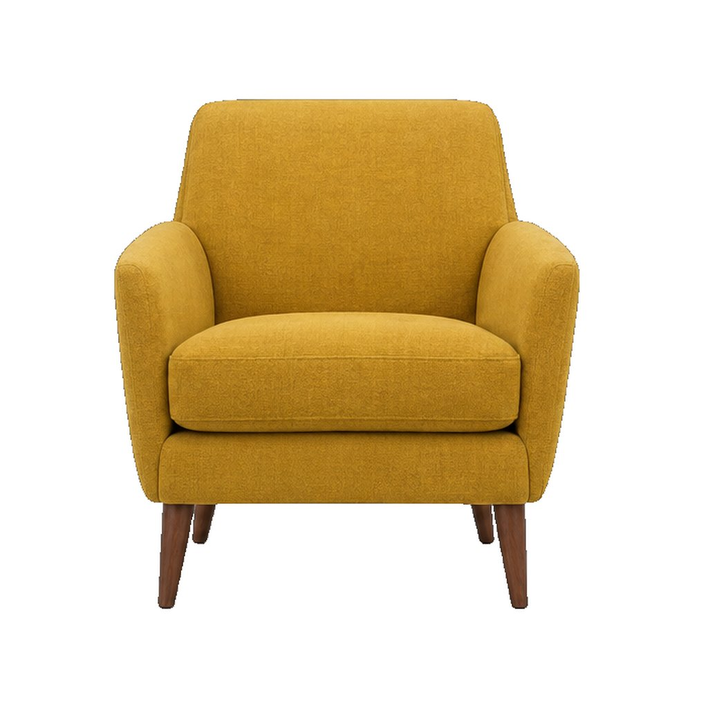
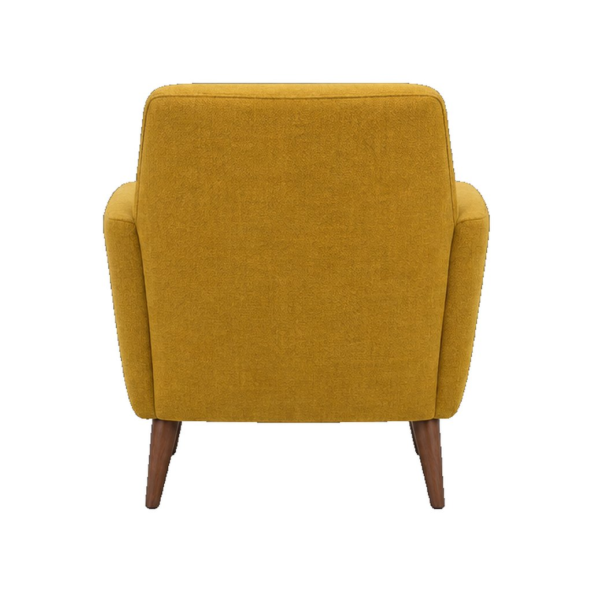
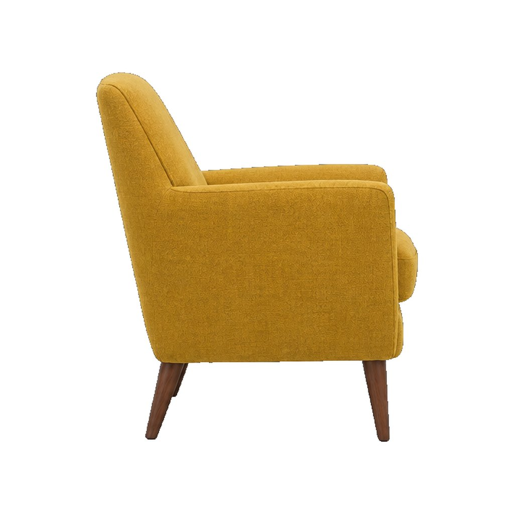
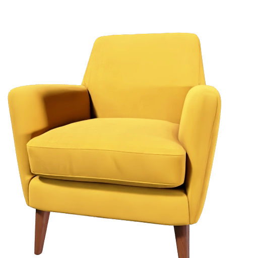
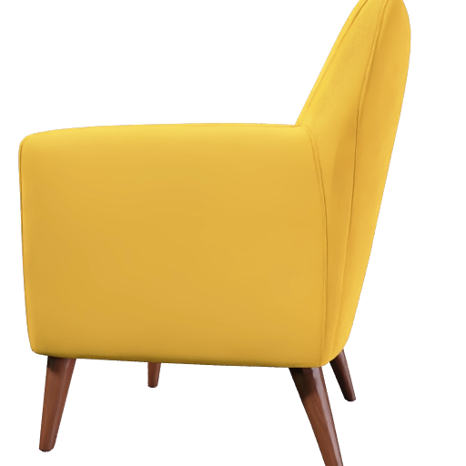
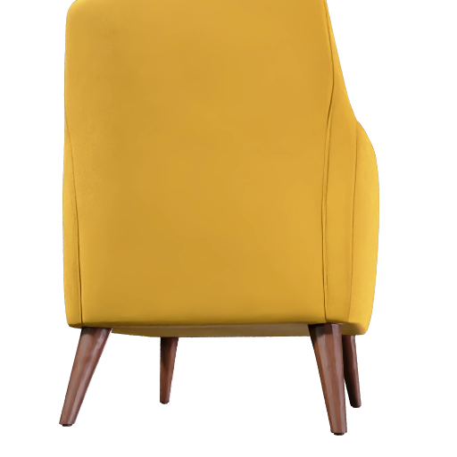
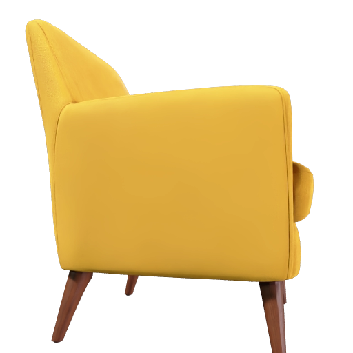

# Create a 3D product model from multiple photos

Turn a few views of the same object into a 3D model you can inspect from every angle. Start with the included armchair example, then try your own product photos.

| Front input (first) | Back input | Side input | Generated model |
|---|---|---|---|
|  |  |  |  |

[Preview provenance](assets/SOURCES.md).

## What you'll make

One photo tells Meshy what the front of an object looks like. Several photos tell it what the back and sides look like too. The model itself is a mesh, the 3D shape made of triangles, wrapped in textures, the images that give it color and material detail.

This recipe delivers it in two formats: a GLB for web viewers and 3D tools, and a USDZ, the format Apple devices use to place a model in your room through the camera. It also asks Meshy to work out the object's real-world size from the photos, so the armchair comes out at the size of a real armchair, which you check in Step 5.

To get there, you'll:

1. Give your coding agent the recipe and store your Meshy API key. No credits are spent.
2. Line up the views, front first.
3. Start the run and approve the credit cost.
4. Wait about four minutes while Meshy builds the model from all the views.
5. Inspect it from every side and check its size.

- **Start with:** One to four PNG or JPEG images of the same object, with the front view first. The three armchair views shown above are included.
- **Receive:** A 3D model for web viewers (`armchair.glb`), an Apple AR file (`armchair.usdz`), and four preview images.
- **Allow:** about four minutes for generation, plus time for first-time setup.
- **Budget:** about 35 Meshy credits for the default example.

These are recorded sample costs and timings, not guarantees. Your generated result will vary. [Check current API pricing](https://docs.meshy.ai/en/api/pricing) before you run it.

## Before you start

You need three things. None of them involves writing code.

1. **A Meshy account with API access.** Create an API key in the [Meshy Developer Platform](https://www.meshy.ai/developers/) and [check your credit balance](https://www.meshy.ai/settings/subscription). The default run spends about 35 credits.
2. **A coding agent.** That is an AI assistant such as Claude Code, Codex or Cursor that can open a folder on your computer and run commands for you. It handles installation, runs the recipe, and reports back in plain language.
3. **The example files.** [Download the cookbook files](https://github.com/meshy-dev/meshy-cookbook/archive/refs/heads/main.zip), unzip them, and open the extracted folder in your agent. Or skip the download and ask your agent to clone the [cookbook repository](https://github.com/meshy-dev/meshy-cookbook) for you. Either way, open the folder containing `AGENTS.md`, `examples`, and `shared`, so the agent can see everything it needs.

Optional: install [Blender](https://www.blender.org/download/), which is free, to open the finished model on your own computer. Without it, you can still inspect every result in your Meshy account, and on a Mac the USDZ file previews with nothing extra installed, as Step 5 explains.

Keep your API key on your computer. The agent will help you create a local settings file named `.env`. Paste your key into that file yourself, never into chat.

Already comfortable running code? Jump to [Run it](#run-it) for the Python and TypeScript commands, and to [How it works](#how-it-works) for the API call behind the run.

## Step 1: Give your agent the recipe

With the cookbook folder open in your agent, paste this prompt. It sets everything up without spending any credits: the agent fetches the cookbook if it is not there yet, installs what the recipe needs, and helps you store your key in the local settings file.

```text
If the Meshy cookbook folder is not already open, clone https://github.com/meshy-dev/meshy-cookbook and work inside it. Read AGENTS.md and examples/04-photos-to-product-model/README.md. Set up everything this recipe needs, using Python unless my project already uses TypeScript. Help me store MESHY_API_KEY in a local .env file without asking me to paste the key into chat. Do not start any generation yet. When setup is done, explain in plain language what the run will do and how many credits it will cost.
```

Follow the agent's instructions and paste your key into the settings file yourself. This step is done when the agent confirms the key is in place and quotes a cost of about 35 credits.

## Step 2: Line up the views

Meshy treats the first image as the main view. It sets the shape and the look of the model, and the other images fill in the sides the first one cannot show. So the order matters for the first image only, and the recipe sends the included views front first.

| The front view goes first: it is the view Meshy builds the model around |
|---|
|  |

A good set of views:

- shows the same object in every image, with the whole object in frame
- starts with the clearest front view, then adds the back and a side
- keeps the lighting even and the background plain, so the images agree with each other
- has between one and four images; one works, four is the maximum

The included views were generated to match each other exactly, which real photos never quite do. For this walkthrough, keep them. [Try your own idea](#try-your-own-idea) covers photographing your own product once you have seen a full run.

## Step 3: Start the run and approve the cost

Paste this prompt. The agent quotes the cost and waits for your approval before anything is generated.

```text
Run cookbook 04, the product photos recipe, with the three included armchair views in their numbered order and the default settings. Tell me the expected credit cost and wait for my approval before generating. When it is done, show me where the files were saved.
```

Expect a quote of about 35 credits. Once you approve, the recipe sends all three views to Meshy in one request and reports progress until the files are downloaded. The run takes about four minutes, so keep the terminal open and read ahead to see what is happening.

## Step 4: Meshy builds the model

The whole run is a single stage of about four minutes. Meshy does more in it than in the single-image recipes, because the recipe asks for several extras a product model needs:

1. **Builds the mesh from all the views.** The front view sets the form, and the back and side views correct what the front cannot show. The recipe asks for Meshy's Ultra 2K geometry setting, the highest available for multiple images.
2. **Generates 4K textures.** A base color texture plus PBR maps, short for physically based rendering: a metallic map, a roughness map that separates matte fabric from polished wood, and a normal map that shades fine surface detail, such as the weave of the fabric, without adding any geometry. At 4K they are double the usual texture size, so fabric weave and wood grain hold up close.
3. **Estimates the real size.** The armchair comes out around 0.8 meters tall. Meshy works that out from the pictures, so check it against the real object.
4. **Puts the floor under it.** The model's origin is placed at its lowest point, so it sits on the ground in a viewer instead of floating.
5. **Renders four previews and converts the files.** Front, right, back and left renders, then a GLB and a USDZ.

| The front render Meshy returns with the model |
|---|
|  |

## Step 5: Inspect it from every side

When the agent reports that everything is done, the output folder inside the recipe's `python` or `typescript` folder holds six files:

| File | What it is |
|---|---|
| `armchair.glb` | The mesh and textures for web viewers and 3D tools. |
| `armchair.usdz` | The same model for Apple's Quick Look and AR. |
| `armchair-front.png`, `-right.png`, `-back.png`, `-left.png` | The four renders from Step 4. |

Start with the renders, which show the model from four sides at a glance:

| Right | Back | Left |
|---|---|---|
|  |  |  |

You don't need to install anything to take a first look. Open the [API console logs](https://www.meshy.ai/api-console/logs) in your Meshy account: every generation made with your key is listed there, and you can rotate and inspect the model in the browser. To open the downloaded files instead, open Blender and choose **File → Import → glTF 2.0**, then pick `armchair.glb`, or on a Mac select `armchair.usdz` in Finder and press the space bar to preview it with Quick Look. Or ask your agent:

```text
Help me look at output/armchair.glb from all sides and compare it with the three input views. If Blender is installed, open the model there. Otherwise suggest a free viewer that opens GLB files and help me open the file in it. Then tell me the model's estimated height, width and depth.
```

Compare each side against the matching input view. Check the thin parts, such as the legs, and the surfaces no view showed, such as the underside of the seat. Then check the size: the estimate from Step 4 is only as good as the pictures, so compare it with the real object and correct it in your 3D tool before anyone places the chair in their room.

Expect a file around 33 MB, which is more than a product page wants to load. Before putting the model on a page, simplify the mesh: the [simplify recipe](../08-image-to-simplified-prop/) rebuilds a dense model as a quad mesh at a face count you choose, keeping its textures. The remesh endpoint it uses takes a model file as well as a task ID, so your agent can send the downloaded GLB and simplify it for 5 credits without generating it again. Check how the lighter copy looks in your viewer, and keep a copy of the original result.

## Try your own idea

Photograph one product following [Step 2](#step-2-line-up-the-views): the whole object in every shot, the clearest front view first, then the back and a side, with even lighting and a plain background. Measure the real product so you can check the generated size. Attach the photos to your agent or tell it where they are, then paste this prompt.

```text
Use my product photos for cookbook 04, with the front photo first. Keep the default settings and both GLB and USDZ outputs. Explain the expected credit cost and wait for my approval before generating. When finished, help me compare the model’s dimensions with my real measurements.
```

Save a copy of your first result before generating another version. Changing the input or settings creates a new paid generation.

## If something goes wrong

- **The key is missing or rejected:** ask your agent to check that the local `.env` file is in the language folder and contains `MESHY_API_KEY`. Do not paste the key into chat.
- **The run cannot start:** check API access and available credits in your Meshy account, and ask the agent to explain the error before retrying.
- **Progress stops or a download fails:** keep the task ID your agent reports. Meshy keeps a finished result for up to three days, so ask the agent to check that existing task and download its result before starting again. Running the recipe again creates a new paid task, and closing the terminal does not cancel the first one.
- **The result looks different from the example:** each generation can vary. Check the views against [Step 2](#step-2-line-up-the-views) with your agent before paying for another run.

## Technical details

**Endpoints:** `POST /openapi/v1/multi-image-to-3d` → `GET /openapi/v1/multi-image-to-3d/:id`\
**Languages:** Python 3.10+ · TypeScript (Node 22+)\
**Source:** [Python](python/main.py) · [TypeScript](typescript/main.ts)\
**Last verified run measurements:** September 21, 2026 · [Sample result](sample-result.json)

`multi-image-to-3d` uses the first image as the front view and additional images to guide the other sides. This recipe requests textured GLB and USDZ files, estimated scale, a floor origin, and four preview views.

## Run it

Complete [Before you start](#before-you-start) to configure API access and your key. Review the estimated budget above before running.

Clone once, then choose one language and run its commands from the repository root:

    git clone https://github.com/meshy-dev/meshy-cookbook.git
    cd meshy-cookbook

**Python**

    cd examples/04-photos-to-product-model/python
    python3 -m venv .venv && source .venv/bin/activate
    cp .env.example .env          # paste your key
    pip install -r requirements.txt
    python main.py

**TypeScript**

    cd examples/04-photos-to-product-model/typescript
    cp .env.example .env          # paste your key
    npm install
    npm start

You get `output/armchair.glb`, `output/armchair.usdz` and four 512 px renders, `output/armchair-front.png`, `-right.png`, `-back.png` and `-left.png`. Drop the GLB on https://modelviewer.dev/editor to see it with its PBR maps and copy the `<model-viewer>` embed tag; select the USDZ in Finder and press Space for Quick Look.

To use your own photos, pass one to four PNG or JPEG paths, front view first:

    python main.py /path/to/front.jpg /path/to/back.jpg /path/to/side.jpg
    npm start -- /path/to/front.jpg /path/to/back.jpg /path/to/side.jpg

Each run overwrites the files in `output/`. Stopping a run does not cancel the task: the script prints the task ID first, and `client.get` with that ID returns the finished task for up to three days.

## How it works

1. **Encode the three photos and create the task.** `Meshy.data_uri` reads each JPEG in `PHOTOS` into a base64 data URI, and `client.create` POSTs them as one `image_urls` list to `/openapi/v1/multi-image-to-3d` with Ultra 2K geometry, 4K textures, estimated scale and both output formats.

```python
image_urls = [Meshy.data_uri(p) for p in PHOTOS]
task_id = client.create(
    "multi-image-to-3d",
    {
        "image_urls": image_urls,
        "geometry_resolution": "2k",
        "should_texture": True,
        "enable_pbr": True,
        "texture_resolution": "4k",
        "auto_size": True,
        "origin_at": "bottom",
        "multi_view_thumbnails": True,
        "target_formats": ["glb", "usdz"],
    },
)
```

   Put the front view first; the remaining views can be in any order.

2. **Poll until the task finishes.** `client.wait` GETs `/openapi/v1/multi-image-to-3d/:id` until the task succeeds or reports an error.

```python
task = client.wait("multi-image-to-3d", task_id)
```

   On `FAILED` or `CANCELED`, the client raises an error with `task_error.message`. After 30 minutes it raises `MeshyTimeoutError`; use the task ID to check progress before retrying.

3. **Download the GLB, the USDZ and the four renders.** `client.download` streams `model_urls.glb` and `model_urls.usdz` to `output/`, then each entry of `thumbnail_urls`.

```python
client.download(task["model_urls"]["glb"], OUTPUT / "armchair.glb")
client.download(task["model_urls"]["usdz"], OUTPUT / "armchair.usdz")
for view, url in task["thumbnail_urls"].items():
    client.download(url, OUTPUT / f"armchair-{view}.png")
```

   Reduce geometry and compress textures before publishing the model on a product page.

## Parameters worth changing

| Parameter | We use | Why |
|---|---|---|
| [`image_urls`](https://docs.meshy.ai/en/api/multi-image-to-3d#create-a-multi-image-to-3d-task) | three data URIs, front first | The first image is the primary view on Meshy 7.1; the others fill in the back and sides. One photo works, four is the maximum |
| [`geometry_resolution`](https://docs.meshy.ai/en/api/multi-image-to-3d#create-a-multi-image-to-3d-task) | `"2k"` | Uses Ultra 2K geometry for an estimated 5 extra credits. Requires Meshy 7.1; 4K geometry is not supported for multi-image input. |
| [`should_texture`](https://docs.meshy.ai/en/api/multi-image-to-3d#create-a-multi-image-to-3d-task) | `true` | You want a textured model, not a gray mesh. Set `false` for geometry only, which drops the task to 25 credits with Ultra |
| [`enable_pbr`](https://docs.meshy.ai/en/api/multi-image-to-3d#create-a-multi-image-to-3d-task) | `true` | Adds metallic, roughness and normal maps that model-viewer and three.js render without extra setup. Needs `should_texture: true` |
| [`texture_resolution`](https://docs.meshy.ai/en/api/multi-image-to-3d#create-a-multi-image-to-3d-task) | `"4k"` | 4096 × 4096 base color and normal maps instead of the 2048 default, at the same credit cost. `"8k"` costs 5 more |
| [`auto_size`](https://docs.meshy.ai/en/api/multi-image-to-3d#create-a-multi-image-to-3d-task) | `true` | Estimates real-world dimensions. Check against actual measurements before using in AR. |
| [`origin_at`](https://docs.meshy.ai/en/api/multi-image-to-3d#create-a-multi-image-to-3d-task) | `"bottom"` | Puts the origin under the model so it sits on the floor in a viewer. Use `"center"` for things that hang or float |
| [`multi_view_thumbnails`](https://docs.meshy.ai/en/api/multi-image-to-3d#create-a-multi-image-to-3d-task) | `true` | Returns front, right, back, and left preview images. |
| [`target_formats`](https://docs.meshy.ai/en/api/multi-image-to-3d#create-a-multi-image-to-3d-task) | `["glb", "usdz"]` | GLB for the web viewer, USDZ for AR Quick Look on iOS; every format is a conversion step after generation. Add `"fbx"` for a game engine |

`ai_model` is omitted, so the standard 3D task uses the API’s current default. See the sample record above for the model used in the recorded runs.
