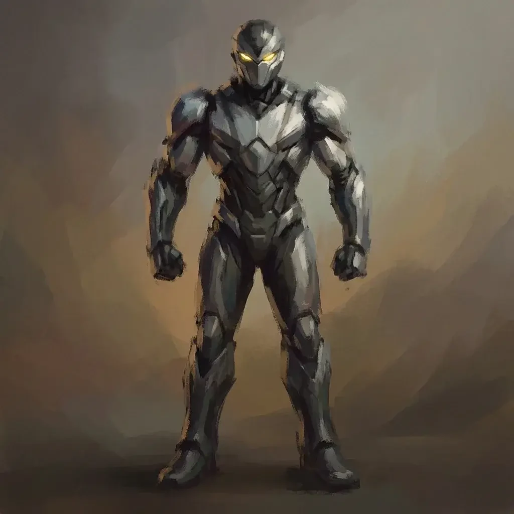
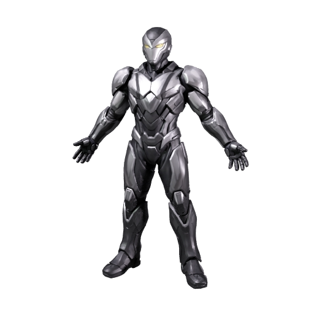
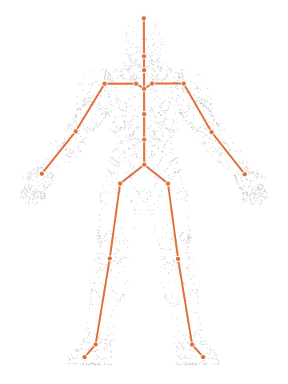
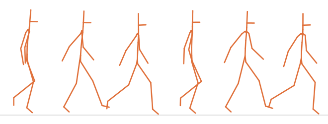

# Rig a 3D character with walk and run animations

Turn one character image into a 3D model with a skeleton inside it, plus a walking and a running clip you can play right away. Your coding agent runs the recipe, and this guide explains what happens at each step and what to look for.

| Concept art | Generated model | Skeleton | Walking clip |
|---|---|---|---|
|  |  |  |  |

The skeleton and walk frames are drawn from a real result: **24 joints** and a **1.07-second** walking loop. [Preview provenance](assets/SOURCES.md).

## What you'll make

The armored character comes back rigged: with a skeleton inside the mesh, a set of joints, each of which moves the part of the mesh around it, so animation software can bend an elbow or swing a leg and the armor follows. The mesh is the shape, a surface made of triangles, and the textures are the images wrapped onto it that give it color; the skeleton and the way it is attached to the mesh are together called the rig. Meshy places that skeleton for you and sends back two short animations with it: a walking loop and a running loop.

To get there, you'll:

1. Give your coding agent the recipe and store your Meshy API key. No credits are spent.
2. Check that the character image is one the rigger can work with.
3. Start the run and approve the credit cost.
4. Wait about two minutes while Meshy builds a 3D model in a pose made for rigging.
5. Wait under a minute while Meshy adds the skeleton and the two animations.
6. Open the result and watch it walk.

- **Start with:** One PNG or JPEG of a standing humanoid character. The armored character shown above is included.
- **Receive:** A rigged model (`rigged-character.glb` and `rigged-character.fbx`), two animated copies (`walking.glb`, `running.glb`), and a preview image.
- **Allow:** about three to four minutes for generation, plus time for first-time setup.
- **Budget:** about 35 Meshy credits for the default example: 30 to build the model and 5 to rig it.

These are recorded sample costs and timings, not guarantees. Your generated result will vary. [Check current API pricing](https://docs.meshy.ai/en/api/pricing) before you run it.

## Before you start

You need three things. None of them involves writing code.

1. **A Meshy account with API access.** Create an API key in the [Meshy Developer Platform](https://www.meshy.ai/developers/) and [check your credit balance](https://www.meshy.ai/settings/subscription). The default run spends about 35 credits.
2. **A coding agent.** That is an AI assistant such as Claude Code, Codex or Cursor that can open a folder on your computer and run commands for you. It handles installation, runs the recipe, and reports back in plain language.
3. **The example files.** [Download the cookbook files](https://github.com/meshy-dev/meshy-cookbook/archive/refs/heads/main.zip), unzip them, and open the extracted folder in your agent. Or skip the download and ask your agent to clone the [cookbook repository](https://github.com/meshy-dev/meshy-cookbook) for you. Either way, open the folder containing `AGENTS.md`, `examples`, and `shared`, so the agent can see everything it needs.

Optional: install [Blender](https://www.blender.org/download/), which is free, to play the finished animation on your own computer. Without it, you can still inspect every result in your Meshy account, as Step 6 explains.

Keep your API key on your computer. The agent will help you create a local settings file named `.env`. Paste your key into that file yourself, never into chat.

Already comfortable running code? Jump to [Run it](#run-it) for the Python and TypeScript commands, and to [How it works](#how-it-works) for the API calls behind each step.

## Step 1: Give your agent the recipe

With the cookbook folder open in your agent, paste this prompt. It sets everything up without spending any credits: the agent fetches the cookbook if it is not there yet, installs what the recipe needs, and helps you store your key in the local settings file.

```text
If the Meshy cookbook folder is not already open, clone https://github.com/meshy-dev/meshy-cookbook and work inside it. Read AGENTS.md and examples/05-image-to-rigged-character/README.md. Set up everything this recipe needs, using Python unless my project already uses TypeScript. Help me store MESHY_API_KEY in a local .env file without asking me to paste the key into chat. Do not start any generation yet. When setup is done, explain in plain language what the run will do, stage by stage, and how many credits it will cost.
```

Follow the agent's instructions and paste your key into the settings file yourself. This step is done when the agent confirms the key is in place and quotes a cost of about 35 credits.

## Step 2: Check that the character can be rigged

Automatic rigging works by finding a body in the model: a head, a torso, two arms and two legs. The clearer those are in your image, the better the skeleton fits. The included concept art is a good input, and it is worth knowing why before you try your own.

| One standing humanoid, facing forward, with arms and legs clear of the body |
|---|
|  |

A good input shows:

- one character, standing upright and facing the camera
- arms and legs clearly separated from the body and from each other
- the whole figure, with little background clutter

Animals, vehicles, seated or crouching poses, and cloaks or long dresses that hide the legs will not rig well. The rigger cannot place a knee joint it cannot see.

For this walkthrough, keep the included image. [Try your own idea](#try-your-own-idea) covers swapping in your own art once you have seen a full run.

## Step 3: Start the run and approve the cost

Paste this prompt. The agent quotes the cost and waits for your approval before anything is generated.

```text
Run cookbook 05, the rigged character recipe, with the included armored character and the default settings. Tell me the expected credit cost and wait for my approval before generating. While it runs, tell me when each stage finishes. When everything is done, show me where the files were saved.
```

Expect a quote of about 30 credits to build the model and 5 to rig it. Once you approve, the recipe runs both stages back to back and the agent reports progress. The whole run takes three to four minutes, so keep the terminal open and read ahead to see what is happening.

## Step 4: Meshy builds the model

This stage takes about two minutes. Meshy reads the image and builds a complete mesh from it, including the back and sides the picture does not show, then generates its textures: a base color texture plus PBR maps, short for physically based rendering, which tell a viewer how the armor reflects light.

Two settings make this model different from a plain character model, and both exist for the rigger's sake:

- **The pose.** The recipe asks for an A-pose, with the arms angled down and away from the body. Separated limbs give the rigger a clear place to put shoulders, elbows and hands.
- **The detail level.** The recipe asks Meshy to simplify the mesh to about 30,000 triangles. The rigger refuses meshes over 300,000 triangles, and the same image without simplification came back from the [character recipe](../01-image-to-3d-character/) at about a million. A lighter model is also what games and web viewers want.

| The model before rigging, in its A-pose |
|---|
|  |

As soon as this stage finishes, the recipe saves this preview as `character-thumbnail.png` in the output folder, and you can open it while the next stage runs. It tells you whether the model was worth rigging: check that the proportions match the drawing and that the arms and legs are distinct from the body.

## Step 5: Meshy adds the skeleton and the animations

This stage takes under a minute. Meshy takes the model it just built and:

1. **Places a skeleton inside it.** The rig has 24 joints in a standard humanoid layout: hips and spine, neck and head, and on each side a shoulder, upper arm, forearm, hand, upper leg, lower leg, foot and toe.
2. **Attaches the mesh to the joints.** Every vertex of the mesh, meaning each corner point of its triangles, is told which joints move it and by how much. These are the skin weights, and they are what make the armor bend at the elbow instead of tearing apart.
3. **Sets the size.** The recipe tells Meshy the character is 1.8 meters tall, so the model comes out at real-world scale and stands as tall as a person when it lands in a game engine.
4. **Applies two animations.** Meshy returns the rigged model in two file formats, plus copies with a walking loop and a running loop already applied.

| The 24-joint skeleton inside the finished model, drawn from a real result |
|---|
|  |

One limit to know: the rigged files keep only the base color texture. The PBR maps generated in Step 4 are not carried into them, so the rigged armor loses some of its metal shine.

## Step 6: Watch it walk

When the agent reports that everything is done, the output folder inside the recipe's `python` or `typescript` folder holds five files:

| File | What it is |
|---|---|
| `walking.glb` | The character with the walking loop applied. Start here. |
| `running.glb` | The character with the running loop applied. |
| `rigged-character.glb` | The character with its skeleton, standing still, ready for animations of your own. |
| `rigged-character.fbx` | The same, in the format Unity and Unreal prefer. |
| `character-thumbnail.png` | The preview from Step 4, before rigging. |

You don't need to install anything to take a first look. Open the [API console logs](https://www.meshy.ai/api-console/logs) in your Meshy account: every generation made with your key is listed there, and you can rotate and inspect the rigged model in the browser. To watch the walk on your own computer, open Blender and choose **File → Import → glTF 2.0**, then pick `walking.glb`. Press the space bar to play. Or ask your agent:

```text
Help me watch output/walking.glb move. If Blender is installed, open the file there and play the animation. Otherwise suggest a free viewer that plays glTF animations and help me open the file in it.
```

Watch the elbows, knees and shoulders as the character walks. Joints should bend where a person's would, and the armor should travel with the body. Some stretching where armor plates meet is normal for automatic rigging. Then import `running.glb` for the faster loop.

| Six moments of the 1.07-second walking loop, seen from the side |
|---|
|  |

Using Unity or Unreal? Import `rigged-character.fbx` and mark its skeleton as humanoid in the engine's rig settings. The joints use standard names such as `Hips`, `Spine` and `Head`, so the engine can map them automatically and play its own animations on your character. If you also want the walking and running clips as FBX, ask your agent to add their downloads; [What you get](#what-you-get) explains where they come from. For more clips, such as an idle, a jump and an attack in one file, continue with the [animated character recipe](../09-image-to-animated-character/).

## Try your own idea

Choose a PNG or JPEG that passes the checks in [Step 2](#step-2-check-that-the-character-can-be-rigged): one humanoid character, standing upright, facing the camera, with arms and legs clear of the body. Attach it to your agent or tell it where the file is, then paste this prompt.

```text
Use my image for cookbook 05. Archive any previous output first. Check that the image shows one standing humanoid character facing forward, and tell me about anything that could cause rigging problems before spending credits. Explain the expected credit cost and wait for my approval before generating.
```

Save a copy of your first result before generating another version. Changing the input creates a new paid generation.

## If something goes wrong

- **The key is missing or rejected:** ask your agent to check that the local `.env` file is in the language folder and contains `MESHY_API_KEY`. Do not paste the key into chat.
- **The run cannot start:** check API access and available credits in your Meshy account, and ask the agent to explain the error before retrying.
- **Progress stops or a download fails:** ask your agent to resume the saved run. The recipe records each stage as it finishes, so a model that was already built is not paid for twice. If the agent reports that it cannot tell whether a request went through, have it check Meshy's task history before continuing.
- **Rigging fails:** the rigging stage needs a textured, standing humanoid. Ask your agent to read the error message with you and check the image against [Step 2](#step-2-check-that-the-character-can-be-rigged) before paying for another model.
- **The walk looks wrong:** joints in the wrong place usually trace back to the input image. A cleaner picture with the limbs further from the body helps more than re-running the same one.

## Technical details

**Endpoints:** `POST /openapi/v1/image-to-3d` → `GET /openapi/v1/image-to-3d/:id`, then `POST /openapi/v1/rigging` → `GET /openapi/v1/rigging/:id`\
**Languages:** Python 3.10+ · TypeScript (Node 22+)\
**Source:** [Python](python/main.py) · [TypeScript](typescript/main.ts)\
**Last verified run measurements:** September 26, 2026 · [Sample result](sample-result.json)

The rigging endpoint adds a humanoid skeleton and skin weights to a model Meshy already made, and returns walking and running clips with it. This recipe builds that model with `image-to-3d` using settings the rigger needs, then chains the two with `input_task_id`. See the [character recipe](../01-image-to-3d-character/) for the same image without rigging.

## Run it

Complete [Before you start](#before-you-start) to configure API access and your key. Review the estimated budget above before running.

Clone once, then choose one language and run its commands from the repository root:

    git clone https://github.com/meshy-dev/meshy-cookbook.git
    cd meshy-cookbook

**Python**

    cd examples/05-image-to-rigged-character/python
    python3 -m venv .venv && source .venv/bin/activate
    cp .env.example .env          # paste your key
    pip install -r requirements.txt
    python main.py

**TypeScript**

    cd examples/05-image-to-rigged-character/typescript
    cp .env.example .env          # paste your key
    npm install
    npm start

You get `output/rigged-character.glb` and `output/rigged-character.fbx`, animated copies at `output/walking.glb` and `output/running.glb`, and a 512 px preview of the unrigged model at `output/character-thumbnail.png`. Open `walking.glb` in Blender with File > Import > glTF 2.0 and press Space to play.

To rig your own character, pass the image path:

    python main.py my-character.png
    npm start -- my-character.png

### Resume an interrupted run

The script saves the image path and task IDs in `output/run.json`. If a poll, download or the rigging stage is interrupted, continue the same run from the same language directory:

    python main.py --resume
    npm start -- --resume

Resume reuses saved tasks and creates only stages that have not started. Starting the rigging stage still costs its estimated 5 credits. If the rig task is already saved, resume retrieves it directly and reports rig credits only. Resume before the results expire; the recorded retention period is three days outside Enterprise.

A normal run refuses to start when `output/run.json` already exists. To rig another character, archive the current `output/` directory first. Passing a different image with `--resume` is rejected.

If execution stops while a create request is in flight, the checkpoint may contain a `creating` marker without its task ID. The script stops rather than risk duplicate charges. Check the Meshy task history for the submitted request; if it exists, put its ID in `model_task_id` or `rig_task_id` as appropriate and set `creating` to `null` before resuming. If no task was created, clear the marker only after confirming that. The checkpoint contains no API key or signed download URLs.

## How it works

The excerpts below show the API calls from the Python runner. The full [Python](python/main.py) and [TypeScript](typescript/main.ts) sources also checkpoint each stage and skip creation when resuming a saved task.

1. **Build a model the rigger can use.** `client.create` POSTs the image to `/openapi/v1/image-to-3d` in an A-pose, remeshed to about 30,000 triangles, with textures.

```python
model_id = client.create(
    "image-to-3d",
    {
        "image_url": image_url,
        "pose_mode": "a-pose",
        "should_remesh": True,
        "target_polycount": 30000,
        "should_texture": True,
        "enable_pbr": True,
        "target_formats": ["glb"],
    },
)
```

   Rigging rejects models over 300,000 faces. The same image without remeshing gave cookbook 01 about a million triangles, so `should_remesh` is not optional here.

2. **Wait for the model and save its preview.** `client.wait` GETs `/openapi/v1/image-to-3d/:id` until the model is ready.

```python
model = client.wait("image-to-3d", model_id, label="model")
client.download(model["thumbnail_url"], output / "character-thumbnail.png")
```

3. **Rig the model.** `client.create` POSTs to `/openapi/v1/rigging` with `input_task_id` pointing at the model task, so the model never leaves Meshy.

```python
rig_id = client.create(
    "rigging",
    {
        "input_task_id": model_id,
        "height_meters": 1.8,
    },
)
```

   `height_meters` scales the character in real units. The sample mesh came back exactly 1.8 m tall.

4. **Download the rigged model and the clips.** The rig task keeps its files under `result` instead of `model_urls`.

```python
rig = client.wait("rigging", rig_id, label="rig")
result = rig["result"]
client.download(result["rigged_character_glb_url"], output / "rigged-character.glb")
client.download(result["rigged_character_fbx_url"], output / "rigged-character.fbx")
client.download(result["basic_animations"]["walking_glb_url"], output / "walking.glb")
client.download(result["basic_animations"]["running_glb_url"], output / "running.glb")
```

   The rigged files carry one texture, the base color. The metallic, roughness and normal maps from step 1 are not included in the rigger's output.

## What you get

These are measurements of the two recorded sample runs, one per language. The Python run's files are pictured above.

| File | Contents |
|---|---|
| `rigged-character.glb` / `.fbx` | 30,756–30,878 triangles, 24 joints, one base-color texture, about 7.0 MB |
| `walking.glb` | The same character with a 1.07-second walking loop |
| `running.glb` | The same character with a 0.67-second running loop |

The skeleton uses conventional humanoid names such as `Hips`, `LeftUpLeg`, `Spine` and `Head`, which engine retargeting tools can map automatically. The rigger also returns FBX and armature-only GLB versions of both clips under `result.basic_animations`; add downloads for them if your pipeline needs them.

## Parameters worth changing

| Parameter | We use | Why |
|---|---|---|
| [`pose_mode`](https://docs.meshy.ai/en/api/image-to-3d#create-an-image-to-3d-task) (image-to-3d) | `"a-pose"` | Arms away from the body give the rigger clear limbs. `"t-pose"` also works |
| [`should_remesh`](https://docs.meshy.ai/en/api/image-to-3d#create-an-image-to-3d-task) | `true` | Required for `target_polycount` to apply, which keeps the model under the rigger’s 300,000-face limit |
| [`target_polycount`](https://docs.meshy.ai/en/api/image-to-3d#create-an-image-to-3d-task) | `30000` | A common budget for a real-time character. Anything from 100 to 300,000 is accepted |
| [`should_texture`](https://docs.meshy.ai/en/api/image-to-3d#create-an-image-to-3d-task) | `true` | The rigger expects a textured model |
| [`enable_pbr`](https://docs.meshy.ai/en/api/image-to-3d#create-an-image-to-3d-task) | `true` | Kept for the unrigged model. Only the base color reaches the rigged files |
| [`input_task_id`](https://docs.meshy.ai/en/api/rigging#create-a-rigging-task) (rigging) | the image-to-3d task ID | Chains the two tasks inside Meshy. To rig a GLB you already have, send `model_url` with a public URL or a GLB data URI instead |
| [`height_meters`](https://docs.meshy.ai/en/api/rigging#create-a-rigging-task) | `1.8` | Character height in meters. The API default is 1.7 |

`ai_model` is omitted, so the model stage uses the API’s current default.
