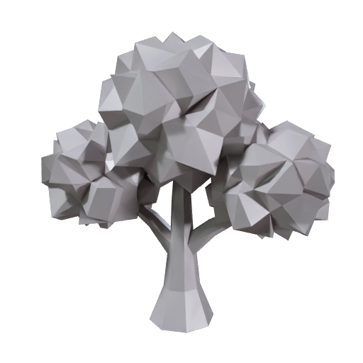
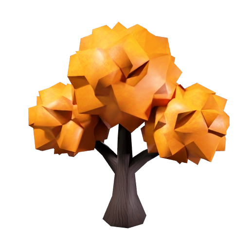
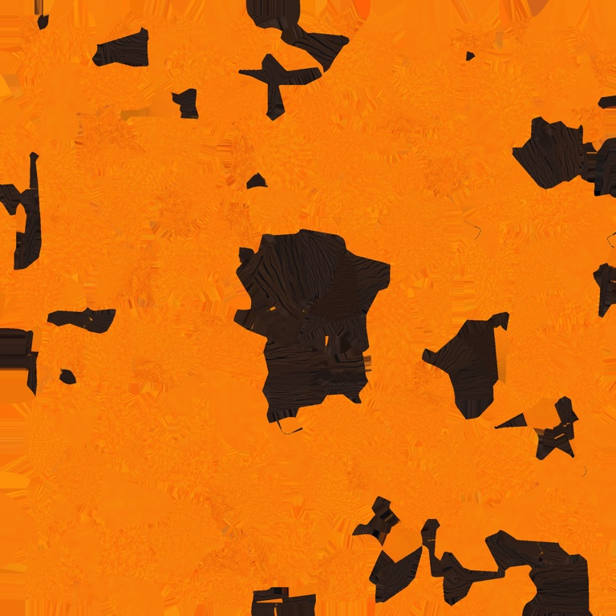
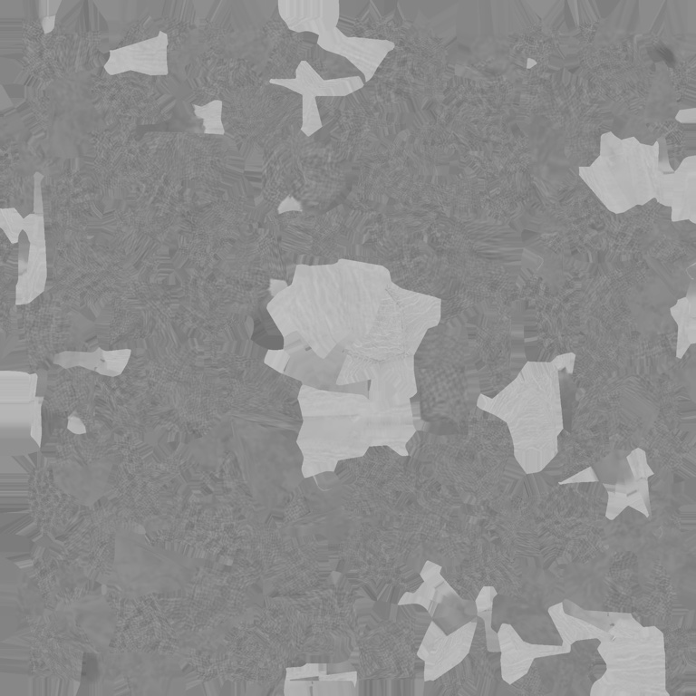
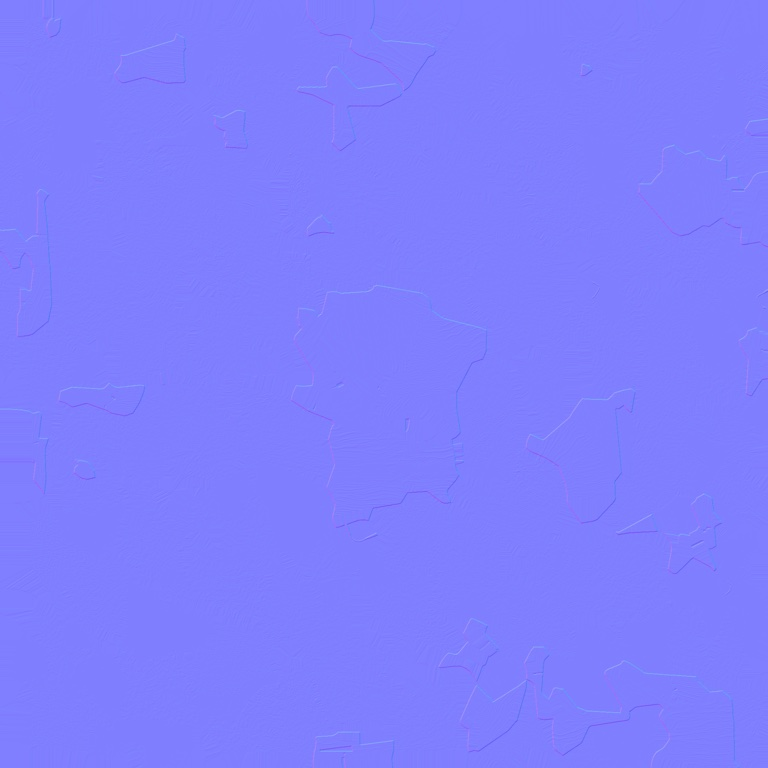

# Restyle a model with a text prompt

Describe the look you want, and Meshy turns the gray low-poly oak into an autumn tree: it keeps the mesh and generates new textures for it. Your coding agent runs the recipe, and this guide explains each step and what to look for.

| Gray oak before | Restyled oak | Base color texture |
|---|---|---|
|  |  |  |

The mesh is the same in both pictures, about 1,000 triangles. Everything that changed is in the textures. [Preview provenance](assets/SOURCES.md).

## What you'll make

The gray low-poly oak from the [low-poly recipe](../02-image-to-low-poly-prop/) comes back with bark, leaves and whatever look you describe. That recipe stops after the mesh, the shape, a surface made of about 1,000 triangles, and leaves it plain gray. This recipe builds the same gray oak again, then asks Meshy to texture it from a short description of the look you want. Textures are the images wrapped onto the mesh that give it color and material detail: Meshy returns a base color texture, the image that gives the mesh its colors, plus PBR maps, short for physically based rendering, three more images that tell a viewer how each part of the surface reflects light.

A GLB is a file that packages the mesh and its textures together, and that is what you get, along with each texture as a separate image you can open.

The mesh does not change. The restyled oak has the same triangles as the gray one, so it stays as light as the gray oak, and the bark grooves and leaf detail come entirely from the textures. That is the reason to texture a low-poly mesh this way: the detail costs no extra triangles.

To get there, you'll:

1. Give your coding agent the recipe and store your Meshy API key. No credits are spent.
2. See how the style prompt is built.
3. Start the run and approve the credit cost.
4. Wait a few seconds while Meshy builds the gray oak.
5. Wait under a minute while Meshy generates the textures from your prompt.
6. Compare the two versions and open the texture maps.

- **Start with:** A short style prompt. The autumn oak prompt shown in Step 2 is included, and so is the oak concept image the mesh is built from.
- **Receive:** A textured 3D model (`restyled-prop.glb`), its four texture maps as PNG images, and two preview images.
- **Allow:** about a minute for generation, plus time for first-time setup.
- **Budget:** about 15 Meshy credits for the default example: 5 to build the gray oak and 10 to texture it.

These are recorded sample costs and timings, not guarantees. Your generated result will vary. [Check current API pricing](https://docs.meshy.ai/en/api/pricing) before you run it.

## Before you start

You need three things. None of them involves writing code.

1. **A Meshy account with API access.** Create an API key in the [Meshy Developer Platform](https://www.meshy.ai/developers/) and [check your credit balance](https://www.meshy.ai/settings/subscription). The default run spends about 15 credits.
2. **A coding agent.** That is an AI assistant such as Claude Code, Codex or Cursor that can open a folder on your computer and run commands for you. It handles installation, runs the recipe, and reports back in plain language.
3. **The example files.** [Download the cookbook files](https://github.com/meshy-dev/meshy-cookbook/archive/refs/heads/main.zip), unzip them, and open the extracted folder in your agent. Or skip the download and ask your agent to clone the [cookbook repository](https://github.com/meshy-dev/meshy-cookbook) for you. Either way, open the folder containing `AGENTS.md`, `examples`, and `shared`, so the agent can see everything it needs.

Optional: install [Blender](https://www.blender.org/download/), which is free, to see the texture maps wired into the material on your own computer. Without it, you can still inspect every result in your Meshy account, as Step 6 explains.

Keep your API key on your computer. The agent will help you create a local settings file named `.env`. Paste your key into that file yourself, never into chat.

Already comfortable running code? Jump to [Run it](#run-it) for the Python and TypeScript commands, and to [How it works](#how-it-works) for the API calls behind each step.

## Step 1: Give your agent the recipe

With the cookbook folder open in your agent, paste this prompt. It sets everything up without spending any credits: the agent fetches the cookbook if it is not there yet, installs what the recipe needs, and helps you store your key in the local settings file.

```text
If the Meshy cookbook folder is not already open, clone https://github.com/meshy-dev/meshy-cookbook and work inside it. Read AGENTS.md and examples/06-text-to-restyled-prop/README.md. Set up everything this recipe needs, using Python unless my project already uses TypeScript. Help me store MESHY_API_KEY in a local .env file without asking me to paste the key into chat. Do not start any generation yet. When setup is done, explain in plain language what the run will do, stage by stage, and how many credits it will cost.
```

Follow the agent's instructions and paste your key into the settings file yourself. This step is done when the agent confirms the key is in place and quotes a cost of about 15 credits.

## Step 2: See how the style prompt is built

The style prompt is the one input you write. Meshy reads it to decide the colors and materials of every part of the mesh, and it follows one pattern: name the object, describe the material of each part, and set the style.

| The prompt says | What it does |
|---|---|
| An oak tree in autumn | Names the object and the season, so the canopy turns orange instead of green. |
| rough dark brown bark with deep vertical grooves on the trunk | Describes the trunk's material. The grooves end up in the normal map, which is why the bark reads as rough on a mesh that has no grooves in it. |
| dense orange and gold leaves on the canopy | Describes the canopy's material and colors. |
| Stylized hand-painted game prop | Sets the style, so the textures come out with flat, clean colors rather than photographic detail. |

The prompt does not have to say where the trunk ends and the canopy begins. Meshy reads that from the shape of the mesh. Keep the prompt under 800 characters. For this walkthrough, keep the included prompt. [Try your own idea](#try-your-own-idea) reuses the same pattern for a different look.

## Step 3: Start the run and approve the cost

Paste this prompt. The agent quotes the cost and waits for your approval before anything is generated.

```text
Run cookbook 06, the restyle recipe, with the included oak and the included autumn style prompt. Tell me the expected credit cost and wait for my approval before generating. While it runs, tell me when each stage finishes. When everything is done, show me where the files were saved.
```

Expect a quote of about 5 credits to build the gray oak and 10 to texture it. Once you approve, the recipe runs both stages back to back and the agent reports progress. The whole run takes about a minute, so keep the terminal open and read ahead to see what is happening.

## Step 4: Meshy builds the gray oak

This stage takes a few seconds. It is the same request the [low-poly recipe](../02-image-to-low-poly-prop/) makes: Meshy reads the oak concept image and uses Smart Topology, which builds the mesh directly at a chosen face count, to produce a mesh of about 1,000 triangles with no texture. The recipe repeats this stage instead of reusing an old result because Meshy keeps a finished result for three days, and the texturing stage needs a model that is still there.

| The gray oak, exactly as it comes back from the first stage |
|---|
|  |

As soon as this stage finishes, the recipe saves this preview as `low-poly-prop-thumbnail.png` in the output folder. The gray surface is expected: with texturing off, the mesh has no texture and no UV layout yet. A UV layout is the map that says which spot on a texture image lands on which triangle of the mesh, and the next stage creates one.

## Step 5: Meshy generates the textures from your prompt

This stage takes under a minute. Meshy takes the gray oak it just built, which never leaves Meshy between the two stages, and:

1. **Unwraps the mesh.** It creates the UV layout by cutting the surface into flat pieces and arranging them on one square image, so every triangle has its own patch of texture. The base color texture pictured at the top of this page is that square, with the trunk's dark pieces scattered among the orange canopy pieces.
2. **Generates the base color texture.** From your prompt, it fills each piece with the colors of the part it belongs to: orange and gold for the canopy, dark brown for the bark.
3. **Generates the PBR maps.** The recipe asks for them, and they are three more images in the same layout. A metallic map marks which parts are metal, and for a tree it comes back almost entirely black. A roughness map marks which parts are polished or matte, and for bark and leaves it is mostly light. A normal map makes the surface shade as if it had fine bumps and dents, without adding any geometry, and this is where the bark grooves live.

| The restyled oak. The mesh is unchanged; the color, the grooves and the leaf detail are all in the textures |
|---|
|  |

One limit to know: the restyled model comes back 2 meters on its longest side, twice the size of the gray oak, so set the scale in your 3D tool before placing it in a scene.

## Step 6: Compare the two versions and open the texture maps

When the agent reports that everything is done, the output folder inside the recipe's `python` or `typescript` folder holds seven files:

| File | What it is |
|---|---|
| `restyled-prop.glb` | The oak mesh with its base color texture and PBR maps packed inside. Start here. |
| `restyled-prop-thumbnail.png` | A still preview of the restyled oak. |
| `low-poly-prop-thumbnail.png` | The preview of the gray oak from Step 4, for comparison. |
| `base-color.png` | The base color texture: the colors, arranged in the UV layout. |
| `metallic.png` | The metallic map. Almost entirely black, because nothing on a tree is metal. |
| `roughness.png` | The roughness map. Mostly light, because bark and leaves are matte. |
| `normal.png` | The normal map. Mostly one flat blue, with the bark grooves drawn as faint lines. |

You don't need to install anything to take a first look. Open the [API console logs](https://www.meshy.ai/api-console/logs) in your Meshy account: every generation made with your key is listed there, and you can rotate and inspect the restyled oak in the browser, next to the gray one from the first stage. To open the downloaded file instead, open Blender and choose **File → Import → glTF 2.0**, then pick `restyled-prop.glb`. Drag with the middle mouse button to orbit around it, and switch to the Shading workspace to see the texture images wired into the material. Or ask your agent:

```text
Help me look at output/restyled-prop.glb from all sides and compare it with output/low-poly-prop-thumbnail.png. If Blender is installed, open the file there and show me the material with its texture maps. Otherwise suggest a free viewer that opens GLB files and help me open the file in it.
```

| Base color | Metallic | Roughness | Normal |
|---|---|---|---|
|  |  |  |  |

Open the four texture images too. They share one layout, so a dark bark piece in the base color texture sits in the same spot in the other three. Then turn the model and look at the places where two pieces of the layout meet on the mesh: the colors should continue across the edge. A visible seam or a smeared patch is the thing to look for on a restyled model.

What comes next depends on what you want:

- **A different look:** [Try your own idea](#try-your-own-idea) runs the recipe again with a new prompt. Each look is a new paid generation.
- **Color it by hand instead:** the [low-poly recipe](../02-image-to-low-poly-prop/) ends with the other route, a flat material per part in Blender, which needs no texture at all.
- **Textures in one go:** the [character recipe](../01-image-to-3d-character/) generates the mesh and its textures in a single task, for models that do not need a low face count.

## Try your own idea

Write a style prompt following the pattern from [Step 2](#step-2-see-how-the-style-prompt-is-built): name the object, describe the material of each part, and set a style. For example: "A snow-covered oak in winter: bare dark gray bark with frost in the grooves, thick white snow on top of every canopy clump. Stylized hand-painted game prop." Then paste this prompt.

```text
Use cookbook 06 with this style prompt: A snow-covered oak in winter: bare dark gray bark with frost in the grooves, thick white snow on top of every canopy clump. Stylized hand-painted game prop. Archive any previous output before starting. Explain the expected credit cost and wait for my approval before generating.
```

To restyle a different prop, also give the agent a PNG or JPEG that passes the checks in [the low-poly recipe's Step 2](../02-image-to-low-poly-prop/#step-2-check-the-image): one object with a clean outline on a plain background. The recipe builds the mesh from that image first, then textures it from your prompt.

Save a copy of your first result before generating another version. Changing the prompt or the image creates a new paid generation.

## If something goes wrong

- **The key is missing or rejected:** ask your agent to check that the local `.env` file is in the language folder and contains `MESHY_API_KEY`. Do not paste the key into chat.
- **The run cannot start:** check API access and available credits in your Meshy account, and ask the agent to explain the error before retrying.
- **Progress stops or a download fails:** ask your agent to resume the saved run. The recipe records each stage as it finishes, so a gray oak that was already built is not paid for twice. If the agent reports that it cannot tell whether a request went through, have it check Meshy's task history before continuing.
- **The texturing stage fails:** it needs a finished model task that is less than three days old. Ask your agent to read the error message with you. If the oak task has expired, archive the output folder and run again.
- **The result looks different from the example:** each generation can vary. Check the prompt against [Step 2](#step-2-see-how-the-style-prompt-is-built) with your agent before paying for another run.

## Technical details

**Endpoints:** `POST /openapi/v1/image-to-3d` → `GET /openapi/v1/image-to-3d/:id`, then `POST /openapi/v1/retexture` → `GET /openapi/v1/retexture/:id`\
**Languages:** Python 3.10+ · TypeScript (Node 22+)\
**Source:** [Python](python/main.py) · [TypeScript](typescript/main.ts)\
**Last verified run measurements:** September 27, 2026 · [Sample result](sample-result.json)

The retexture endpoint generates new textures for a model Meshy already made, from a text style prompt, a style image or up to four reference views. This recipe builds its input with the same untextured Smart Topology request as the [low-poly recipe](../02-image-to-low-poly-prop/), chains the two tasks with `input_task_id`, and textures the mesh from a text prompt with PBR maps. The model never leaves Meshy between the stages.

## Run it

Complete [Before you start](#before-you-start) to configure API access and your key. Review the estimated budget above before running.

Clone once, then choose one language and run its commands from the repository root:

    git clone https://github.com/meshy-dev/meshy-cookbook.git
    cd meshy-cookbook

**Python**

    cd examples/06-text-to-restyled-prop/python
    python3 -m venv .venv && source .venv/bin/activate
    cp .env.example .env          # paste your key
    pip install -r requirements.txt
    python main.py

**TypeScript**

    cd examples/06-text-to-restyled-prop/typescript
    cp .env.example .env          # paste your key
    npm install
    npm start

You get `output/restyled-prop.glb`, the four texture maps at `output/base-color.png`, `output/metallic.png`, `output/roughness.png` and `output/normal.png`, and two 512 px previews at `output/restyled-prop-thumbnail.png` and `output/low-poly-prop-thumbnail.png`. Open the GLB in Blender with File > Import > glTF 2.0 and switch to the Shading workspace to see the maps in the material.

To use your own style prompt, pass it in quotes. To restyle a different prop, add its image after the prompt:

    python main.py "A snow-covered oak in winter, bare gray bark, white snow on the canopy"
    npm start -- "A snow-covered oak in winter, bare gray bark, white snow on the canopy"
    python main.py "Weathered stone with mossy cracks" my-prop.png
    npm start -- "Weathered stone with mossy cracks" my-prop.png

The prompt can be up to 800 characters.

### Resume an interrupted run

The script saves the prompt, the image path and the task IDs in `output/run.json`. If a poll, download or the texturing stage is interrupted, continue the same run from the same language directory:

    python main.py --resume
    npm start -- --resume

Resume reuses saved tasks and creates only stages that have not started. Starting the retexture stage still costs its estimated 10 credits. If the retexture task is already saved, resume retrieves it directly and reports retexture credits only. Resume before the results expire; the recorded retention period is three days outside Enterprise.

A normal run refuses to start when `output/run.json` already exists. To restyle again, archive the current `output/` directory first. Passing a different prompt or image with `--resume` is rejected.

If execution stops while a create request is in flight, the checkpoint may contain a `creating` marker without its task ID. The script stops rather than risk duplicate charges. Check the Meshy task history for the submitted request; if it exists, put its ID in `model_task_id` or `retexture_task_id` as appropriate and set `creating` to `null` before resuming. If no task was created, clear the marker only after confirming that. The checkpoint contains no API key or signed download URLs.

## How it works

The excerpts below show the API calls from the Python runner. The full [Python](python/main.py) and [TypeScript](typescript/main.ts) sources also checkpoint each stage and skip creation when resuming a saved task.

1. **Build the gray oak.** `client.create` POSTs the oak image to `/openapi/v1/image-to-3d` as a Smart Topology task with a 1,000-face target and no texture, the exact request cookbook 02 makes.

```python
model_id = client.create(
    "image-to-3d",
    {
        "image_url": image_url,
        "model_type": "smart-topology",
        "target_polycount": 1000,
        "should_texture": False,
        "target_formats": ["glb"],
    },
)
```

   The untextured result carries only `POSITION` data: no normals, no UVs, no material. That matters for `enable_original_uv` below.

2. **Wait for the mesh and save its preview.** `client.wait` GETs `/openapi/v1/image-to-3d/:id` until the mesh is ready.

```python
model = client.wait("image-to-3d", model_id, label="model")
client.download(model["thumbnail_url"], output / "low-poly-prop-thumbnail.png")
```

3. **Retexture it from the prompt.** `client.create` POSTs to `/openapi/v1/retexture` with `input_task_id` pointing at the model task, so the mesh never leaves Meshy, plus the style prompt and PBR maps turned on.

```python
retexture_id = client.create(
    "retexture",
    {
        "input_task_id": model_id,
        "text_style_prompt": state["prompt"],
        "enable_original_uv": False,
        "enable_pbr": True,
        "target_formats": ["glb"],
    },
)
```

   `enable_original_uv` is `False` because the gray oak has no UV layout to keep, so Meshy unwraps the mesh itself. Retexturing the same oak task with `True` produced the same 1,262-vertex unwrap, so on this input the value makes no difference. Set it to `True` for a model that already has a layout worth keeping, such as a textured Meshy model.

4. **Download the model, the preview and the texture maps.** The task lists the maps under `texture_urls`, one object per material.

```python
task = client.wait("retexture", retexture_id, label="retexture")
client.download(task["model_urls"]["glb"], output / "restyled-prop.glb")
client.download(task["thumbnail_url"], output / "restyled-prop-thumbnail.png")
textures = task["texture_urls"][0]
client.download(textures["base_color"], output / "base-color.png")
client.download(textures["metallic"], output / "metallic.png")
client.download(textures["roughness"], output / "roughness.png")
client.download(textures["normal"], output / "normal.png")
```

   The GLB packs the same maps as three JPEG images, with metallic and roughness combined into one, which is how glTF stores them.

## What you get

These are measurements of the two recorded sample runs, one per language. The Python run's files are pictured above.

| File | Contents |
|---|---|
| `restyled-prop.glb` | 1,032–1,072 triangles, the same count as the gray oak; 1,262–1,341 vertices after unwrapping; one material with three embedded JPEG images; 7.3–8.6 MB; 2.0 m on the longest side |
| `base-color.png`, `metallic.png`, `roughness.png`, `normal.png` | 2048 × 2048 PNGs of 6.0–6.5 MB, 19 KB, 1.6–1.7 MB and 4.6–5.4 MB |
| `low-poly-prop-thumbnail.png`, `restyled-prop-thumbnail.png` | 512 × 512 previews |

The model stage took about 3 seconds and the retexture stage 42–45 seconds; each language's run finished in 55–57 seconds from start to files on disk. The gray oak comes back 1.0 m on its longest side and the restyled one 2.0 m.

## Parameters worth changing

| Parameter | We use | Why |
|---|---|---|
| [`model_type`](https://docs.meshy.ai/en/api/image-to-3d#create-an-image-to-3d-task) (image-to-3d) | `"smart-topology"` | Builds the mesh directly at the face count, as cookbook 02 does |
| [`target_polycount`](https://docs.meshy.ai/en/api/image-to-3d#create-an-image-to-3d-task) | `1000` | The target face count, from 100 to 15,000 |
| [`should_texture`](https://docs.meshy.ai/en/api/image-to-3d#create-an-image-to-3d-task) | `false` | The retexture stage does the texturing; leaving it off keeps the model stage at 5 credits and a few seconds |
| [`input_task_id`](https://docs.meshy.ai/en/api/retexture#create-a-retexture-task) (retexture) | the image-to-3d task ID | Chains the two tasks inside Meshy. To retexture a GLB you already have, send `model_url` with a public URL or a data URI instead |
| [`text_style_prompt`](https://docs.meshy.ai/en/api/retexture#create-a-retexture-task) | the prompt | Up to 800 characters. Send `image_style_url` with a picture instead to match a reference image, or `multiview_image_urls` with up to four views |
| [`enable_original_uv`](https://docs.meshy.ai/en/api/retexture#create-a-retexture-task) | `false` | The gray oak has no UV layout, so Meshy unwraps one. `true` keeps the layout of a model that has one |
| [`enable_pbr`](https://docs.meshy.ai/en/api/retexture#create-a-retexture-task) | `true` | Adds the metallic, roughness and normal maps. Off, the task returns the base color texture only |
| [`texture_resolution`](https://docs.meshy.ai/en/api/retexture#create-a-retexture-task) | omitted (`2k`) | `4k` costs the same 10 credits; `8k` costs 15 |
| [`target_formats`](https://docs.meshy.ai/en/api/retexture#create-a-retexture-task) | `["glb"]` | Add `"fbx"` for Unity or Unreal, or `"usdz"` for Apple AR Quick Look |

`ai_model` is omitted on both stages, so each follows the API's current default.
