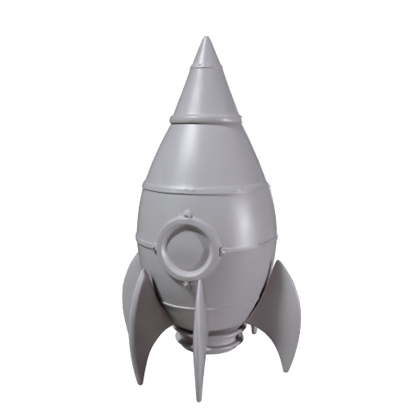

# Generate a 3D model from a description in two stages

Describe a retro toy rocket, and Meshy builds it in two stages: first an untextured preview mesh, then a refine pass that generates its textures. Your coding agent runs the recipe, and this guide explains each step and what to look for.

| Preview mesh | Textured model |
|---|---|
|  |  |

Both pictures are Meshy's own thumbnails of one run: the same mesh before and after the refine stage. [Preview provenance](assets/SOURCES.md).

## What you'll make

The retro toy rocket comes back as a textured model built in two stages, which Meshy bills separately. The preview stage reads your description and builds only the mesh, the shape, a surface made of many small triangles, so you can check the shape before paying for color. The refine stage takes that mesh and generates its textures, the images wrapped onto the mesh that give it color and material detail: a base color texture, the image that gives the mesh its colors, plus PBR maps, short for physically based rendering, three more images that tell a viewer how each part of the surface reflects light. You get a GLB, a file that packages the mesh and its textures together, plus a thumbnail of each stage.

Splitting the work is what makes this recipe useful: the mesh costs 20 credits and the textures 10, and the shape is settled after the first stage. A preview can also be refined a second time with a different texture prompt, for 10 more credits, without rebuilding the mesh. This recipe runs both stages back to back and saves the preview mesh's thumbnail between them.

To get there, you'll:

1. Give your coding agent the recipe and store your Meshy API key. No credits are spent.
2. See how the description is built.
3. Start the run and approve the credit cost.
4. Wait about a minute while Meshy builds the preview mesh.
5. Wait under a minute while Meshy generates the textures.
6. Turn it around and compare it with the description.

- **Start with:** A short description of one object. The retro toy rocket description shown in Step 2 is included.
- **Receive:** A textured 3D model (`textured-prop.glb`) and two thumbnails, one per stage.
- **Allow:** about two minutes for generation, plus time for first-time setup.
- **Budget:** about 30 Meshy credits for the default example: 20 to build the preview mesh and 10 to texture it.

These are recorded sample costs and timings, not guarantees. Your generated result will vary. [Check current API pricing](https://docs.meshy.ai/en/api/pricing) before you run it.

## Before you start

You need three things. None of them involves writing code.

1. **A Meshy account with API access.** Create an API key in the [Meshy Developer Platform](https://www.meshy.ai/developers/) and [check your credit balance](https://www.meshy.ai/settings/subscription). The default run spends about 30 credits.
2. **A coding agent.** That is an AI assistant such as Claude Code, Codex or Cursor that can open a folder on your computer and run commands for you. It handles installation, runs the recipe, and reports back in plain language.
3. **The example files.** [Download the cookbook files](https://github.com/meshy-dev/meshy-cookbook/archive/refs/heads/main.zip), unzip them, and open the extracted folder in your agent. Or skip the download and ask your agent to clone the [cookbook repository](https://github.com/meshy-dev/meshy-cookbook) for you. Either way, open the folder containing `AGENTS.md`, `examples`, and `shared`, so the agent can see everything it needs.

Optional: install [Blender](https://www.blender.org/download/), which is free, to turn the model around on your own computer. Without it, you can still inspect every result in your Meshy account, as Step 6 explains.

Keep your API key on your computer. The agent will help you create a local settings file named `.env`. Paste your key into that file yourself, never into chat.

Already comfortable running code? Jump to [Run it](#run-it) for the Python and TypeScript commands, and to [How it works](#how-it-works) for the API calls behind each step.

## Step 1: Give your agent the recipe

With the cookbook folder open in your agent, paste this prompt. It sets everything up without spending any credits: the agent fetches the cookbook if it is not there yet, installs what the recipe needs, and helps you store your key in the local settings file.

```text
If the Meshy cookbook folder is not already open, clone https://github.com/meshy-dev/meshy-cookbook and work inside it. Read AGENTS.md and examples/07-text-to-3d-prop/README.md. Set up everything this recipe needs, using Python unless my project already uses TypeScript. Help me store MESHY_API_KEY in a local .env file without asking me to paste the key into chat. Do not start any generation yet. When setup is done, explain in plain language what the run will do, stage by stage, and how many credits it will cost.
```

Follow the agent's instructions and paste your key into the settings file yourself. This step is done when the agent confirms the key is in place and quotes a cost of about 30 credits.

## Step 2: See how the description is built

The description is the one input you write, and both stages read it. The preview stage uses the object and its parts to build the shape. The refine stage uses the colors and materials to generate the textures. The included description follows one pattern: name the object, name its parts with their colors and materials, set how it stands, and set the style.

| The description says | What it does |
|---|---|
| A retro toy rocket ship | Names one object. A toy, so the proportions come out rounded and simple. |
| a rounded silver body with a red nose cone, three red tail fins | Names the parts and gives each one a color and a material. The shape comes from the parts, the textures from the colors. |
| a round porthole window on the side | Adds one detail that is easy to find on the finished model. |
| standing upright on its fins | Sets how the rocket stands, so it is built standing up rather than lying on its side. |
| Stylized hand-painted game prop | Sets the style, so the textures come out with clean, flat colors rather than photographic detail. |

Keep the description under 800 characters and describe one object. A scene with several objects or a character in a pose gives a poorer result. For this walkthrough, keep the included description. [Try your own idea](#try-your-own-idea) reuses the same pattern for a different object.

## Step 3: Start the run and approve the cost

Paste this prompt. The agent quotes the cost and waits for your approval before anything is generated.

```text
Run cookbook 07, the text-to-3d recipe, with the included rocket description and the default settings. Tell me the expected credit cost and wait for my approval before generating. While it runs, tell me when each stage finishes. When everything is done, show me where the files were saved.
```

Expect a quote of about 20 credits to build the preview mesh and 10 to texture it. Once you approve, the recipe runs both stages back to back and the agent reports progress. The whole run takes about two minutes, so keep the terminal open and read ahead to see what is happening.

## Step 4: Meshy builds the preview mesh

This stage takes about a minute. Meshy calls the untextured first pass a preview. It reads the description and builds a complete mesh from it: the body, the nose cone, the three fins and the porthole, as one surface of many small triangles. Expect a few hundred thousand triangles. The recipe keeps the mesh at that density; the [simplify recipe](../08-image-to-simplified-prop/) shows how to bring a dense mesh down to a face count you choose afterwards.

| The preview mesh, exactly as it comes back from the first stage: the shape, with no texture |
|---|
|  |

As soon as this stage finishes, the recipe saves this picture as `preview-thumbnail.png` in the output folder. The gray surface is expected: the mesh has no texture yet. This is why the work is split in two: count the fins, find the porthole and look at the nose cone now, because the textures in the next stage cannot fix a missing part.

## Step 5: Meshy generates the textures

This stage takes under a minute. Meshy calls it the refine stage. It takes the preview mesh, which never leaves Meshy between the two stages, and:

1. **Unwraps the mesh.** It creates the UV layout, the map that says which spot on a texture image lands on which triangle of the mesh, by cutting the surface into flat pieces arranged on one square image.
2. **Generates the base color texture.** From the description, it fills each piece with the colors of the part it belongs to: silver for the body, red for the nose cone and fins, a cyan glass for the porthole.
3. **Generates the PBR maps.** The recipe asks for them, and they are three more images in the same layout. A metallic map marks which parts are metal, and for this rocket it is light over the silver body and dark over the red parts and the glass. A roughness map marks which parts are polished or matte. A normal map makes the surface shade as if it had fine bumps and dents, without adding any geometry, and this is where the panel lines and rivets live.

| The textured rocket. The mesh is the preview above; the silver, the red, the rivets and the porthole glass are all in the textures |
|---|
|  |

One limit to know: the recipe does not pause between the two stages, so the refine stage textures whatever preview came back. If the shape is wrong, the fix is a changed description and a new run, not a second refine.

## Step 6: Turn it around and compare it with the description

When the agent reports that everything is done, the output folder inside the recipe's `python` or `typescript` folder holds three files:

| File | What it is |
|---|---|
| `textured-prop.glb` | The rocket mesh with its base color texture and PBR maps packed inside. Start here. |
| `textured-prop-thumbnail.png` | A still preview of the textured rocket. |
| `preview-thumbnail.png` | The preview mesh from Step 4, for comparison. |

You don't need to install anything to take a first look. Open the [API console logs](https://www.meshy.ai/api-console/logs) in your Meshy account: every generation made with your key is listed there, and you can rotate and inspect the textured rocket in the browser, next to its preview. To open the downloaded file instead, open Blender and choose **File → Import → glTF 2.0**, then pick `textured-prop.glb`. Drag with the middle mouse button to orbit around it. Or ask your agent:

```text
Help me look at output/textured-prop.glb from all sides and compare it with output/preview-thumbnail.png. If Blender is installed, open the file there. Otherwise suggest a free viewer that opens GLB files and help me open the file in it.
```

Check the model against the description, one part at a time: three fins, one porthole, a red nose cone, a silver body, standing upright. Then look at the back. The description says nothing about it, so check that the panel lines and the color continue around the body. A part that is missing or doubled is a shape problem from Step 4; a smeared patch or a visible seam where two pieces of the texture layout meet is a texture problem from Step 5.

What comes next depends on what you want:

- **A different object:** [Try your own idea](#try-your-own-idea) runs the recipe again with a new description. Each description is a new paid generation.
- **Fewer triangles:** the [simplify recipe](../08-image-to-simplified-prop/) rebuilds a dense model as a quad mesh at a face count you choose, keeping its textures.
- **Start from a picture instead:** the [character recipe](../01-image-to-3d-character/) builds a model from an image, and the [hero prop recipe](../03-text-to-hero-prop/) generates a concept image from a description first, then builds the model from that image.

## Try your own idea

Write a description following the pattern from [Step 2](#step-2-see-how-the-description-is-built): name one object, name its parts with their colors and materials, set how it stands, and set a style. For example: "A small ceramic teapot: a round pale blue glazed body, a curved spout, a rounded wooden handle, a lid with a knob on top. Stylized hand-painted game prop." Then paste this prompt.

```text
Use cookbook 07 with this description: A small ceramic teapot: a round pale blue glazed body, a curved spout, a rounded wooden handle, a lid with a knob on top. Stylized hand-painted game prop. Archive any previous output before starting. Explain the expected credit cost and wait for my approval before generating.
```

Save a copy of your first result before generating another version. Changing the description creates a new paid generation.

## If something goes wrong

- **The key is missing or rejected:** ask your agent to check that the local `.env` file is in the language folder and contains `MESHY_API_KEY`. Do not paste the key into chat.
- **The run cannot start:** check API access and available credits in your Meshy account, and ask the agent to explain the error before retrying.
- **Progress stops or a download fails:** ask your agent to resume the saved run. The recipe records each stage as it finishes, so a preview mesh that was already built is not paid for twice. If the agent reports that it cannot tell whether a request went through, have it check Meshy's task history before continuing.
- **The refine stage fails:** it needs a preview task that succeeded less than three days ago. Ask your agent to read the error message with you. If the preview has expired, archive the output folder and run again.
- **The result looks different from the example:** each generation can vary. Check the description against [Step 2](#step-2-see-how-the-description-is-built) with your agent before paying for another run.

## Technical details

**Endpoints:** `POST /openapi/v2/text-to-3d` (`mode: "preview"`) → `GET /openapi/v2/text-to-3d/:id`, then `POST /openapi/v2/text-to-3d` (`mode: "refine"`) → `GET /openapi/v2/text-to-3d/:id`\
**Languages:** Python 3.10+ · TypeScript (Node 22+)\
**Source:** [Python](python/main.py) · [TypeScript](typescript/main.ts)\
**Last verified run measurements:** September 27, 2026 · [Sample result](sample-result.json)

Text-to-3d is the one Meshy endpoint served under `/openapi/v2`, and the one that splits a generation into two billed requests on the same path. A preview task builds the untextured mesh from the prompt, and a refine task, given `preview_task_id`, generates the textures for it. This recipe runs both back to back, checkpoints each task ID, and downloads the refined GLB. The [hero prop recipe](../03-text-to-hero-prop/) is the other route from a description: text-to-image first, then image-to-3d from the concept image.

## Run it

Complete [Before you start](#before-you-start) to configure API access and your key. Review the estimated budget above before running.

Clone once, then choose one language and run its commands from the repository root:

    git clone https://github.com/meshy-dev/meshy-cookbook.git
    cd meshy-cookbook

**Python**

    cd examples/07-text-to-3d-prop/python
    python3 -m venv .venv && source .venv/bin/activate
    cp .env.example .env          # paste your key
    pip install -r requirements.txt
    python main.py

**TypeScript**

    cd examples/07-text-to-3d-prop/typescript
    cp .env.example .env          # paste your key
    npm install
    npm start

You get `output/textured-prop.glb` and two 512 px previews at `output/preview-thumbnail.png` and `output/textured-prop-thumbnail.png`. Open the GLB in Blender with File > Import > glTF 2.0.

To use your own description, pass it in quotes:

    python main.py "A small ceramic teapot: a round pale blue glazed body, a curved spout, a rounded wooden handle. Stylized hand-painted game prop."
    npm start -- "A small ceramic teapot: a round pale blue glazed body, a curved spout, a rounded wooden handle. Stylized hand-painted game prop."

The description can be up to 800 characters.

### Resume an interrupted run

The script saves the description and the task IDs in `output/run.json`. If a poll, download or the refine stage is interrupted, continue the same run from the same language directory:

    python main.py --resume
    npm start -- --resume

Resume reuses saved tasks and creates only stages that have not started. Starting the refine stage still costs its 10 credits. If the refine task is already saved, resume retrieves it directly and reports refine credits only. Resume before the results expire; the recorded retention period is three days outside Enterprise.

A normal run refuses to start when `output/run.json` already exists. To generate again, archive the current `output/` directory first. Passing a different description with `--resume` is rejected.

If execution stops while a create request is in flight, the checkpoint may contain a `creating` marker without its task ID. The script stops rather than risk duplicate charges. Check the Meshy task history for the submitted request; if it exists, put its ID in `preview_task_id` or `refine_task_id` as appropriate and set `creating` to `null` before resuming. If no task was created, clear the marker only after confirming that. The checkpoint contains no API key or signed download URLs.

## How it works

The excerpts below show the API calls from the Python runner. The full [Python](python/main.py) and [TypeScript](typescript/main.ts) sources also checkpoint each stage and skip creation when resuming a saved task. The shared client sends `text-to-3d` requests to `/openapi/v2` and every other endpoint to `/openapi/v1`.

1. **Build the preview mesh.** `client.create` POSTs the description to `/openapi/v2/text-to-3d` with `mode` set to `preview`, remeshing off so the dense mesh is kept, and GLB as the only format.

```python
preview_id = client.create(
    "text-to-3d",
    {
        "mode": "preview",
        "prompt": state["prompt"],
        "should_remesh": False,
        "target_formats": ["glb"],
    },
)
```

2. **Wait for the mesh and save its preview.** `client.wait` GETs `/openapi/v2/text-to-3d/:id` until the preview task succeeds.

```python
preview = client.wait("text-to-3d", preview_id, label="preview")
client.download(preview["thumbnail_url"], output / "preview-thumbnail.png")
```

3. **Refine it.** `client.create` POSTs to the same path with `mode` set to `refine` and `preview_task_id` pointing at the preview, so the mesh never leaves Meshy, plus PBR maps turned on.

```python
refine_id = client.create(
    "text-to-3d",
    {
        "mode": "refine",
        "preview_task_id": preview_id,
        "enable_pbr": True,
        "target_formats": ["glb"],
    },
)
```

   The refine task inherits the preview's model and seed.

4. **Download the model and its preview.**

```python
task = client.wait("text-to-3d", refine_id, label="refine")
client.download(task["model_urls"]["glb"], output / "textured-prop.glb")
client.download(task["thumbnail_url"], output / "textured-prop-thumbnail.png")
```

   The refine task also lists the four texture maps under `texture_urls` as 2048 × 2048 PNGs; the GLB packs the same maps as three JPEG images, with metallic and roughness combined into one, which is how glTF stores them.

## What you get

These are measurements of the two recorded sample runs, one per language. The Python run's files are pictured above.

| File | Contents |
|---|---|
| `textured-prop.glb` | 277,978–403,910 triangles; 149,722–216,091 vertices; one material with three embedded JPEG images; 16.9–19.4 MB; 1.90 m tall |
| `preview-thumbnail.png`, `textured-prop-thumbnail.png` | 512 × 512 previews |

The preview stage took 50–61 seconds and the refine stage 40–42 seconds; each language's run finished in 98–105 seconds from start to files on disk. A second refine of the Python run's preview with a `texture_prompt`, made the same day, cost 10 credits, took 58 seconds and returned the same 403,910-triangle mesh with new textures. The task object echoes `mode`, `model_type` (`standard`), the prompt and a `seed` shared by the preview and its refine, but not `ai_model`.

## Parameters worth changing

| Parameter | We use | Why |
|---|---|---|
| [`mode`](https://docs.meshy.ai/en/api/text-to-3d#create-a-text-to-3d-preview-task) | `"preview"`, then `"refine"` | The two billed stages of the endpoint, on the same path |
| [`prompt`](https://docs.meshy.ai/en/api/text-to-3d#create-a-text-to-3d-preview-task) | the description | Up to 800 characters; one object with its parts, colors and style |
| [`should_remesh`](https://docs.meshy.ai/en/api/text-to-3d#create-a-text-to-3d-preview-task) | `false` | Keeps the dense mesh. `true` with `target_polycount` simplifies inside the task; the [simplify recipe](../08-image-to-simplified-prop/) does it as a separate task with quad topology |
| [`geometry_resolution`](https://docs.meshy.ai/en/api/text-to-3d#create-a-text-to-3d-preview-task) | omitted (`standard`) | `2k` or `4k` runs the Ultra geometry pass for 5 more credits; preview only |
| [`pose_mode`](https://docs.meshy.ai/en/api/text-to-3d#create-a-text-to-3d-preview-task) | omitted | `a-pose` or `t-pose` for a character that will be rigged; not needed for a prop |
| [`preview_task_id`](https://docs.meshy.ai/en/api/text-to-3d#create-a-text-to-3d-refine-task) (refine) | the preview task ID | Any preview that succeeded in the last three days. A second refine of the same preview costs 10 credits |
| [`texture_prompt`](https://docs.meshy.ai/en/api/text-to-3d#create-a-text-to-3d-refine-task) | omitted | Up to 800 characters to steer the textures separately from the shape, such as a different paint scheme for the same rocket |
| [`enable_pbr`](https://docs.meshy.ai/en/api/text-to-3d#create-a-text-to-3d-refine-task) | `true` | Adds the metallic, roughness and normal maps. Off, the refine returns the base color texture only |
| [`texture_resolution`](https://docs.meshy.ai/en/api/text-to-3d#create-a-text-to-3d-refine-task) | omitted (`2k`) | `4k` costs the same 10 credits; `8k` costs 15 |
| [`target_formats`](https://docs.meshy.ai/en/api/text-to-3d#create-a-text-to-3d-preview-task) | `["glb"]` | Add `"fbx"` for Unity or Unreal, or `"usdz"` for Apple AR Quick Look. Omitted, every format is generated and the task takes longer |

`ai_model` is omitted on both stages: the preview follows the API's current default, and the refine inherits the preview's model.
