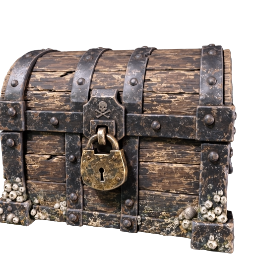
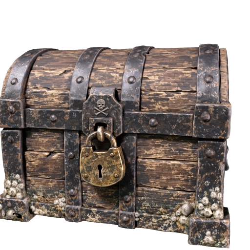
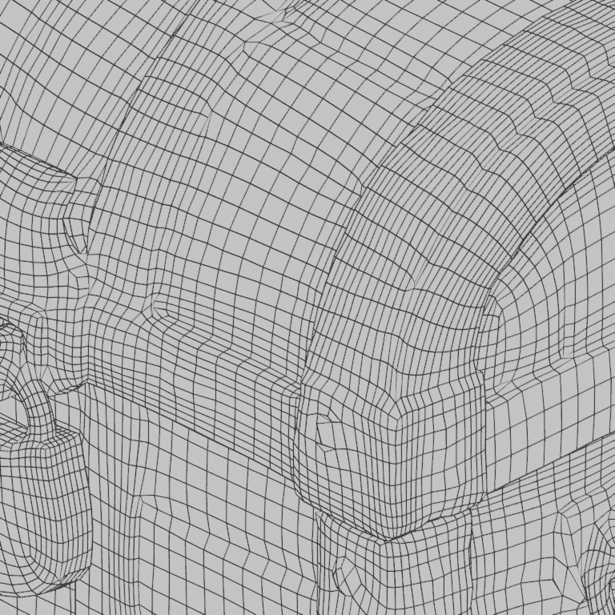
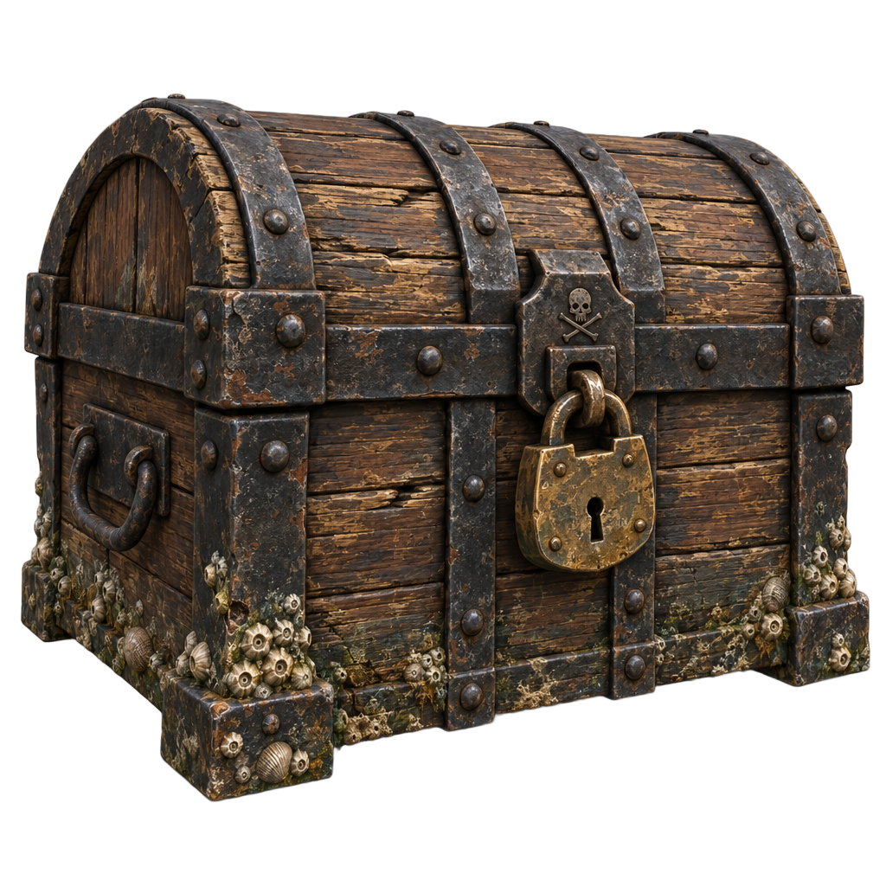
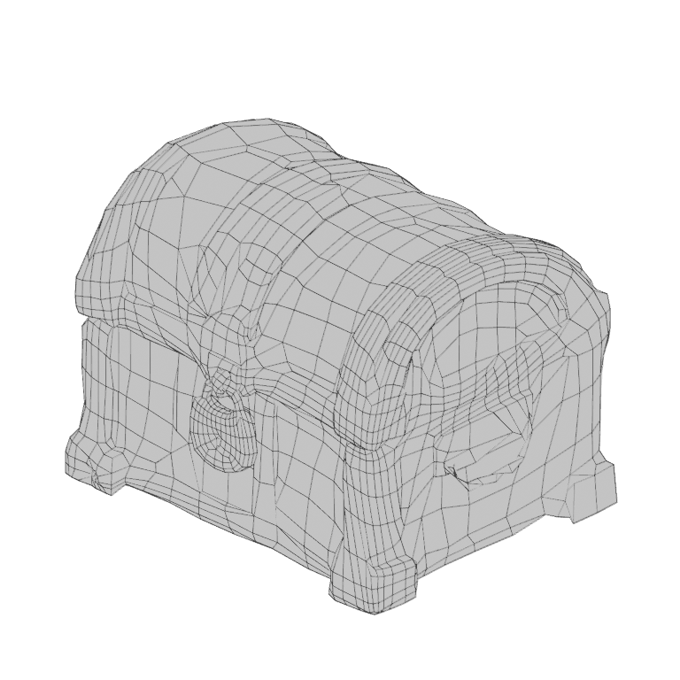
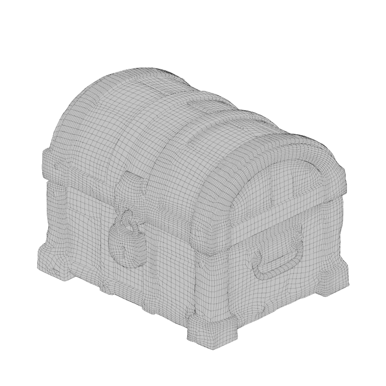
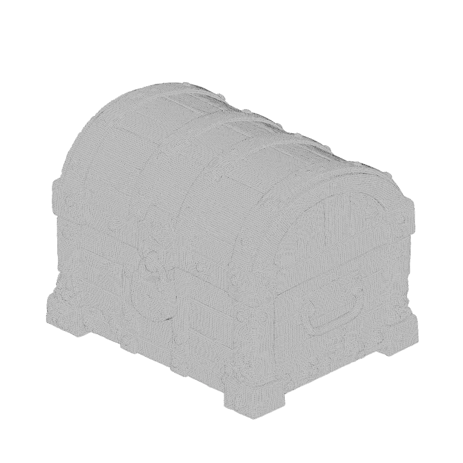

# Simplify a dense model to the face count you choose

Build the sea chest as a dense model of more than a million triangles, then ask Meshy to rebuild it as a clean quad mesh of about 20,000 faces that keeps every texture. Your coding agent runs the recipe, and this guide explains each step and what to look for.

| Dense model | Simplified model | Its quad faces |
|---|---|---|
|  |  |  |

The wireframe is drawn from the actual simplified file: **19,602 faces** from a **20,000-face target**, almost all of them quads. [Preview provenance](assets/SOURCES.md).

## What you'll make

The sea chest comes back twice: as the dense model Meshy builds from the image, and as a clean copy rebuilt at a face count you choose, about 20,000 by default, that looks the same. The mesh is the shape of a model, a surface made of many small flat polygons called faces, and the ones Meshy builds from an image are dense: the chest comes out at more than a million triangles and about 50 MB, which is more than a game or a web page wants to load. The rebuilt copy keeps the textures, the images wrapped onto the mesh that give it color and material detail.

The remesh also chooses the kind of face: this recipe asks for quads, four-sided faces laid out in flowing rows. That layout of faces is called the topology, and 3D artists prefer quads because a quad mesh bends smoothly when it is animated and can be smoothed further without ridges. A triangle mesh is the other option.

You get the simplified chest as a GLB, a file that packages the mesh and its textures together, and as an FBX, the format Unity and Unreal prefer. The FBX keeps the quads. The GLB stores each quad as two triangles, because that is the only face a GLB can hold, so the same mesh counts as about 39,000 triangles there. You also keep the dense model from the first stage, so you can compare the two.

To get there, you'll:

1. Give your coding agent the recipe and store your Meshy API key. No credits are spent.
2. Check that the image shows one object with a clean outline.
3. Choose how many faces the simplified mesh should have.
4. Start the run and approve the credit cost.
5. Wait about two minutes while Meshy builds the dense model.
6. Wait about two minutes while Meshy rebuilds the mesh at the count you chose.
7. Compare the two versions and look at the quads.

- **Start with:** One PNG or JPEG image, plus a face count for the simplified mesh. The sea chest shown above is included.
- **Receive:** The simplified chest (`simplified-prop.glb` and `simplified-prop.fbx`), the dense chest (`dense-prop.glb`) and a preview image of each.
- **Allow:** about four minutes for generation, plus time for first-time setup.
- **Budget:** about 35 Meshy credits for the default example: 30 to build the dense model and 5 to simplify it.

These are recorded sample costs and timings, not guarantees. Your generated result will vary. [Check current API pricing](https://docs.meshy.ai/en/api/pricing) before you run it.

## Before you start

You need three things. None of them involves writing code.

1. **A Meshy account with API access.** Create an API key in the [Meshy Developer Platform](https://www.meshy.ai/developers/) and [check your credit balance](https://www.meshy.ai/settings/subscription). The default run spends about 35 credits.
2. **A coding agent.** That is an AI assistant such as Claude Code, Codex or Cursor that can open a folder on your computer and run commands for you. It handles installation, runs the recipe, and reports back in plain language.
3. **The example files.** [Download the cookbook files](https://github.com/meshy-dev/meshy-cookbook/archive/refs/heads/main.zip), unzip them, and open the extracted folder in your agent. Or skip the download and ask your agent to clone the [cookbook repository](https://github.com/meshy-dev/meshy-cookbook) for you. Either way, open the folder containing `AGENTS.md`, `examples`, and `shared`, so the agent can see everything it needs.

Optional: install [Blender](https://www.blender.org/download/), which is free, to see the quads on your own computer. Without it, you can still inspect every result in your Meshy account, as Step 7 explains.

Keep your API key on your computer. The agent will help you create a local settings file named `.env`. Paste your key into that file yourself, never into chat.

Already comfortable running code? Jump to [Run it](#run-it) for the Python and TypeScript commands, and to [How it works](#how-it-works) for the API calls behind each step.

## Step 1: Give your agent the recipe

With the cookbook folder open in your agent, paste this prompt. It sets everything up without spending any credits: the agent fetches the cookbook if it is not there yet, installs what the recipe needs, and helps you store your key in the local settings file.

```text
If the Meshy cookbook folder is not already open, clone https://github.com/meshy-dev/meshy-cookbook and work inside it. Read AGENTS.md and examples/08-image-to-simplified-prop/README.md. Set up everything this recipe needs, using Python unless my project already uses TypeScript. Help me store MESHY_API_KEY in a local .env file without asking me to paste the key into chat. Do not start any generation yet. When setup is done, explain in plain language what the run will do, stage by stage, and how many credits it will cost.
```

Follow the agent's instructions and paste your key into the settings file yourself. This step is done when the agent confirms the key is in place and quotes a cost of about 35 credits.

## Step 2: Check the image

The first stage is the same request the [character recipe](../01-image-to-3d-character/) makes: Meshy reads one image and builds a complete, textured model from it. The image decides the shape and the colors of the dense model, and the simplified model inherits both.

| The included sea chest: one object, a clean outline, nothing behind it |
|---|
|  |

A good input shows:

- one object, with the whole thing in frame
- a front or three-quarter view, so Meshy sees two sides
- a clean outline against a plain or transparent background

A photo with clutter behind the object, or a scene with several objects, gives a poorer dense model, and the simplified one can only be as good as that. For this walkthrough, keep the included image. [Try your own idea](#try-your-own-idea) covers your own object once you have seen a full run.

## Step 3: Choose a face count

The face count is the one setting in this recipe. You ask for a number of faces between 100 and 300,000, and Meshy rebuilds the mesh close to that number. Here is what the chest looks like at four targets, drawn from real results:

| 2,000 faces | 5,000 faces | 20,000 faces | 100,000 faces |
|---|---|---|---|
|  |  |  |  |

| You ask for | You get | What it looks like |
|---|---|---|
| 2,000 | 2,262 faces | The silhouette holds and the padlock is a few dozen quads. The barnacles become lumps. |
| 5,000 | 6,198 faces | The strap edges and the rivets have their own rows of quads. |
| 20,000 | 19,602–20,001 faces | Every detail of the dense model has clean quads of its own. This is the default, pictured above. |
| 100,000 | 98,299 faces | Close to the dense model in shape. The wireframe is nearly solid at this size. |

The number you ask for is a target, not an exact count. Meshy lays a new surface of quads over the dense shape, and how many faces that takes depends on how complex the shape is: every strap edge, rivet and opening such as the padlock's ring needs enough faces to keep its form. That minimum is why the small targets come back above the number, while the large ones land within a few percent of it. A handful of triangles appear where rows of quads meet.

With the textures on, the four versions look almost the same in a still picture, because the textures were generated from the dense model and carry the plank grain, the rust and the barnacle detail whatever the face count is. The count shows at the silhouette, where a low count makes curved edges polygonal, and up close. Pick it by asking where the prop will be seen: a chest in the background of a scene can take 2,000, one the player opens deserves 20,000 or more. For the first run, keep the default of 20,000.

## Step 4: Start the run and approve the cost

Paste this prompt. The agent quotes the cost and waits for your approval before anything is generated.

```text
Run cookbook 08, the simplify recipe, with the included sea chest and the default 20,000-face target. Tell me the expected credit cost and wait for my approval before generating. While it runs, tell me when each stage finishes. When everything is done, show me where the files were saved.
```

Expect a quote of about 30 credits to build the dense model and 5 to simplify it. Once you approve, the recipe runs both stages back to back and the agent reports progress. The whole run takes about four minutes, so keep the terminal open and read ahead to see what is happening.

## Step 5: Meshy builds the dense model

This stage takes about two minutes. Meshy reads the sea chest image and builds a complete mesh from it, then generates its textures: a base color texture, the image that gives the mesh its colors, plus PBR maps, short for physically based rendering, three more images that tell a viewer how each part of the surface reflects light. Expect more than a million triangles and a file of about 45 to 50 MB.

| The dense chest, exactly as it comes back from the first stage |
|---|
|  |

As soon as this stage finishes, the recipe saves the model as `dense-prop.glb` and this picture as `dense-prop-thumbnail.png`. The recipe keeps the dense file on purpose: it is the version to compare against, and it is the version to simplify again later at a different count.

## Step 6: Meshy rebuilds the mesh at the count you chose

This stage takes about two minutes. Meshy takes the dense chest it just built, which never leaves Meshy between the two stages, and:

1. **Rebuilds the mesh.** It lays a new surface of about 20,000 quads over the dense shape, following its curves and edges, so the straps, the padlock and the planks each get rows of faces of their own.
2. **Unwraps the new mesh.** It creates a UV layout, the map that says which spot on a texture image lands on which face of the mesh.
3. **Re-bakes the textures.** It transfers the base color texture and the PBR maps from the dense model onto the new layout, so the simplified chest keeps its colors, its rust and its surface detail.

| The simplified chest. About 20,000 quads instead of 1.3 million triangles, with the same textures |
|---|
|  |

One limit to know: the simplified GLB is still about 21 MB, because the remesh writes its three re-baked texture images as PNG and they make up almost all of the file. The mesh itself shrinks from about 38 MB of geometry to about 1 MB.

## Step 7: Compare the two versions and look at the quads

When the agent reports that everything is done, the output folder inside the recipe's `python` or `typescript` folder holds five files:

| File | What it is |
|---|---|
| `simplified-prop.glb` | The simplified chest with its textures packed inside, each quad stored as two triangles. Start here. |
| `simplified-prop.fbx` | The same mesh with its quads intact, for Unity, Unreal or Blender. |
| `simplified-prop-thumbnail.png` | A still preview of the simplified chest. |
| `dense-prop.glb` | The dense chest from Step 5, for comparison. |
| `dense-prop-thumbnail.png` | A still preview of the dense chest. |

You don't need to install anything to take a first look. Open the [API console logs](https://www.meshy.ai/api-console/logs) in your Meshy account: every generation made with your key is listed there, and you can rotate and inspect the simplified chest in the browser, next to the dense one. To see the quads on your own computer, open Blender and choose **File → Import → FBX**, then pick `simplified-prop.fbx`. Press Z and choose Wireframe, and every edge appears. Or ask your agent:

```text
Help me open output/simplified-prop.fbx and view it as a wireframe so I can see the quads, then open output/dense-prop.glb next to it. Use Blender if it is installed. Otherwise suggest a free viewer that opens FBX or GLB files and help me open the file in it.
```

| A close look at the front of the simplified chest, drawn from the actual FBX: rows of quads following the straps and the padlock |
|---|
|  |

Turn the simplified chest and look at its outline against the dense one: the lid's curve, the strap edges and the padlock's ring. Then look at the quads. Rows that follow a strap or wrap around the padlock are what a clean remesh looks like. A row that stretches across an edge, or a texture that slides off a rivet, is the thing to look for on a simplified model. If the outline lost detail you need, go back to Step 3 and ask for more faces; if the detail is wasted at the size you plan to show it, ask for fewer. Each new count costs 5 credits, and the dense model does not need to be built again, as [Run it](#run-it) explains.

What comes next depends on what you want:

- **A different count:** [Try your own idea](#try-your-own-idea) runs the recipe again with your own number.
- **Fewer faces from the start:** the [low-poly recipe](../02-image-to-low-poly-prop/) builds a mesh directly at a small face count instead of building a dense one and simplifying it, at 5 credits and in seconds, without textures.
- **A rig or animation:** the [rigged character recipe](../05-image-to-rigged-character/) simplifies inside the model task, because the rigger needs a mesh under 300,000 faces.

## Try your own idea

Choose a PNG or JPEG that passes the checks in [Step 2](#step-2-check-the-image): one object with a clean outline on a plain background. Attach it to your agent or tell it where the file is, then paste this prompt. Start with 20,000 faces, then try a lower count for a lighter mesh or a higher one for more detail. The supported range is 100 to 300,000.

```text
Use my image for cookbook 08 with a target of 20,000 faces. Archive any previous output first. Check the image and tell me about anything that could give a poor result before spending credits. Explain the expected credit cost and wait for my approval before starting a new generation.
```

Save a copy of your first result before generating another version. Changing the image or the count creates a new paid generation.

## If something goes wrong

- **The key is missing or rejected:** ask your agent to check that the local `.env` file is in the language folder and contains `MESHY_API_KEY`. Do not paste the key into chat.
- **The run cannot start:** check API access and available credits in your Meshy account, and ask the agent to explain the error before retrying.
- **Progress stops or a download fails:** ask your agent to resume the saved run. The recipe records each stage as it finishes, so a dense model that was already built is not paid for twice. If the agent reports that it cannot tell whether a request went through, have it check Meshy's task history before continuing.
- **The simplify stage fails:** it needs a finished model task that is less than three days old. Ask your agent to read the error message with you. If the model task has expired, archive the output folder and run again.
- **The result looks different from the example:** each generation can vary, and the dense model varies most. Check the image against [Step 2](#step-2-check-the-image) with your agent before paying for another run.

## Technical details

**Endpoints:** `POST /openapi/v1/image-to-3d` → `GET /openapi/v1/image-to-3d/:id`, then `POST /openapi/v1/remesh` → `GET /openapi/v1/remesh/:id`\
**Languages:** Python 3.10+ · TypeScript (Node 22+)\
**Source:** [Python](python/main.py) · [TypeScript](typescript/main.ts)\
**Last verified run measurements:** September 27, 2026 · [Sample result](sample-result.json)

The remesh endpoint rebuilds the mesh of a model Meshy already made, at a target polygon count and in quad or triangle topology, re-bakes its textures onto the new mesh, and exports it in the formats you ask for. This recipe builds its input with the same textured image-to-3d request as the [character recipe](../01-image-to-3d-character/), chains the two tasks with `input_task_id`, and downloads the dense GLB as well as the simplified GLB and FBX. The model never leaves Meshy between the stages.

## Run it

Complete [Before you start](#before-you-start) to configure API access and your key. Review the estimated budget above before running.

Clone once, then choose one language and run its commands from the repository root:

    git clone https://github.com/meshy-dev/meshy-cookbook.git
    cd meshy-cookbook

**Python**

    cd examples/08-image-to-simplified-prop/python
    python3 -m venv .venv && source .venv/bin/activate
    cp .env.example .env          # paste your key
    pip install -r requirements.txt
    python main.py

**TypeScript**

    cd examples/08-image-to-simplified-prop/typescript
    cp .env.example .env          # paste your key
    npm install
    npm start

You get `output/simplified-prop.glb`, `output/simplified-prop.fbx`, `output/dense-prop.glb` and two 512 px previews at `output/simplified-prop-thumbnail.png` and `output/dense-prop-thumbnail.png`. Open the FBX in Blender with File > Import > FBX to see the quads.

To use your own image, pass it as the first argument. To change the face count, add the number after the image:

    python main.py my-prop.png
    npm start -- my-prop.png
    python main.py my-prop.png 5000
    npm start -- my-prop.png 5000

The count must be an integer from 100 to 300,000.

### Resume an interrupted run

The script saves the image path, the face count and the task IDs in `output/run.json`. If a poll, download or the remesh stage is interrupted, continue the same run from the same language directory:

    python main.py --resume
    npm start -- --resume

Resume reuses saved tasks and creates only stages that have not started. Starting the remesh stage still costs its 5 credits. If the remesh task is already saved, resume retrieves it directly and reports remesh credits only. Resume before the results expire; the recorded retention period is three days outside Enterprise.

A normal run refuses to start when `output/run.json` already exists. To simplify again, archive the current `output/` directory first. Passing a different image or count with `--resume` is rejected.

To simplify the same dense model at another count without building it again:

1. Archive the current `output/` folder.
2. Copy its `run.json` into a new, empty `output/` folder. In the copy, keep `model_task_id`, set `remesh_task_id` to `null`, and set `polycount` to the new count.
3. Run with `--resume`.

Resume then downloads the dense files again and creates only the new remesh task, which costs 5 credits. The saved model task stays valid for three days.

If execution stops while a create request is in flight, the checkpoint may contain a `creating` marker without its task ID. The script stops rather than risk duplicate charges. Check the Meshy task history for the submitted request; if it exists, put its ID in `model_task_id` or `remesh_task_id` as appropriate and set `creating` to `null` before resuming. If no task was created, clear the marker only after confirming that. The checkpoint contains no API key or signed download URLs.

## How it works

The excerpts below show the API calls from the Python runner. The full [Python](python/main.py) and [TypeScript](typescript/main.ts) sources also checkpoint each stage and skip creation when resuming a saved task.

1. **Build the dense model.** `client.create` POSTs the chest image to `/openapi/v1/image-to-3d` as a textured task with PBR maps, the exact request cookbook 01 makes.

```python
model_id = client.create(
    "image-to-3d",
    {
        "image_url": image_url,
        "should_texture": True,
        "enable_pbr": True,
        "target_formats": ["glb"],
    },
)
```

2. **Wait for it and save the dense files.** `client.wait` GETs `/openapi/v1/image-to-3d/:id` until the model is ready.

```python
model = client.wait("image-to-3d", model_id, label="model")
client.download(model["model_urls"]["glb"], output / "dense-prop.glb")
client.download(model["thumbnail_url"], output / "dense-prop-thumbnail.png")
```

3. **Remesh it.** `client.create` POSTs to `/openapi/v1/remesh` with `input_task_id` pointing at the model task, so the model never leaves Meshy, plus the topology, the face count and both output formats.

```python
remesh_id = client.create(
    "remesh",
    {
        "input_task_id": model_id,
        "topology": "quad",
        "target_polycount": state["polycount"],
        "target_formats": ["glb", "fbx"],
    },
)
```

   `target_polycount` counts faces of the chosen topology: 20,000 quads here, which the GLB stores as about 40,000 triangles.

4. **Download the simplified files.** The task lists one URL per requested format under `model_urls`.

```python
task = client.wait("remesh", remesh_id, label="remesh")
client.download(task["model_urls"]["glb"], output / "simplified-prop.glb")
client.download(task["model_urls"]["fbx"], output / "simplified-prop.fbx")
client.download(task["thumbnail_url"], output / "simplified-prop-thumbnail.png")
```

   The remesh task also lists the re-baked maps under `texture_urls`: base color, metallic, roughness, normal and a combined metallic-roughness image.

## What you get

These are measurements of the two recorded sample runs, one per language. The Python run's files are pictured above.

| File | Contents |
|---|---|
| `dense-prop.glb` | 1,158,688–1,329,968 triangles; 615,718–705,150 vertices; one material with three embedded JPEG images; 44.8–50.0 MB; 1.90 m on the longest side |
| `simplified-prop.fbx` | 19,602–20,001 faces, of which 19,579–19,977 are quads and the rest triangles; 16.8–18.0 MB |
| `simplified-prop.glb` | The same mesh as 39,181–39,978 triangles; 28,362–28,947 vertices; one material with three embedded PNG images of about 19.6 MB in total, plus about 1.1 MB of geometry; 20.7–22.3 MB |
| `dense-prop-thumbnail.png`, `simplified-prop-thumbnail.png` | 512 × 512 previews |

The model stage took 108–109 seconds and the remesh stage 133–139 seconds; each language's run finished in 249–257 seconds from start to files on disk.

## Compare face counts

These are sample measurements of five remeshes of one dense chest (the Python run's model task, 1,329,968 triangles), one per setting, on September 27, 2026. Face counts come from the FBX files.

| Setting | Faces | Quads | GLB triangles | Remesh time | GLB size |
|---|---|---|---|---|---|
| quad, 2,000 | 2,262 | 2,235 | 4,497 | 128 s | 22.1 MB |
| quad, 5,000 | 6,198 | 6,090 | 12,288 | 129 s | 24.0 MB |
| quad, 20,000 | 19,602 | 19,579 | 39,181 | 133 s | 20.7 MB |
| quad, 100,000 | 98,299 | 95,361 (plus 928 five-sided faces) | 195,516 | 162 s | 27.2 MB |
| triangle, 20,000 | 19,769 | 0 | 19,769 | 114 s | 26.7 MB |

The file size does not follow the count: 19 to 26 MB of every file is the three re-baked PNG texture images, and the geometry is 0.1 to 6 MB of it. The quad results came back 13 percent above the 2,000 target and 24 percent above 5,000, and within 2 percent of 20,000 and 100,000; the triangle result was within 2 percent.

## Parameters worth changing

| Parameter | We use | Why |
|---|---|---|
| [`should_texture`](https://docs.meshy.ai/en/api/image-to-3d#create-an-image-to-3d-task) (image-to-3d) | `true` | The remesh re-bakes whatever textures the model has. Set it to `false` for a 20-credit gray mesh |
| [`enable_pbr`](https://docs.meshy.ai/en/api/image-to-3d#create-an-image-to-3d-task) | `true` | The metallic, roughness and normal maps survive the remesh along with the base color |
| [`input_task_id`](https://docs.meshy.ai/en/api/remesh#create-a-remesh-task) (remesh) | the image-to-3d task ID | Any successful image-to-3d, text-to-3d or retexture task from the last three days. To simplify a file you already have, send `model_url` with a public URL or a data URI instead |
| [`topology`](https://docs.meshy.ai/en/api/remesh#create-a-remesh-task) | `"quad"` | Quads for modeling, rigging and subdivision. `"triangle"` gives a decimated triangle mesh with fewer vertices at the same face count |
| [`target_polycount`](https://docs.meshy.ai/en/api/remesh#create-a-remesh-task) | `20000` | The target face count, from 100 to 300,000. Or send `decimation_mode` 1 to 4 instead, from ultra to low, and let Meshy pick the count |
| [`target_formats`](https://docs.meshy.ai/en/api/remesh#create-a-remesh-task) | `["glb", "fbx"]` | Add `"obj"`, `"usdz"`, `"blend"`, `"stl"` or `"3mf"`. Omitted, only GLB is generated |

`ai_model` is omitted on the model stage, so it follows the API's current default; the remesh endpoint has no model selection.
