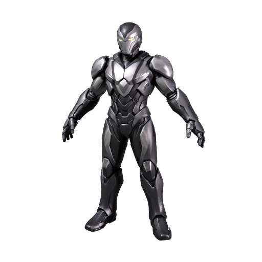
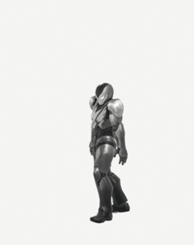
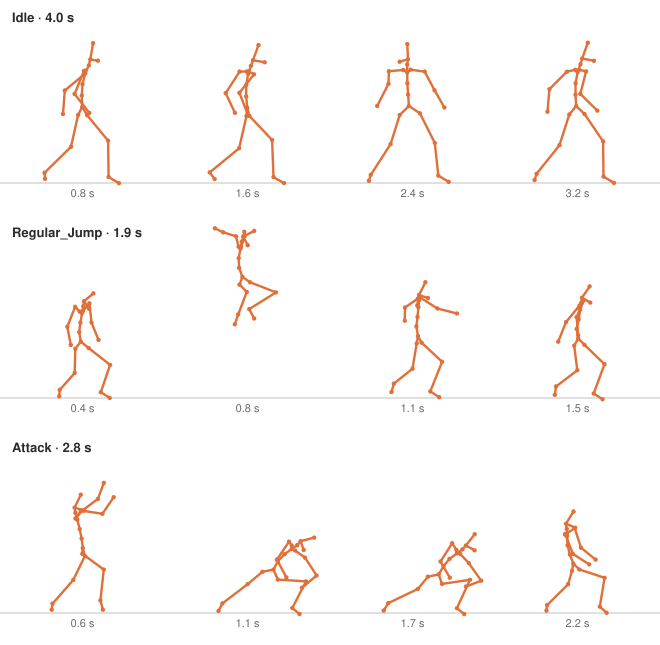
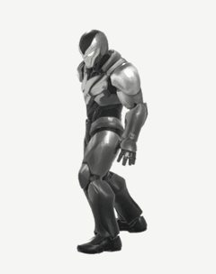
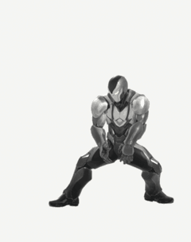

# Animate a 3D character with idle, jump and attack clips

Turn one character image into a rigged 3D character with three animation clips from Meshy's library, an idle, a jump and an attack, packed into one file the way a game engine expects them. Your coding agent runs the recipe, and this guide explains what happens at each step and what to look for.

| Concept art | Generated model | Jump clip |
|---|---|---|
|  |  |  |

The jump plays from a real result, rendered in Blender: **three clips** in one file, 4.0, 1.9 and 2.8 seconds long. [Preview provenance](assets/SOURCES.md).

## What you'll make

The armored character comes back rigged and animated: one file with an idle, a jump and an attack, three ready-made clips from Meshy's animation library. To move, a character needs a rig: a skeleton of joints inside the mesh, the shape made of triangles, each joint moving the part of the mesh around it, plus skin weights, which tell every corner point of the mesh which joints move it and by how much. An animation clip is a short recorded motion: where every joint is at each moment of the clip. Meshy's library holds several hundred of them, called actions, and this recipe applies three to your character.

Each clip keeps its own name inside the file. That is what a game engine's state machine expects: the part of the engine that plays one clip at a time and switches between them, idle while the player waits, jump on one button, attack on another.

To get there, you'll:

1. Give your coding agent the recipe and store your Meshy API key. No credits are spent.
2. Choose the three actions the character will perform.
3. Start the run and approve the credit cost.
4. Wait about three minutes while Meshy builds the model and adds the skeleton.
5. Wait under a minute while Meshy fits the three clips onto the skeleton.
6. Open the result and play each clip.

- **Start with:** One PNG or JPEG of a standing humanoid character, plus the ids of one to ten actions from the animation library. The armored character shown above is included, and the recipe picks Idle, Regular Jump and Attack.
- **Receive:** One animated character in two formats (`animated-character.glb` and `animated-character.fbx`), each holding the three clips, and a preview image.
- **Allow:** about three to four minutes for generation, plus time for first-time setup.
- **Budget:** about 44 Meshy credits for the default example: 30 to build the model, 5 to rig it and 9 for the three clips.

These are recorded sample costs and timings, not guarantees. Your generated result will vary. [Check current API pricing](https://docs.meshy.ai/en/api/pricing) before you run it.

## Before you start

You need three things. None of them involves writing code.

1. **A Meshy account with API access.** Create an API key in the [Meshy Developer Platform](https://www.meshy.ai/developers/) and [check your credit balance](https://www.meshy.ai/settings/subscription). The default run spends about 44 credits.
2. **A coding agent.** That is an AI assistant such as Claude Code, Codex or Cursor that can open a folder on your computer and run commands for you. It handles installation, runs the recipe, and reports back in plain language.
3. **The example files.** [Download the cookbook files](https://github.com/meshy-dev/meshy-cookbook/archive/refs/heads/main.zip), unzip them, and open the extracted folder in your agent. Or skip the download and ask your agent to clone the [cookbook repository](https://github.com/meshy-dev/meshy-cookbook) for you. Either way, open the folder containing `AGENTS.md`, `examples`, and `shared`, so the agent can see everything it needs.

Optional: install [Blender](https://www.blender.org/download/), which is free, to play each clip on your own computer. Without it, you can still inspect every result in your Meshy account, as Step 6 explains.

Keep your API key on your computer. The agent will help you create a local settings file named `.env`. Paste your key into that file yourself, never into chat.

Already comfortable running code? Jump to [Run it](#run-it) for the Python and TypeScript commands, and to [How it works](#how-it-works) for the API calls behind each step.

## Step 1: Give your agent the recipe

With the cookbook folder open in your agent, paste this prompt. It sets everything up without spending any credits: the agent fetches the cookbook if it is not there yet, installs what the recipe needs, and helps you store your key in the local settings file.

```text
If the Meshy cookbook folder is not already open, clone https://github.com/meshy-dev/meshy-cookbook and work inside it. Read AGENTS.md and examples/09-image-to-animated-character/README.md. Set up everything this recipe needs, using Python unless my project already uses TypeScript. Help me store MESHY_API_KEY in a local .env file without asking me to paste the key into chat. Do not start any generation yet. When setup is done, explain in plain language what the run will do, stage by stage, and how many credits it will cost.
```

Follow the agent's instructions and paste your key into the settings file yourself. This step is done when the agent confirms the key is in place and quotes a cost of about 44 credits.

## Step 2: Choose three actions

Meshy's animation library is a catalog of motions recorded for a humanoid skeleton. Each one has a number, its action id, and the recipe names the actions it wants by id. Meshy fits each motion onto your character's own skeleton, whatever its proportions, so the same jump works for a knight, a robot or a child.

The recipe uses three actions that cover what a playable character needs first:

| Action | Library id | Clip in the file | What a game uses it for |
|---|---|---|---|
| Idle | `0` | `Idle`, 4.0 seconds | Standing and shifting weight while the player does nothing |
| Regular Jump | `466` | `Regular_Jump`, 1.9 seconds | Crouch, leave the ground, land |
| Attack | `4` | `Attack`, 2.8 seconds | A step forward and a weapon swing |

Browse the [Animation Library](https://docs.meshy.ai/en/api/animation-library) to see a looping preview of every action, sorted by category: walking and running, body movements, daily actions, fighting and dancing. Or ask your agent to search it. Listing the library is free; only applying an action costs credits.

```text
Without spending any credits, show me what Meshy's animation library offers for cookbook 09. Call GET https://api.meshy.ai/openapi/v1/animations/library with the key from my local .env file, once with search=jump and once with search=attack, and show me the action ids and names it returns as two short tables. Then confirm the three actions the recipe uses by default: Idle (0), Regular Jump (466) and Attack (4).
```

A request takes one to ten actions, each id once, and every action costs 3 credits whether its clip is one second or ten. For this walkthrough, keep the default three. [Try your own idea](#try-your-own-idea) covers choosing other actions once you have seen a full run.

## Step 3: Start the run and approve the cost

Paste this prompt. The agent quotes the cost and waits for your approval before anything is generated.

```text
Run cookbook 09, the animated character recipe, with the included armored character and the default actions. Tell me the expected credit cost and wait for my approval before generating. While it runs, tell me when each stage finishes. When everything is done, show me where the files were saved.
```

Expect a quote of about 30 credits to build the model, 5 to rig it and 9 for the three clips. Once you approve, the recipe runs three stages back to back and the agent reports progress. The whole run takes three to four minutes, so keep the terminal open and read ahead to see what is happening.

## Step 4: Meshy builds and rigs the character

This stage takes about three minutes and repeats the two stages of the [rigged character recipe](../05-image-to-rigged-character/), which explains each of them in detail.

- **Build the model.** About two minutes. Meshy reads the image and builds a complete mesh from it, including the back and sides the picture does not show, then generates its textures: a base color texture plus PBR maps, short for physically based rendering, which tell a viewer how the armor reflects light. The recipe asks for an A-pose, with the arms angled down and away from the body, so the rigger can find shoulders, elbows and hands. It also simplifies the mesh to about 30,000 triangles, the flat polygons a mesh is made of, because the rigger refuses meshes over 300,000.
- **Rig it.** Under a minute. Meshy places a skeleton of 24 joints inside the mesh in a standard humanoid layout, computes the skin weights, and scales the character to 1.8 meters tall so it stands as tall as a person when it lands in a game engine.

| The model before rigging, in its A-pose |
|---|
|  |

As soon as the model is built, the recipe saves this preview as `character-thumbnail.png` in the output folder, and you can open it while the next stages run. Check that the proportions match the drawing and that the arms and legs are distinct from the body: a clear body is what the rigger needs to place the joints, and every clip moves those joints.

One limit to know: the rigged and animated files keep only the base color texture. The PBR maps are not carried into them, so the animated armor loses some of its metal shine.

## Step 5: Meshy fits the three clips onto the skeleton

This stage takes under a minute. Meshy takes the rigged character and, for each action you chose:

1. **Retargets the motion.** The library clip was recorded on a reference skeleton. Meshy transfers it onto your character's 24 joints, so the jump lifts your character's legs and the swing moves your character's arms. Fitting a recorded motion onto a different skeleton is called retargeting.
2. **Adds it to the file as a named clip.** The clips keep the order you listed them in, and each is named after its library key: `Idle`, `Regular_Jump` and `Attack`. A game engine shows those names when you wire the clips into a state machine.

| Four moments of each clip, drawn from a real result |
|---|
|  |

The character comes back in two formats, GLB and FBX, and each file holds the mesh, its base color texture, the skeleton and the three clips. Nothing has to be assembled afterwards.

## Step 6: Play each clip

When the agent reports that everything is done, the output folder inside the recipe's `python` or `typescript` folder holds three files:

| File | What it is |
|---|---|
| `animated-character.glb` | The character with its skeleton and the three clips. Start here. |
| `animated-character.fbx` | The same, in the format Unity and Unreal prefer. |
| `character-thumbnail.png` | The preview from Step 4, before rigging. |

You don't need to install anything to take a first look. Open the [API console logs](https://www.meshy.ai/api-console/logs) in your Meshy account: every generation made with your key is listed there, and you can play the animation in the browser. To play the clips on your own computer, open Blender and choose **File → Import → glTF 2.0**, then pick `animated-character.glb`. Press the space bar to play: the idle clip is active after import. To switch clips, select the Armature, open a Dope Sheet editor, change its mode to Action Editor, and pick `Regular_Jump` or `Attack` from the action list in its header. Or ask your agent:

```text
Help me play the clips in output/animated-character.glb. If Blender is installed, open the file there, play the Idle clip, then switch to the Regular_Jump and Attack clips and play each one. Otherwise suggest a free viewer that plays glTF files with more than one animation clip and help me open the file in it.
```

Watch the elbows, knees and shoulders in each clip. Joints should bend where a person's would, and the armor should travel with the body. Some stretching where armor plates meet is normal for automatic rigging. The jump should leave the ground and land on both feet, and the attack should step forward and swing. This is how the three clips play on the finished character:

| `Idle`, 4.0 seconds | `Regular_Jump`, 1.9 seconds | `Attack`, 2.8 seconds |
|---|---|---|
|  |  |  |

Using Unity or Unreal? Import `animated-character.fbx`. Each clip arrives as its own animation clip, named `Idle`, `Regular_Jump` and `Attack`, so you can drop the three into an Animator Controller in Unity or an Animation Blueprint in Unreal and wire the transitions: idle by default, jump on one input, attack on another. The joints use standard names such as `Hips`, `Spine` and `Head`, so the engine can also map the skeleton as humanoid and play its own animations on your character.

## Try your own idea

Choose actions that pass the checks in [Step 2](#step-2-choose-three-actions): ids from the [Animation Library](https://docs.meshy.ai/en/api/animation-library), one to ten of them, none repeated. Then paste this prompt with the ids you picked; the example below swaps in a second idle, a running jump and a two-hit combo.

```text
Run cookbook 09 again with actions 243, 463 and 92, which are Idle 3, Run and Jump and Double Combo Attack, on the included armored character. Archive any previous output first. Explain the expected credit cost and wait for my approval before starting a new generation.
```

To animate your own character instead, choose a PNG or JPEG that shows one humanoid, standing upright and facing the camera, with arms and legs clear of the body, as the [rigged character recipe](../05-image-to-rigged-character/) describes. Attach it to your agent or tell it where the file is, then paste this prompt.

```text
Use my image for cookbook 09 with the default actions. Archive any previous output first. Check that the image shows one standing humanoid character facing forward, and tell me about anything that could cause rigging problems before spending credits. Explain the expected credit cost and wait for my approval before generating.
```

Save a copy of your first result before generating another version. Every new run builds and rigs the character again before animating it, so a new set of actions costs the full amount, not just the clips.

## If something goes wrong

- **The key is missing or rejected:** ask your agent to check that the local `.env` file is in the language folder and contains `MESHY_API_KEY`. Do not paste the key into chat.
- **The run cannot start:** check API access and available credits in your Meshy account, and ask the agent to explain the error before retrying.
- **Progress stops or a download fails:** ask your agent to resume the saved run. The recipe records each stage as it finishes, so a model that was already built or rigged is not paid for twice. If the agent reports that it cannot tell whether a request went through, have it check Meshy's task history before continuing.
- **Rigging fails:** the rigging stage needs a textured, standing humanoid. Ask your agent to read the error message with you and check the image against the [rigged character recipe](../05-image-to-rigged-character/) before paying for another model.
- **The animation stage fails:** an id that is not in the library is rejected, and the error names it. Check the id in the [Animation Library](https://docs.meshy.ai/en/api/animation-library), then ask your agent to resume the run with the corrected actions. Meshy keeps a rig for three days; after that, animating it needs a new run.
- **A clip looks wrong:** joints in the wrong place trace back to the input image, and a cleaner picture with the limbs further from the body helps more than re-running the same one. A motion that does not suit the character, such as a jump on a long dress, is a reason to pick a different action.

## Technical details

**Endpoints:** `POST /openapi/v1/image-to-3d` → `GET /openapi/v1/image-to-3d/:id`, then `POST /openapi/v1/rigging` → `GET /openapi/v1/rigging/:id`, then `POST /openapi/v1/animations` → `GET /openapi/v1/animations/:id`\
**Languages:** Python 3.10+ · TypeScript (Node 22+)\
**Source:** [Python](python/main.py) · [TypeScript](typescript/main.ts)\
**Last verified run measurements:** September 27, 2026 · [Sample result](sample-result.json)

The animation endpoint applies preset actions from the animation library to a finished rigging task. With `action_ids` it returns one GLB and one FBX that hold every requested action as a separate clip, in the order given, named by the action's library key. This recipe builds the character and its rig exactly as the [rigged character recipe](../05-image-to-rigged-character/) does, then chains the three tasks with `input_task_id` and `rig_task_id`, so no file leaves Meshy between stages. The free `GET /openapi/v1/animations/library` endpoint lists every accepted id with its name, key, category and preview GIF.

## Run it

Complete [Before you start](#before-you-start) to configure API access and your key. Review the estimated budget above before running.

Clone once, then choose one language and run its commands from the repository root:

    git clone https://github.com/meshy-dev/meshy-cookbook.git
    cd meshy-cookbook

**Python**

    cd examples/09-image-to-animated-character/python
    python3 -m venv .venv && source .venv/bin/activate
    cp .env.example .env          # paste your key
    pip install -r requirements.txt
    python main.py

**TypeScript**

    cd examples/09-image-to-animated-character/typescript
    cp .env.example .env          # paste your key
    npm install
    npm start

You get `output/animated-character.glb` and `output/animated-character.fbx`, each with the three clips, and a 512 px preview of the unrigged model at `output/character-thumbnail.png`. Open the GLB in Blender with File > Import > glTF 2.0 and press Space to play the active `Idle` clip; the Action Editor switches to the others.

To choose other actions, pass their library ids. To animate a different character, add its image after the ids:

    python main.py 243 463 92
    npm start -- 243 463 92
    python main.py 243 463 92 my-character.png
    npm start -- 243 463 92 my-character.png

One to ten ids, none repeated, 3 credits each. An image on its own keeps the default actions.

### Resume an interrupted run

The script saves the image path, the action ids and the task IDs in `output/run.json`. If a poll, download or a later stage is interrupted, continue the same run from the same language directory:

    python main.py --resume
    npm start -- --resume

Resume reuses saved tasks and creates only stages that have not started. Starting the rigging stage still costs its 5 credits and the animation stage its 3 credits per action. If the animation task is already saved, resume retrieves it directly and reports animation credits only. Resume before the results expire; the recorded retention period is three days outside Enterprise.

A normal run refuses to start when `output/run.json` already exists. To animate another character, archive the current `output/` directory first. Passing a different image or different action ids with `--resume` is rejected.

To apply a different set of actions to a character you already rigged, edit `output/run.json`: replace `actions` with the new ids and set `animation_task_id` to `null`, then run with `--resume` and no arguments. Only the animation stage is created, for 3 credits per action, as long as the rig task is under three days old.

If execution stops while a create request is in flight, the checkpoint may contain a `creating` marker without its task ID. The script stops rather than risk duplicate charges. Check the Meshy task history for the submitted request; if it exists, put its ID in `model_task_id`, `rig_task_id` or `animation_task_id` as appropriate and set `creating` to `null` before resuming. If no task was created, clear the marker only after confirming that. The checkpoint contains no API key or signed download URLs.

## How it works

The excerpts below show the API calls from the Python runner. The full [Python](python/main.py) and [TypeScript](typescript/main.ts) sources also checkpoint each stage and skip creation when resuming a saved task.

1. **Build a model the rigger can use.** `client.create` POSTs the image to `/openapi/v1/image-to-3d` in an A-pose, remeshed to about 30,000 triangles, with textures, exactly as cookbook 05 does.

```python
model_id = client.create(
    "image-to-3d",
    {
        "image_url": image_url,
        "pose_mode": "a-pose",
        "should_remesh": True,
        "target_polycount": 30000,
        "should_texture": True,
        "enable_pbr": True,
        "target_formats": ["glb"],
    },
)
```

2. **Wait for the model and save its preview.** `client.wait` GETs `/openapi/v1/image-to-3d/:id` until the model is ready.

```python
model = client.wait("image-to-3d", model_id, label="model")
client.download(model["thumbnail_url"], output / "character-thumbnail.png")
```

3. **Rig the model.** `client.create` POSTs to `/openapi/v1/rigging` with `input_task_id` pointing at the model task.

```python
rig_id = client.create(
    "rigging",
    {
        "input_task_id": model_id,
        "height_meters": 1.8,
    },
)
```

4. **Apply the actions.** Once the rig task has succeeded, `client.create` POSTs to `/openapi/v1/animations` with `rig_task_id` and the list of action ids.

```python
rig = client.wait("rigging", rig_id, label="rig")
```

```python
animation_id = client.create(
    "animations",
    {
        "rig_task_id": rig_id,
        "action_ids": state["actions"],
    },
)
```

   `state["actions"]` is `[0, 466, 4]` unless ids were passed on the command line. Three ids cost 9 credits.

5. **Download the animated character.** The animation task keeps its files under `result`; with `action_ids`, `animation_glb_url` and `animation_fbx_url` each point at one merged file.

```python
animation = client.wait("animations", animation_id, label="animation")
result = animation["result"]
client.download(result["animation_glb_url"], output / "animated-character.glb")
client.download(result["animation_fbx_url"], output / "animated-character.fbx")
```

## What you get

These are measurements of the two recorded sample runs, one per language. The Python run's files are pictured above.

| File | Contents |
|---|---|
| `animated-character.glb` | 30,794–30,810 triangles, 32,386–33,975 vertices, 24 joints, one base color texture, three clips, 7.1–7.2 MB |
| `animated-character.fbx` | The same mesh, skeleton and clips as FBX, 7.4–7.5 MB |
| `character-thumbnail.png` | 512 px preview of the model before rigging |

The three clips are named `Idle` (4.0 seconds), `Regular_Jump` (1.9 seconds) and `Attack` (2.8 seconds), in the order of `action_ids`: the names are the library `key` values, so an action called "Regular Jump" in the library becomes a clip called `Regular_Jump`. Blender 5.2 imports the GLB as three actions on the armature, with `Idle` active and one muted NLA track per clip; the FBX carries the same three clips as animation stacks, which Unity and Unreal list as separate clips. The skeleton uses conventional humanoid names such as `Hips`, `LeftUpLeg`, `Spine` and `Head`. The model stage took 125–126 seconds, rigging 38 seconds and the animation stage 27–31 seconds, 205–211 seconds end to end.

## Parameters worth changing

| Parameter | We use | Why |
|---|---|---|
| [`action_ids`](https://docs.meshy.ai/en/api/animation#create-an-animation-task) (animations) | `[0, 466, 4]` | One to ten unique ids from the library, 3 credits each; the clips keep this order. A single `action_id` returns one clip instead, and `motion_task_id` applies a Text to Motion clip |
| [`post_process`](https://docs.meshy.ai/en/api/animation#create-an-animation-task) | omitted | `{"operation_type": "change_fps", "fps": 60}` re-times the merged file (24, 25, 30 or 60), `fbx2usdz` adds a USDZ and `extract_armature` an armature-only FBX |
| [`rig_task_id`](https://docs.meshy.ai/en/api/animation#create-an-animation-task) | the rigging task ID | Must be a succeeded rigging task; Meshy keeps it for three days |
| [`height_meters`](https://docs.meshy.ai/en/api/rigging#create-a-rigging-task) (rigging) | `1.8` | Character height in meters. The API default is 1.7 |
| [`pose_mode`](https://docs.meshy.ai/en/api/image-to-3d#create-an-image-to-3d-task), [`target_polycount`](https://docs.meshy.ai/en/api/image-to-3d#create-an-image-to-3d-task) (image-to-3d) | `"a-pose"`, `30000` | The settings the rigger needs, explained in [cookbook 05](../05-image-to-rigged-character/) |

`ai_model` is omitted, so the model stage uses the API's current default. The rigging and animation endpoints have no model selection.
