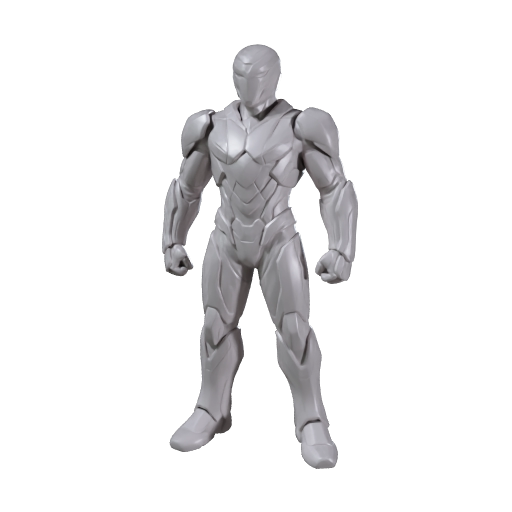
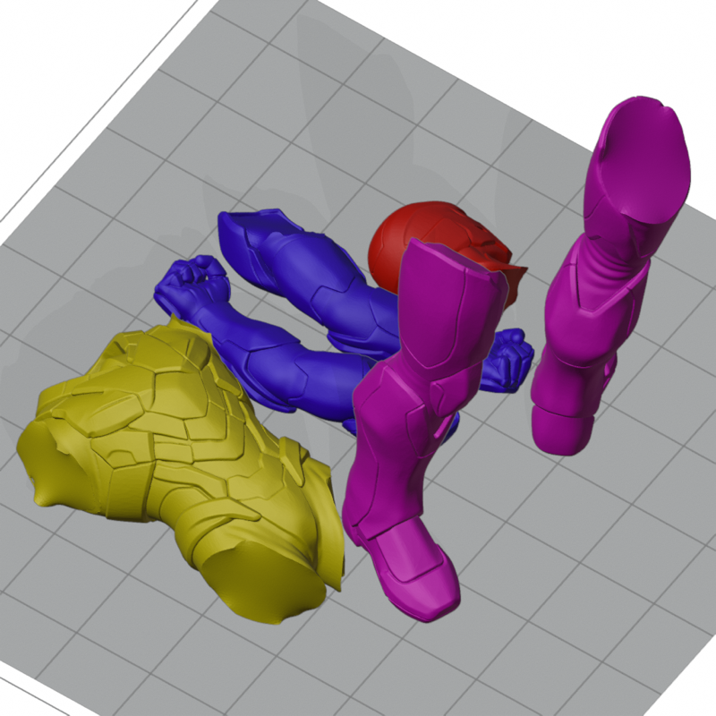

# Turn a character image into 3D-printable parts

Build the armored character as a mesh from one image, check that the mesh is printable, then ask Meshy to cut it into parts that each rest on a flat cut face on the build plate, ready for your slicer. Your coding agent runs the recipe, and this guide explains each step and what to look for.

| Concept art | The mesh | The parts on the build plate |
|---|---|---|
|  |  |  |

The parts picture is drawn from the actual split file: the six parts as they stand on the plate, each in the filament color Meshy assigns to it. [Preview provenance](assets/SOURCES.md).

## What you'll make

The armored character comes back cut into six parts that each stand on a flat cut face, ready to print and glue: the head, the torso, both arms and both legs. A 3D printer prints only the mesh, the shape, a surface made of many small triangles, in whatever filament is loaded, and has no use for textures, the images that give a model its color. So this recipe asks Meshy for the mesh alone, which saves 10 credits, and the split would drop the textures anyway.

This figure does not print well in one piece. The arms stick out and need support material under them, and a figure taller than the printer does not fit at all. Makers cut such a model into parts, print each part resting on a flat face, and glue the parts together. Auto Split does the cutting: Meshy chooses where to cut, rebuilds each part as a solid piece with a flat cut face, thickens any wall a cut left too thin, and stands the parts on the build plate, the flat surface a printer prints on.

You get the parts as a 3MF, a 3D-printing file that holds several objects with their positions on the plate, so a slicer opens every part at once and lets you select each one. A slicer is the program that turns a model into the layer-by-layer instructions a printer follows; Bambu Studio, PrusaSlicer and OrcaSlicer are free. You also get the same parts as a GLB, the file web viewers and Blender open, and a free printability report on the mesh from before the cut.

To get there, you'll:

1. Give your coding agent the recipe and store your Meshy API key. No credits are spent.
2. Check that the image shows one figure with its limbs clear of the body.
3. Start the run and approve the credit cost.
4. Wait under a minute while Meshy builds the mesh.
5. See Meshy check the mesh for printing, at no cost.
6. Wait about two minutes while Meshy cuts the mesh into parts and stands them on the plate.
7. Open the parts in your slicer.

- **Start with:** One PNG or JPEG image. The armored character shown above is included.
- **Receive:** The parts as `printable-parts.3mf` and `printable-parts.glb`, the printability report `printability.json`, and a preview image of the mesh and of the parts.
- **Allow:** about three minutes for generation, plus time for first-time setup.
- **Budget:** about 30 Meshy credits for the default example: 20 to build the mesh and 10 to split it. The printability check is free.

These are recorded sample costs and timings, not guarantees. Your generated result will vary. [Check current API pricing](https://docs.meshy.ai/en/api/pricing) before you run it.

## Before you start

You need three things. None of them involves writing code.

1. **A Meshy account with API access.** Create an API key in the [Meshy Developer Platform](https://www.meshy.ai/developers/) and [check your credit balance](https://www.meshy.ai/settings/subscription). The default run spends about 30 credits.
2. **A coding agent.** That is an AI assistant such as Claude Code, Codex or Cursor that can open a folder on your computer and run commands for you. It handles installation, runs the recipe, and reports back in plain language.
3. **The example files.** [Download the cookbook files](https://github.com/meshy-dev/meshy-cookbook/archive/refs/heads/main.zip), unzip them, and open the extracted folder in your agent. Or skip the download and ask your agent to clone the [cookbook repository](https://github.com/meshy-dev/meshy-cookbook) for you. Either way, open the folder containing `AGENTS.md`, `examples`, and `shared`, so the agent can see everything it needs.

Optional: install [Bambu Studio](https://bambulab.com/en/download/studio) or [PrusaSlicer](https://www.prusa3d.com/page/prusaslicer_424/), which are free, to see the parts on a build plate and print them. Without a slicer, you can still inspect every result in your Meshy account, as Step 7 explains.

Keep your API key on your computer. The agent will help you create a local settings file named `.env`. Paste your key into that file yourself, never into chat.

Already comfortable running code? Jump to [Run it](#run-it) for the Python and TypeScript commands, and to [How it works](#how-it-works) for the API calls behind each step.

## Step 1: Give your agent the recipe

With the cookbook folder open in your agent, paste this prompt. It sets everything up without spending any credits: the agent fetches the cookbook if it is not there yet, installs what the recipe needs, and helps you store your key in the local settings file.

```text
If the Meshy cookbook folder is not already open, clone https://github.com/meshy-dev/meshy-cookbook and work inside it. Read AGENTS.md and examples/10-image-to-printable-parts/README.md. Set up everything this recipe needs, using Python unless my project already uses TypeScript. Help me store MESHY_API_KEY in a local .env file without asking me to paste the key into chat. Do not start any generation yet. When setup is done, explain in plain language what the run will do, stage by stage, and how many credits it will cost.
```

Follow the agent's instructions and paste your key into the settings file yourself. This step is done when the agent confirms the key is in place and quotes a cost of about 30 credits.

## Step 2: Check the image

Meshy builds the whole mesh from a single picture, so the picture decides the shape, including the sides and back it does not show. For printing, the shape is all that matters: the colors in the picture are not used.

| The included concept art: one figure, fully visible, with the arms clear of the body |
|---|
|  |

A good input shows:

- one figure or object, with the whole thing in frame
- a front or three-quarter view, so Meshy sees the main shapes
- limbs, handles or other pieces that stand clear of the body, which gives the split natural places to cut
- a clean outline against a plain background

Busy scenes, several objects, or a figure cropped at the knees give Meshy less to work with, and a shape that is one smooth lump gives the split little to cut. For this walkthrough, keep the included image. [Try your own idea](#try-your-own-idea) covers your own figure or object once you have seen a full run.

## Step 3: Start the run and approve the cost

Paste this prompt. The agent quotes the cost and waits for your approval before anything is generated.

```text
Run cookbook 10, the printable parts recipe, with the included armored character and the default settings. Tell me the expected credit cost and wait for my approval before generating. While it runs, tell me when each stage finishes and what the printability check reported. When everything is done, show me where the files were saved.
```

Expect a quote of about 30 credits: 20 to build the mesh and 10 to split it. Once you approve, the recipe runs three stages back to back and the agent reports progress. The whole run takes two to three minutes, so keep the terminal open and read ahead to see what is happening.

## Step 4: Meshy builds the mesh

This stage takes under a minute. Meshy reads the image and builds a complete mesh from it, including the back and the sides the picture does not show. The recipe asks for the mesh only, so no textures are generated: the mesh comes back gray, and the stage costs 20 credits instead of the 30 the [character recipe](../01-image-to-3d-character/) spends to build the same figure with textures. Expect about a million triangles.

| The untextured mesh, exactly as it comes back from the first stage |
|---|
|  |

As soon as this stage finishes, the recipe saves this picture as `model-thumbnail.png`. Look at the arms, the legs and the head: the pieces you would expect to print separately should already be distinct shapes here, because the split follows the shape it is given.

## Step 5: Meshy checks the mesh for printing

This check takes seconds and costs nothing. Meshy measures the mesh the way a slicer does and reports five things:

| Meshy reports | What it means | What you want to see |
|---|---|---|
| Watertight | The surface is closed, with no gaps, so a slicer can tell inside from outside and fill the model with material | Yes |
| Holes | Openings in the surface | 0 |
| Non-manifold edges | Every edge of a mesh should be shared by exactly two triangles. An edge shared by one, or by three, is a spot a slicer cannot interpret | 0 |
| Degenerate faces | Triangles smaller than a square millimeter at the model's scale. A mesh of a million triangles has hundreds of thousands of them, and a slicer handles them without complaint | A warning, not an error |
| Volume | How much material the solid holds, in the model's own units | More than zero |

The agent reports the result in one line, and the recipe saves the full report as `printability.json`. Expect the mesh to be watertight, with no holes and no non-manifold edges, and expect the report's status to be a warning for about half a million degenerate faces. The check is a confirmation, not a repair: the split runs whatever it reports. For a mesh of your own that reports errors, [If something goes wrong](#if-something-goes-wrong) points at the repair endpoint.

## Step 6: Meshy cuts the mesh into parts

This stage takes about two minutes. Meshy takes the mesh it just built, which never leaves Meshy between the stages, and:

1. **Chooses where to cut.** The recipe leaves the choice to Meshy, which follows the shape: an arm meets the body at the shoulder, so the cut goes there. You can name the parts you want instead, as [Parameters worth changing](#parameters-worth-changing) shows.
2. **Rebuilds each part as a solid.** Every part gets a flat cut face where it was separated, and any wall a cut left too thin is thickened so the part prints solid. Slivers too small to print are removed.
3. **Stands the parts on the plate.** Each part is set down on its cut face and spread out on the build plate: the legs stand on their hip cuts, the head on its neck cut, and the arms and the torso lie on their cut sides. The layout fits a 150 mm square, the same arrangement as the On Plate view in the Meshy web app, so nothing has to be repositioned before slicing.

| The six parts on the build plate, drawn from the actual split file: the legs standing on their hip cuts, the head on its neck cut, the arms and the torso lying on their cut sides |
|---|
|  |

The colors only tell the parts apart. The file carries one flat color per part and none of the textures, so the parts print in whatever filament you load. Expect six parts for the armored character: the head, the torso, both arms and both legs.

One limit to know: the split accepts models Meshy built with Meshy 6 or later. A Smart Topology model, such as the oak from the [low-poly recipe](../02-image-to-low-poly-prop/), is rejected before anything is charged.

## Step 7: Open the parts in your slicer

When the agent reports that everything is done, the output folder inside the recipe's `python` or `typescript` folder holds five files:

| File | What it is |
|---|---|
| `printable-parts.3mf` | The parts, each as its own object, standing on the plate. Open this in your slicer. |
| `printable-parts.glb` | The same parts as a GLB, for the API console or Blender. |
| `printable-parts-thumbnail.png` | The preview of the parts on the plate from Step 6. |
| `printability.json` | The report from Step 5. |
| `model-thumbnail.png` | The preview of the whole mesh from Step 4. |

You don't need to install anything to take a first look. Open the [API console logs](https://www.meshy.ai/api-console/logs) in your Meshy account: every generation made with your key is listed there, and you can rotate the split model in the browser and see the parts in their colors. To lay the parts out for printing, open the 3MF in your slicer. In Bambu Studio, choose **File → Import → Import 3MF/STL/STEP/SVG/OBJ/AMF** and pick `printable-parts.3mf`, or open the file itself: Bambu Studio treats it as a project, with a printer, the plate and one filament per part already set. PrusaSlicer and OrcaSlicer open the same file through their File → Import menu. Blender can open `printable-parts.glb` with **File → Import → glTF 2.0** and lists the parts in the outliner, but a slicer is where the parts are going. Or ask your agent:

```text
Help me open output/printable-parts.3mf in a slicer. If Bambu Studio or PrusaSlicer is installed, open the file there so I can see each part as a separate object. Otherwise help me install one of them, or open output/printable-parts.glb in Blender or a free GLB viewer so I can look at the parts.
```

The split arrives as one object with six parts, one per piece, and each part is assigned its own filament so it shows in its own color. In Bambu Studio, switch the process panel from Global to Objects to see the object and its parts listed; click a part to select it on the plate. Check three things before you print. First, the size: the parts arrive scaled to fit a 150 mm square on the plate, so the legs stand about 130 mm tall. To print larger or smaller, select every part and scale them together, so they stay in proportion. Second, the cut faces: each part should rest on the plate on its flat cut face, with the detailed side up. Third, what still overhangs: an arm lying on its cut face may still have a hand in the air, and the slicer adds supports there when you slice. The six filaments only tell the parts apart, so set every part to the filament you loaded unless your printer holds several. Then slice as you would any model, print, and glue the parts along their cut faces.

What comes next depends on what you want:

- **Pegs to line the parts up:** `connectors` adds a peg and a matching socket at every cut, as [Parameters worth changing](#parameters-worth-changing) explains.
- **Cuts in different places:** name the parts yourself with `mode` set to `by_parts`, also in the parameters table.
- **A figure of your own:** [Try your own idea](#try-your-own-idea).

## Try your own idea

Choose a PNG or JPEG that passes the checks in [Step 2](#step-2-check-the-image): one figure or object, fully in frame, with pieces that stand clear of the body. Attach it to your agent or tell it where the file is, then paste this prompt.

```text
Use my image for cookbook 10 with the default settings. Archive any previous output first. Check the image and tell me about anything that could give a poor mesh or an awkward split before spending credits. Explain the expected credit cost and wait for my approval before starting a new generation.
```

Save a copy of your first result before generating another version. Changing the image or the settings creates a new paid generation.

## If something goes wrong

- **The key is missing or rejected:** ask your agent to check that the local `.env` file is in the language folder and contains `MESHY_API_KEY`. Do not paste the key into chat.
- **The run cannot start:** check API access and available credits in your Meshy account, and ask the agent to explain the error before retrying.
- **Progress stops or a download fails:** ask your agent to resume the saved run. The recipe records each paid stage as it finishes, so a mesh that was already built is not paid for twice, and the free check simply runs again. If the agent reports that it cannot tell whether a request went through, have it check Meshy's task history before continuing.
- **The split stage fails:** it needs a finished mesh task that is less than three days old, built with Meshy 6 or later. Ask your agent to read the error message with you. If the model task has expired, archive the output folder and run again.
- **The check reports holes or non-manifold edges:** the split still runs, and a slicer repairs small problems when it imports a file. For a mesh of your own with real errors, the [repair endpoint](https://docs.meshy.ai/en/api/repair-printability) returns a watertight copy for 10 credits; ask your agent to run it on the model task and split the repaired task instead.
- **The result looks different from the example:** each generation can vary, and the cuts follow the mesh. Check the image against [Step 2](#step-2-check-the-image) with your agent before paying for another run.

## Technical details

**Endpoints:** `POST /openapi/v1/image-to-3d` → `GET /openapi/v1/image-to-3d/:id`, then `POST /openapi/v1/print/analyze` → `GET /openapi/v1/print/analyze/:id`, then `POST /openapi/v1/print/split` → `GET /openapi/v1/print/split/:id`\
**Languages:** Python 3.10+ · TypeScript (Node 22+)\
**Source:** [Python](python/main.py) · [TypeScript](typescript/main.ts)\
**Last verified run measurements:** September 27, 2026 · [Sample result](sample-result.json)

The Auto Split endpoint cuts the model of a finished Meshy task into separately printable parts, reinforces the thin regions its cuts leave, and exports every part as its own object in the formats you ask for, assembled or laid out on the build plate. The Analyze Printability endpoint reports watertightness, volume, holes, non-manifold edges and degenerate faces for a finished task, and consumes no credits. This recipe builds its input with an untextured image-to-3d request, because a split never carries textures into its result, chains the three tasks with `input_task_id`, and downloads the split as 3MF and GLB. The model never leaves Meshy between the stages.

## Run it

Complete [Before you start](#before-you-start) to configure API access and your key. Review the estimated budget above before running.

Clone once, then choose one language and run its commands from the repository root:

    git clone https://github.com/meshy-dev/meshy-cookbook.git
    cd meshy-cookbook

**Python**

    cd examples/10-image-to-printable-parts/python
    python3 -m venv .venv && source .venv/bin/activate
    cp .env.example .env          # paste your key
    pip install -r requirements.txt
    python main.py

**TypeScript**

    cd examples/10-image-to-printable-parts/typescript
    cp .env.example .env          # paste your key
    npm install
    npm start

You get `output/printable-parts.3mf` and `output/printable-parts.glb` with one object per part, the printability report at `output/printability.json`, and two 512 px previews at `output/model-thumbnail.png` and `output/printable-parts-thumbnail.png`. Open the 3MF in Bambu Studio or PrusaSlicer to see the parts on the plate.

To use your own image, pass it as the argument:

    python main.py my-figure.png
    npm start -- my-figure.png

### Resume an interrupted run

The script saves the image path and the paid task IDs in `output/run.json`. If a poll, download or the split stage is interrupted, continue the same run from the same language directory:

    python main.py --resume
    npm start -- --resume

Resume reuses saved tasks and creates only stages that have not started. The printability check is free and is not checkpointed, so a resume that has not reached the split runs it again. Starting the split stage still costs its 10 credits. If the split task is already saved, resume retrieves it directly and reports split credits only. Resume before the results expire; the recorded retention period is three days outside Enterprise.

A normal run refuses to start when `output/run.json` already exists. To split another image, archive the current `output/` directory first. Passing a different image with `--resume` is rejected.

To split the same mesh again with other settings, for example with connectors, without building it again:

1. Archive the current `output/` folder.
2. Copy its `run.json` into a new, empty `output/` folder. In the copy, keep `model_task_id` and set `split_task_id` to `null`.
3. Change the split payload in `main.py` or `main.ts`, then run with `--resume`.

Resume then runs the free check again and creates only the new split task, which costs 10 credits. The saved model task stays valid for three days.

If execution stops while a create request is in flight, the checkpoint may contain a `creating` marker without its task ID. The script stops rather than risk duplicate charges. Check the Meshy task history for the submitted request; if it exists, put its ID in `model_task_id` or `split_task_id` as appropriate and set `creating` to `null` before resuming. If no task was created, clear the marker only after confirming that. The checkpoint contains no API key or signed download URLs.

## How it works

The excerpts below show the API calls from the Python runner. The full [Python](python/main.py) and [TypeScript](typescript/main.ts) sources also checkpoint each paid stage and skip creation when resuming a saved task.

1. **Build the mesh.** `client.create` POSTs the image to `/openapi/v1/image-to-3d` with `should_texture` off, so only the mesh is generated.

```python
model_id = client.create(
    "image-to-3d",
    {
        "image_url": image_url,
        "should_texture": False,
        "target_formats": ["glb"],
    },
)
```

   A textured task is accepted by Auto Split too, but its textures are not carried into the split, so the untextured request saves 10 credits.

2. **Wait for it and save the preview.** `client.wait` GETs `/openapi/v1/image-to-3d/:id` until the mesh is ready.

```python
model = client.wait("image-to-3d", model_id, label="model")
client.download(model["thumbnail_url"], output / "model-thumbnail.png")
```

3. **Check printability.** `client.create` POSTs to `/openapi/v1/print/analyze` with `input_task_id` pointing at the model task. The task is free and finishes in about a second; it is ready at once when Meshy has already analyzed the model.

```python
check_id = client.create("print/analyze", {"input_task_id": model_id})
check = client.wait("print/analyze", check_id, label="check")
printability = check["printability"]
(output / "printability.json").write_text(json.dumps(printability, indent=2) + "\n")
```

   `printability.metrics` holds `is_watertight`, `volume`, `holes`, `non_manifold_edges` and `degenerate_faces`; `status`, `issue_count`, `error_count` and `warning_count` summarize them.

4. **Split it.** `client.create` POSTs to `/openapi/v1/print/split` with `input_task_id`, so the model never leaves Meshy, plus the output formats and the layout.

```python
split_id = client.create(
    "print/split",
    {
        "input_task_id": model_id,
        "target_formats": ["glb", "3mf"],
        "layout": "on_plate",
    },
)
```

   `mode` is omitted, so Meshy chooses the cuts; `connectors` is omitted, so the cut faces are flat.

5. **Download the parts.** The split task lists one URL per requested format under `model_urls`, a preview under `thumbnail_url`, and the number of parts under `part_count`.

```python
task = client.wait("print/split", split_id, label="split")
client.download(task["model_urls"]["3mf"], output / "printable-parts.3mf")
client.download(task["model_urls"]["glb"], output / "printable-parts.glb")
client.download(task["thumbnail_url"], output / "printable-parts-thumbnail.png")
```

## What you get

These are measurements of the two recorded sample runs, one per language. The Python run's files are pictured above.

| File | Contents |
|---|---|
| `printable-parts.3mf` | Six parts (head, torso, two arms, two legs) as one object with one mesh per part, 965,906–1,069,452 triangles in total, in millimeters on a 141–145 × 150 mm footprint with every part resting on the plate; the legs stand 132–140 mm tall. Written as a Bambu Studio project with one filament per part and a Bambu Lab X1 Carbon profile; 12.9–14.3 MB |
| `printable-parts.glb` | The same six parts as six meshes with a flat vertex color each and no materials, at meter scale (1.2–1.3 × 1.2–1.3 × 1.4–1.5 m in the plate layout); 19.3–21.4 MB |
| `printability.json` | `status` warning; `is_watertight` true, 0 holes, 0 non-manifold edges, 510,393–631,467 degenerate faces, `volume` 0.175–0.179 |
| `model-thumbnail.png`, `printable-parts-thumbnail.png` | 512 × 512 previews |

The mesh stage took 31–37 seconds, the check 1 second and the split 95–120 seconds; each language's run finished in 139–173 seconds from start to files on disk. The raw mesh has about 940,000 triangles at meter scale, and none of them has zero area: the `degenerate_faces` count equals the number of triangles smaller than one square millimeter (510,393 of 938,624 in the Python run), so on a dense Meshy mesh the warning is expected. The split preserved the mesh's volume to five decimal places. A Smart Topology task sent to the split endpoint on the same day was rejected with `400 Auto Split does not support Smart Topology (meshy-t2) models` and nothing was charged.

## Parameters worth changing

| Parameter | We use | Why |
|---|---|---|
| [`should_texture`](https://docs.meshy.ai/en/api/image-to-3d#create-an-image-to-3d-task) (image-to-3d) | `false` | A split never carries textures into its result, so the mesh-only request saves 10 credits. Auto Split accepts a textured task as well, since September 16, 2026 |
| [`input_task_id`](https://docs.meshy.ai/en/api/auto-split#create-an-auto-split-task) (print/split) | the image-to-3d task ID | A succeeded image-to-3d, multi-image-to-3d, text-to-3d preview, remesh, convert or resize task built with Meshy 6 or later. Smart Topology models are rejected |
| [`mode`](https://docs.meshy.ai/en/api/auto-split#create-an-auto-split-task) | omitted (`auto`) | `"by_parts"` with a `prompt` such as `"head, torso, arms, legs"` cuts along the 1 to 10 parts you name; `"by_color"` cuts along the color regions of the source image. A prompt Meshy cannot read falls back to `auto` and sets `prompt_ignored` |
| [`layout`](https://docs.meshy.ai/en/api/auto-split#create-an-auto-split-task) | `"on_plate"` | `"assembled"` keeps the parts where the model had them, for a preview of the whole figure |
| [`target_formats`](https://docs.meshy.ai/en/api/auto-split#create-an-auto-split-task) | `["glb", "3mf"]` | `glb` is always produced. `"obj"`, `"fbx"`, `"usdz"` and `"blend"` also keep one object per part; `"stl"` fuses every part into one solid |
| [`connectors`](https://docs.meshy.ai/en/api/auto-split#create-an-auto-split-task) | omitted (`false`) | `true` adds a mortise-and-tenon joint at each cut. `connector_type` is `"cube"` or `"cylinder"`; `connector_size` and `connector_height` are fractions of the cut face from 0.1 to 0.8 |
| [`input_task_id`](https://docs.meshy.ai/en/api/analyze-printability#create-an-analyze-printability-task) (print/analyze) | the image-to-3d task ID | Or `model_url` with a public URL or data URI of a GLB, glTF, OBJ, FBX or STL up to 100 MB, to check a file you already have. The docs list generation, remesh and retexture tasks; a split task's ID was accepted too on September 27, 2026, and reported the same metrics as the model |

`ai_model` is omitted on the model stage, so it follows the API's current default; the printability and Auto Split endpoints have no model selection.
