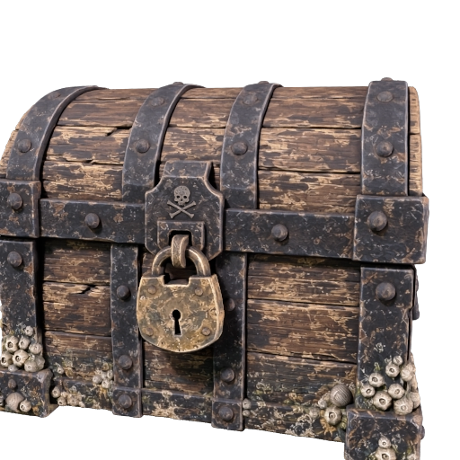
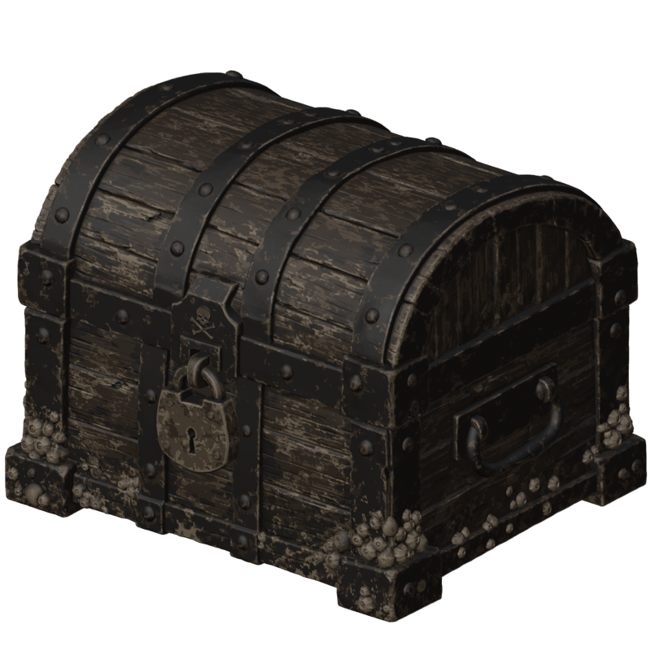
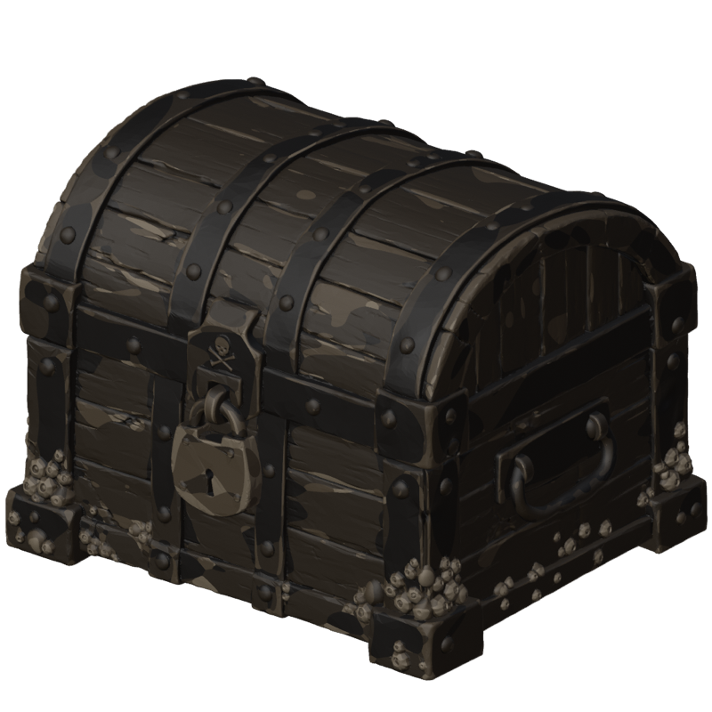

# Turn one image into a multi-color 3D print file

Build the sea chest as a textured model from one image, then ask Meshy to convert it into a print file that a multi-filament printer prints in four colors, in a realistic or a cartoon style. Your coding agent runs the recipe, and this guide explains each step and what to look for.

| Concept image | The textured model | The print file in four colors |
|---|---|---|
|  |  |  |

The print file picture is drawn from the actual 3MF: every triangle in the color the file assigns to it. [Preview provenance](assets/SOURCES.md).

## What you'll make

The sea chest comes back as a print file in which every part of its surface is assigned one of four colors: the dark oak, the black iron, the pale barnacles and a brown for the worn planks. A 3D printer prints the mesh, the shape, a surface made of many small triangles, in whatever filament is loaded. A multi-filament printer holds several spools, four in the common four-slot units, and switches between them while it prints, so it can print one model in several colors. What it cannot read is a texture, the image wrapped onto the mesh that gives a model its color. This recipe asks Meshy to build the chest with its base color texture, the image that gives the mesh its colors, and then to turn that texture into print colors.

Meshy's Multi-Color Print reads the textured model, chooses a palette of up to four colors that cover the most surface, and writes a 3MF, a 3D-printing file that a slicer opens as a project, in which every triangle carries the palette entry it belongs to. A slicer is the program that turns a model into the layer-by-layer instructions a printer follows; Bambu Studio and OrcaSlicer are free and both read this file. Each palette entry becomes one filament in the slicer, so the chest arrives ready to slice, with the four colors already assigned.

You also get the textured model itself as a GLB, the file web viewers and Blender open, to compare the print colors with the colors Meshy started from.

To get there, you'll:

1. Give your coding agent the recipe and store your Meshy API key. No credits are spent.
2. Check that the image shows one object with a few clear colors.
3. Choose a color style, realistic or cartoon.
4. Start the run and approve the credit cost.
5. Wait two to three minutes while Meshy builds the textured model.
6. Wait about 15 seconds while Meshy converts it into a four-color print file.
7. Open the print file in your slicer.

- **Start with:** One PNG or JPEG image, plus a color style. The sea chest shown above is included.
- **Receive:** The print file `multi-color-print.3mf`, the textured model `textured-model.glb` and a preview image of the model.
- **Allow:** about three minutes for generation, plus time for first-time setup.
- **Budget:** about 40 Meshy credits for the default example: 30 to build the textured model and 10 to convert it.

These are recorded sample costs and timings, not guarantees. Your generated result will vary. [Check current API pricing](https://docs.meshy.ai/en/api/pricing) before you run it.

## Before you start

You need three things. None of them involves writing code.

1. **A Meshy account with API access.** Create an API key in the [Meshy Developer Platform](https://www.meshy.ai/developers/) and [check your credit balance](https://www.meshy.ai/settings/subscription). The default run spends about 40 credits.
2. **A coding agent.** That is an AI assistant such as Claude Code, Codex or Cursor that can open a folder on your computer and run commands for you. It handles installation, runs the recipe, and reports back in plain language.
3. **The example files.** [Download the cookbook files](https://github.com/meshy-dev/meshy-cookbook/archive/refs/heads/main.zip), unzip them, and open the extracted folder in your agent. Or skip the download and ask your agent to clone the [cookbook repository](https://github.com/meshy-dev/meshy-cookbook) for you. Either way, open the folder containing `AGENTS.md`, `examples`, and `shared`, so the agent can see everything it needs.

Optional: install [Bambu Studio](https://bambulab.com/en/download/studio) or [OrcaSlicer](https://github.com/SoftFever/OrcaSlicer/releases), which are free, to see the chest in its print colors and print it. Without a slicer, you can still inspect the textured model in your Meshy account, as Step 7 explains.

Keep your API key on your computer. The agent will help you create a local settings file named `.env`. Paste your key into that file yourself, never into chat.

Already comfortable running code? Jump to [Run it](#run-it) for the Python and TypeScript commands, and to [How it works](#how-it-works) for the API calls behind each step.

## Step 1: Give your agent the recipe

With the cookbook folder open in your agent, paste this prompt. It sets everything up without spending any credits: the agent fetches the cookbook if it is not there yet, installs what the recipe needs, and helps you store your key in the local settings file.

```text
If the Meshy cookbook folder is not already open, clone https://github.com/meshy-dev/meshy-cookbook and work inside it. Read AGENTS.md and examples/11-image-to-multi-color-print/README.md. Set up everything this recipe needs, using Python unless my project already uses TypeScript. Help me store MESHY_API_KEY in a local .env file without asking me to paste the key into chat. Do not start any generation yet. When setup is done, explain in plain language what the run will do, stage by stage, and how many credits it will cost.
```

Follow the agent's instructions and paste your key into the settings file yourself. This step is done when the agent confirms the key is in place and quotes a cost of about 40 credits.

## Step 2: Check the image

Meshy builds the whole model from a single picture, so the picture decides the shape, including the sides and back it does not show. For this recipe it also decides the colors: the print palette is chosen from the colors of the texture Meshy generates, and that texture comes from the picture.

| The included sea chest: one object, a clean outline, and four materials in four distinct colors |
|---|
|  |

A good input shows:

- one object, with the whole thing in frame
- a front or three-quarter view, so Meshy sees two sides
- a clean outline against a plain or transparent background
- a few clear colors that cover large areas, such as the oak, the iron, the brass and the barnacles here

An object in one color gives a palette of four near-identical shades, and a photo with a busy background gives a poorer model to start from. For this walkthrough, keep the included image. [Try your own idea](#try-your-own-idea) covers your own object once you have seen a full run.

## Step 3: Choose a color style

The style is the one setting you choose in this recipe. It decides how the colors of the texture are turned into print colors. Here is the chest in both styles, drawn from the two actual print files:

| Realistic | Cartoon |
|---|---|
|  |  |

| Style | What it does | What it looks like |
|---|---|---|
| `realistic` | Samples the texture point by point across the mesh, so one triangle can carry more than one color. | The worn wood, the rust spots and the speckles on the barnacles all come through. The file is larger, about 35 MB for the chest. This is the default, pictured on the left. |
| `cartoon` | Gives each triangle one color and smooths the boundaries into larger regions. | Flat patches of color with clean edges, closer to a hand-painted toy. The file is smaller, about 24 MB. |

The choice matters at the printer as well as on screen. A multi-filament printer with one nozzle changes filament every time the color changes within a layer, and each change purges some filament into a tower beside the model. A speckled surface means many changes per layer, so the realistic style prints more slowly and wastes more filament than the cartoon style on the same chest. For the first run, keep the default. Passing `cartoon` after the image converts the same model in the other style, as [Run it](#run-it) shows.

## Step 4: Start the run and approve the cost

Paste this prompt. The agent quotes the cost and waits for your approval before anything is generated.

```text
Run cookbook 11, the multi-color print recipe, with the included sea chest and the default realistic style. Tell me the expected credit cost and wait for my approval before generating. While it runs, tell me when each stage finishes. When everything is done, show me where the files were saved.
```

Expect a quote of about 40 credits: 30 to build the textured model and 10 to convert it. Once you approve, the recipe runs both stages back to back and the agent reports progress. The whole run takes about three minutes, so keep the terminal open and read ahead to see what is happening.

## Step 5: Meshy builds the textured model

This stage takes two to three minutes. Meshy reads the sea chest image and builds a complete mesh from it, including the back and the sides the picture does not show, then generates its base color texture. The recipe leaves out the PBR maps, short for physically based rendering, the extra images that tell a viewer how a surface reflects light, because a printer cannot reproduce reflection and the conversion reads only the base color. Expect about 1.3 million triangles and a file of about 40 MB.

| The textured chest, exactly as it comes back from the first stage |
|---|
|  |

As soon as this stage finishes, the recipe saves the model as `textured-model.glb` and this picture as `textured-model-thumbnail.png`. Look at the colors here: these are the colors the print palette is chosen from. The dark planks, the black straps, the pale barnacles and the brass padlock are the four materials the picture shows.

## Step 6: Meshy converts it into a print file

This stage takes about 15 seconds. Meshy takes the textured chest it just built, which never leaves Meshy between the two stages, and:

1. **Reads the texture through the mesh.** Every point on the surface gets the color the base color texture gives it.
2. **Chooses the palette.** It picks the four colors that cover the most surface. For the chest that is a dark oak, a near-black iron, a pale tan for the barnacles and the worn wood, and a mid brown. The brass padlock covers too little surface to get a color of its own at four colors, so it takes the nearest one.
3. **Assigns every triangle a color.** In the realistic style a triangle that spans two colors is split so each part keeps its own. In the cartoon style each triangle gets one color.
4. **Writes the 3MF.** The file is a Bambu Studio project: one object on the build plate, the flat surface a printer prints on, with four filaments in the palette colors, one per print color. The chest is scaled to stand 75 mm tall; you can scale it in the slicer.

| The print file in the realistic style, drawn from the actual 3MF: every triangle in the color the file assigns to it |
|---|
|  |

The recipe saves the file as `multi-color-print.3mf`. Meshy does not generate a preview image for a print file, so the way to look at it is a slicer, as the next step shows.

One limit to know: the model has to carry color. A mesh built without textures, such as the gray figure from the [printable parts recipe](../10-image-to-printable-parts/), is rejected before anything is charged, with a message that says to texture the model first.

## Step 7: Open the print file in your slicer

When the agent reports that everything is done, the output folder inside the recipe's `python` or `typescript` folder holds three files:

| File | What it is |
|---|---|
| `multi-color-print.3mf` | The chest with its four print colors, as a slicer project. Open this in your slicer. |
| `textured-model.glb` | The textured model from Step 5, for the API console, Blender or a web viewer. |
| `textured-model-thumbnail.png` | The preview of the textured model from Step 5. |

You don't need to install anything to take a first look at the model. Open the [API console logs](https://www.meshy.ai/api-console/logs) in your Meshy account: every generation made with your key is listed there, and you can rotate the textured chest in the browser. The print file itself needs a slicer. In Bambu Studio, choose **File → Import → Import 3MF/STL/STEP/SVG/OBJ/AMF** and pick `multi-color-print.3mf`, or open the file itself: Bambu Studio treats it as a project, with a printer, the plate, and one filament per print color already set, and shows the chest on the plate in its four colors. OrcaSlicer reads the same project files. The file is written for those two; another slicer opens the shape without its colors. Or ask your agent:

```text
Help me open output/multi-color-print.3mf in Bambu Studio or OrcaSlicer so I can see the chest in its four print colors and the filament list. If neither is installed, help me install one of them. Then open output/textured-model.glb in a free GLB viewer next to it so I can compare the print colors with the model's own colors.
```

Check four things before you print. First, the filaments: the project lists four, each in a palette color, so match each one to a spool you have loaded, darkest to lightest. Second, the size: the chest arrives 75 mm tall. To print larger or smaller, scale it in the slicer; a bigger chest takes longer and uses more filament. Third, the color boundaries: rotate the chest and look at the straps, the rivets and the padlock. Speckles on the planks are the realistic style doing its job; a strap that is half black and half brown is where the palette ran out of colors, and [Parameters worth changing](#parameters-worth-changing) shows how to ask for more. Fourth, the prime tower: the slicer adds a small tower beside the chest where the printer purges filament at each color change. It is part of every multi-color print, not a mistake. Bambu Studio also warns that a model of more than a million triangles is slow to slice; it slices anyway. Then slice as you would any model and print.

What comes next depends on what you want:

- **The other style:** convert the same model again with `cartoon`, without building it a second time, as [Run it](#run-it) explains. It costs 10 credits.
- **More colors:** raise `max_colors` in the code, up to 16, to give the brass its own filament. Each color is one spool your printer has to hold, and each change of color costs time and purged filament.
- **A lighter file:** the conversion accepts a remeshed model, so the [simplify recipe](../08-image-to-simplified-prop/) can rebuild the chest at 20,000 faces before it is converted.
- **An object of your own:** [Try your own idea](#try-your-own-idea).

## Try your own idea

Choose a PNG or JPEG that passes the checks in [Step 2](#step-2-check-the-image): one object with a clean outline and a few clear colors. Attach it to your agent or tell it where the file is, then paste this prompt. Start with the realistic style, then try cartoon on the same model for cleaner regions.

```text
Use my image for cookbook 11 with the realistic style. Archive any previous output first. Check the image and tell me about anything that could give a poor model or a muddy palette before spending credits. Explain the expected credit cost and wait for my approval before starting a new generation.
```

Save a copy of your first result before generating another version. Changing the image creates a new paid generation; changing only the style costs 10 credits for the conversion.

## If something goes wrong

- **The key is missing or rejected:** ask your agent to check that the local `.env` file is in the language folder and contains `MESHY_API_KEY`. Do not paste the key into chat.
- **The run cannot start:** check API access and available credits in your Meshy account, and ask the agent to explain the error before retrying.
- **Progress stops or a download fails:** ask your agent to resume the saved run. The recipe records each stage as it finishes, so a model that was already built is not paid for twice. If the agent reports that it cannot tell whether a request went through, have it check Meshy's task history before continuing.
- **The conversion is refused because the model has no color:** the conversion needs a model with a base color texture. A mesh built with `should_texture` off, a repaired mesh or a split mesh has none and is refused before any credits are spent. Build the model with textures, as this recipe does, or texture an existing model with the [restyle recipe](../06-text-to-restyled-prop/) and convert that task instead.
- **The conversion stage fails:** it needs a finished model task that is less than three days old. Ask your agent to read the error message with you. If the model task has expired, archive the output folder and run again.
- **The colors are muddy or a detail lost its color:** the palette is chosen by how much surface each color covers, so a small bright part takes the nearest large color. Ask for more colors with `max_colors`, or choose an image whose colors cover larger areas.
- **The result looks different from the example:** each generation can vary, and the model varies most. Check the image against [Step 2](#step-2-check-the-image) with your agent before paying for another run.

## Technical details

**Endpoints:** `POST /openapi/v1/image-to-3d` → `GET /openapi/v1/image-to-3d/:id`, then `POST /openapi/v1/print/multi-color` → `GET /openapi/v1/print/multi-color/:id`\
**Languages:** Python 3.10+ · TypeScript (Node 22+)\
**Source:** [Python](python/main.py) · [TypeScript](typescript/main.ts)\
**Last verified run measurements:** September 27, 2026 · [Sample result](sample-result.json)

The Multi-Color Print endpoint converts the model of a finished Meshy task, or a GLB or FBX you supply, into a 3MF in which every triangle is assigned one of up to 16 palette colors, in a realistic or a cartoon style. This recipe builds its input with the textured image-to-3d request of the [character recipe](../01-image-to-3d-character/) minus the PBR maps, chains the two tasks with `input_task_id`, and downloads the textured GLB as well as the 3MF. The model never leaves Meshy between the stages.

## Run it

Complete [Before you start](#before-you-start) to configure API access and your key. Review the estimated budget above before running.

Clone once, then choose one language and run its commands from the repository root:

    git clone https://github.com/meshy-dev/meshy-cookbook.git
    cd meshy-cookbook

**Python**

    cd examples/11-image-to-multi-color-print/python
    python3 -m venv .venv && source .venv/bin/activate
    cp .env.example .env          # paste your key
    pip install -r requirements.txt
    python main.py

**TypeScript**

    cd examples/11-image-to-multi-color-print/typescript
    cp .env.example .env          # paste your key
    npm install
    npm start

You get `output/multi-color-print.3mf`, `output/textured-model.glb` and a 512 px preview at `output/textured-model-thumbnail.png`. Open the 3MF in Bambu Studio or OrcaSlicer to see the four print colors.

To use your own image, pass it as the first argument. To convert in the cartoon style, add `cartoon` after the image:

    python main.py my-object.png
    npm start -- my-object.png
    python main.py my-object.png cartoon
    npm start -- my-object.png cartoon

The style must be `realistic` or `cartoon`.

### Resume an interrupted run

The script saves the image path, the style and the task IDs in `output/run.json`. If a poll, download or the conversion stage is interrupted, continue the same run from the same language directory:

    python main.py --resume
    npm start -- --resume

Resume reuses saved tasks and creates only stages that have not started. Starting the conversion stage still costs its 10 credits. If the print task is already saved, resume retrieves it directly and reports conversion credits only. Resume before the results expire; the recorded retention period is three days outside Enterprise.

A normal run refuses to start when `output/run.json` already exists. To convert another image, archive the current `output/` directory first. Passing a different image or style with `--resume` is rejected.

To convert the same model again in the other style without building it again:

1. Archive the current `output/` folder.
2. Copy its `run.json` into a new, empty `output/` folder. In the copy, keep `model_task_id`, set `print_task_id` to `null`, and set `style` to the other value.
3. Run with `--resume`.

Resume then downloads the textured model again and creates only the new print task, which costs 10 credits. The saved model task stays valid for three days.

If execution stops while a create request is in flight, the checkpoint may contain a `creating` marker without its task ID. The script stops rather than risk duplicate charges. Check the Meshy task history for the submitted request; if it exists, put its ID in `model_task_id` or `print_task_id` as appropriate and set `creating` to `null` before resuming. If no task was created, clear the marker only after confirming that. The checkpoint contains no API key or signed download URLs.

## How it works

The excerpts below show the API calls from the Python runner. The full [Python](python/main.py) and [TypeScript](typescript/main.ts) sources also checkpoint each stage and skip creation when resuming a saved task.

1. **Build the textured model.** `client.create` POSTs the chest image to `/openapi/v1/image-to-3d` as a textured task without PBR maps.

```python
model_id = client.create(
    "image-to-3d",
    {
        "image_url": image_url,
        "should_texture": True,
        "enable_pbr": False,
        "target_formats": ["glb"],
    },
)
```

   The conversion reads only the base color texture, so the metallic, roughness and normal maps would add nothing to the print.

2. **Wait for it and save the model.** `client.wait` GETs `/openapi/v1/image-to-3d/:id` until the model is ready.

```python
model = client.wait("image-to-3d", model_id, label="model")
client.download(model["model_urls"]["glb"], output / "textured-model.glb")
client.download(model["thumbnail_url"], output / "textured-model-thumbnail.png")
```

3. **Convert it.** `client.create` POSTs to `/openapi/v1/print/multi-color` with `input_task_id` pointing at the model task, so the model never leaves Meshy, plus the palette size and the style.

```python
print_id = client.create(
    "print/multi-color",
    {
        "input_task_id": model_id,
        "max_colors": 4,
        "style": state["style"],
    },
)
```

4. **Download the print file.** The task lists the file under `model_urls` as `3mf` and nothing else: a print task has no thumbnail.

```python
task = client.wait("print/multi-color", print_id, label="print")
client.download(task["model_urls"]["3mf"], output / "multi-color-print.3mf")
```

## What you get

These are measurements of the two recorded sample runs, one per language. The Python run's files are pictured above.

| File | Contents |
|---|---|
| `textured-model.glb` | 1,253,204–1,366,246 triangles; 666,491–730,725 vertices; one material with one embedded JPEG base color texture; 41.2–44.6 MB; 1.90 m on the longest side |
| `multi-color-print.3mf` | The same triangles in millimeters, scaled to 75.0 mm tall on a 95.6–95.7 × 78.5–82.2 mm footprint, as a Bambu Studio project with one object, four PLA filaments in the palette colors and a Bambu Lab X1 Carbon profile. 384,370–398,137 of the triangles are subdivided to carry more than one color; 35.3–38.0 MB |
| `textured-model-thumbnail.png` | 512 × 512 preview |

The model stage took 140–161 seconds and the conversion 15–17 seconds; each language's run finished in 170–183 seconds from start to files on disk. The 3MF stores the colors as a per-triangle attribute in Bambu Studio's painting format, not as materials: the palette lives in the project settings as `filament_colour`, and each triangle names the filament it prints with. Every conversion scaled the model to exactly 75 mm tall.

## Compare styles

These are sample measurements of two conversions of one textured chest (the Python run's model task, 1,253,204 triangles) on September 27, 2026, at four colors.

| Style | Palette | Triangles with more than one color | Conversion time | File size |
|---|---|---|---|---|
| `realistic` | `#413325`, `#231F1B`, `#9A876F`, `#685643` | 384,370, subdivided into 18.6 million colored pieces | 15 s | 35.3 MB |
| `cartoon` | `#403528`, `#9E8D76`, `#1C1713`, `#6C5C48` | 0 | 31 s | 24.0 MB |

The two palettes are the same four colors within a few shades, chosen independently by each conversion. In the cartoon file the near-black iron covers 43 percent of the triangles, the dark oak 30 percent, the mid brown 17 percent and the pale tan 9 percent.

## Parameters worth changing

| Parameter | We use | Why |
|---|---|---|
| [`should_texture`](https://docs.meshy.ai/en/api/image-to-3d#create-an-image-to-3d-task) (image-to-3d) | `true` | The conversion needs a base color texture; an untextured task is refused with `400` before anything is charged |
| [`enable_pbr`](https://docs.meshy.ai/en/api/image-to-3d#create-an-image-to-3d-task) | `false` | Only the base color reaches the print. Set it to `true`, at no extra credits, if you also want the GLB for a viewer |
| [`input_task_id`](https://docs.meshy.ai/en/api/multi-color-print#create-a-multi-color-3d-print-task) (print/multi-color) | the image-to-3d task ID | A succeeded image-to-3d, multi-image-to-3d, text-to-3d, remesh or retexture task. To convert a file you already have, send `model_url` with a public URL or a data URI of a GLB or FBX instead |
| [`max_colors`](https://docs.meshy.ai/en/api/multi-color-print#create-a-multi-color-3d-print-task) | `4` | The palette size, 1 to 16. Four matches a four-slot multi-material unit; more colors give small details such as the brass padlock a filament of their own, at the cost of a spool per color and more filament changes |
| [`style`](https://docs.meshy.ai/en/api/multi-color-print#create-a-multi-color-3d-print-task) | `"realistic"` | Samples the texture across each triangle. `"cartoon"` flattens the colors into uniform regions, gives a smaller file, and also accepts models colored per vertex rather than by a texture |

`ai_model` is omitted on the model stage, so it follows the API's current default; the Multi-Color Print endpoint has no model selection.
